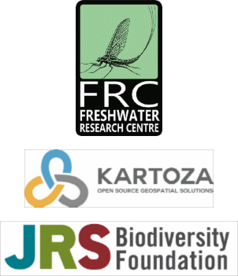

# Citations

## Citation guidelines

Data accessed through the FBIS are free for all—but not free of obligations. Under the terms of the FBIS data users agreement, users who download individual datasets or search results and use them in research or policy agree to cite them using the referencing information provided in the metadata for each data record.

Good citation practices ensure scientific transparency and reproducibility by guiding other researchers to the original sources of information. They also reward data-publishing institutions and individuals by reinforcing the value of sharing open data and demonstrating its impact to their stakeholders and funders.

Users are strongly encouraged to cite data retrieved from the FBIS network according to the recommended citation:

**Freshwater Biodiversity Information System (FBIS). 2022. Downloaded from https://freshwaterbiodiversity.org on [current date]**

> Note: Users also need to cite the individual source references that they have used, which are available in the metadata table provided on the detailed dashboards.

To cite the scientific article published in the African Journal of Aquatic Science.

Dallas HF, Shelton JM, Sutton T, Tri Ciputra D, Kajee M and Job N.  2021. Development of a freshwater biodiversity information system for evaluating long-term change in rivers in South Africa.  African Journal of Aquatic Science. doi.org/10.2989/16085914.2021.1982672

To cite the User Manual:

Freshwater Biodiversity Information System (FBIS). 2022. FBIS User Manual. Prepared by the Freshwater Research Centre and Kartoza.

Website:

[freshwaterbiodiversity.org](https://freshwaterbiodiversity.org/)

## Citation examples

Kajee Mohammed, Henry Dominic A. W., Dallas Helen F., Griffiths Charles L., Pegg Josephine, Van der Colff Dewidine, Impson Dean, Chakona Albert, Raimondo Domitilla C., Job Nancy M., Paxton Bruce R., Jordaan Martine S., Bills Roger, Roux Francois, Zengeya Tsungai A., Hoffman Andre, Rivers-Moore Nick, Shelton Jeremy M. (2023) **How the Freshwater Biodiversity Information System (FBIS) is supporting national freshwater fish conservation decisions in South Africa**, Frontiers in Environmental Science, Vol 11, DOI: DOI=10.3389/fenvs.2023.1122223

[https://www.frontiersin.org/articles/10.3389/fenvs.2023.1122223](https://www.frontiersin.org/articles/10.3389/fenvs.2023.1122223)

----

Helen Dallas, Jeremy Shelton, Tim Sutton, Dimas Tri Cuptura, Mohammed Kajee & Nancy Job (2022) **The Freshwater Biodiversity Information System (FBIS) – mobilising data for evaluating long-term change in South African rivers**, African Journal of Aquatic Science, 47:3, 291-306, DOI: 10.2989/16085914.2021.1982672

[https://www.tandfonline.com/doi/abs/10.2989/16085914.2021.1982672](https://www.tandfonline.com/doi/abs/10.2989/16085914.2021.1982672)

----

Kajee, Mohammed, Helen F. Dallas, Aneri Swanepoel, Charles L. Griffiths, and Jeremy M. Shelton. 2023. “The Freshwater Biodiversity Information System (FBIS) Fish Data: A Georeferenced Dataset of Freshwater Fishes Occurring in South Africa”. Journal of Limnology 82 (s1).

[https://doi.org/10.4081/jlimnol.2023.2133](https://doi.org/10.4081/jlimnol.2023.2133).

----

The past and current distribution of native and non-native fish in the Kowie River catchment, Makhanda, Eastern Cape
Dumisani Khosa, Josie South, Ncumisa Y. Matam, Lubabalo Mofu, Ryan J. Wasserman and Olaf L.F. Weyl
Knowl. Manag. Aquat. Ecosyst., 424 (2023) 3

[https://doi.org/10.1051/kmae/2022026](https://doi.org/10.1051/kmae/2022026)

----

### About the FBIS

Helen Dallas, Jeremy Shelton, Tim Sutton, Dimas Tri Ciptura, Mohammed Kajee & Nancy Job (2022) The Freshwater Biodiversity Information System (FBIS) – mobilising data for evaluating long-term change in South African rivers. African Journal of Aquatic Science, 47:3, 291-306, DOI: 10.2989/16085914.2021.1982672
[https://www.tandfonline.com/](https://www.tandfonline.com/doi/abs/10.2989/16085914.2021.1982672)

----

### Papers using FBIS data

Kajee Mohammed, Henry Dominic A. W., Dallas Helen F., Griffiths Charles L., Pegg Josephine, Van der Colff Dewidine, Impson Dean, Chakona Albert, Raimondo Domitilla C., Job Nancy M., Paxton Bruce R., Jordaan Martine S., Bills Roger, Roux Francois, Zengeya Tsungai A., Hoffman Andre, Rivers-Moore Nick, Shelton Jeremy M. (2023) How the Freshwater Biodiversity Information System (FBIS) is supporting national freshwater fish conservation decisions in South Africa. Frontiers in Environmental Science, Vol 11, DOI: DOI=10.3389/fenvs.2023.1122223
[https://www.frontiersin.org/](https://www.frontiersin.org/articles/10.3389/fenvs.2023.1122223/full)

----

Kajee, Mohammed, Helen F. Dallas, Aneri Swanepoel, Charles L. Griffiths, and Jeremy M. Shelton. 2023. The Freshwater Biodiversity Information System (FBIS) Fish Data: A Georeferenced Dataset of Freshwater Fishes Occurring in South Africa. Journal of Limnology 82 (s1).
[https://doi.org/10.4081/](https://doi.org/10.4081/jlimnol.2023.2133)

----

Dumisani Khosa, Josie South, Ncumisa Y. Matam, Lubabalo Mofu, Ryan J. Wasserman and Olaf L.F. Weyl. The past and current distribution of native and non-native fish in the Kowie River catchment, Makhanda, Eastern Cape.  Knowl. Manag. Aquat. Ecosyst., 424 (2023) 3
[https://doi.org/10.1051/kmae/](https://doi.org/10.1051/kmae/2022026)

----

Céline C. Hanzen, Martyn C. Lucas, Olaf L.F. Weyl, Sean M. Marr, Gordon O’Brien, Colleen T. Downs (2022). Slippery customers for conservation: Distribution and decline of anguillid eels in South Africa. Volume32, Issue 8, Pages 1277-1290. [https://doi.org/10.1002/aqc.](https://doi.org/10.1002/aqc.3823)

----

Mahomed Desai, Celine Hanzen, Colleen T. Downs, Gordon C. O’Brien (2021) Environmental drivers of ichthyofauna community composition of the river ecosystems draining the Lake St. Lucia basin, South Africa. Hydrobiologia 848:3539–3554
[https://doi.org/10.1007/](https://doi.org/10.1007/s10750-021-04609-7)

----

### Environmental Impact Assessments using FBIS data

Toni Belcher (2022) Aquatic Biodiversity Impact Assessment: Farm 1441, Jonkershoek, Stellenbosch in the Western Cape.

----

## Publications citing FBIS and FBIS data

----

### Peer-review articles

Dallas HF, Shelton JM, Sutton T, Tri Ciputra D, Kajee M and Job N. 2022. The Freshwater Biodiversity Information System (FBIS) – mobilising data for evaluating long-term change in South African rivers, African Journal of Aquatic Science 47(3): 291-306, DOI: 10.2989/16085914.2021.1982672

----

Desai M, Hanzen C, Downs CT, O’Brien GC. 2021. Environmental drivers of ichthyofauna community composition of the river ecosystems draining the Lake St. Lucia basin, South Africa. Hydrobiologia 848:3539–3554
[https://doi.org/10.1007/s10750-021-04609-7](https://doi.org/10.1007/s10750-021-04609-7)

----

Khosa D, South J, Matam NY, Mofu L, Wasserman RJ and Weyl OLF. 2023. The past and current distribution of native and non-native fish in the Kowie River catchment, Makhanda, Eastern Cape. Knowl. Manag. Aquat. Ecosyst., 424. DOI: [https://doi.org/10.1051/kmae/2022026](https://doi.org/10.1051/kmae/2022026)

----

Hanzen CC, Lucas MC, Weyl OLF, Marr SM, O’Brien G and Downs CT. 2022. Slippery customers for conservation: Distribution and decline of anguillid eels in South Africa. Aquatic Conservation: Marine and Freshwater Ecosystems, 32: 1277– 1290. [https://doi.org/10.1002/aqc.3823](https://doi.org/10.1002/aqc.3823)

----

Kajee M, Henry DAW, Dallas HF, Griffiths CL, Pegg J, Ven der Coll D, Impson D, Chakona A, Raimondo DC, Job NM, Paxton BR, Jordaan MS, Bills R, Roux F, Zengeya TA, Hoffman A, Rivers-Moore N, Shelton JM. 2023. How the Freshwater Biodiversity Information System (FBIS) is supporting national freshwater fish conservation decisions in South Africa. Frontiers in Environmental Science. Vol 11,
[https://www.frontiersin.org/articles/10.3389/fenvs.2023.1122223](https://www.frontiersin.org/articles/10.3389/fenvs.2023.1122223/full)

----

Kajee M, Dallas HF, Swanepoel A, Griffiths CL, and Shelton JM. 2023. The Freshwater Biodiversity Information System (FBIS) Fish Data: A Georeferenced Dataset of Freshwater Fishes Occurring in South Africa. Journal of Limnology 82 (s1). [https://doi.org/10.4081/jlimnol.2023.2133](https://doi.org/10.4081/jlimnol.2023.2133)

----

King J and Palmer C. 2022. Perspectives on Protecting African freshwater Ecosystems in the Anthropocene. African Journal of Aquatic Science. 47(3): iii-vi.

----

### Government products

The Department of Forestry Fisheries and Environment (DFFE) National Environmental Screening Tool Aquatic Biodiversity Sensitivity Layers. 2023.

----

Shelton J, Jordaan M, Dallas H, van der Colff D, Kajee M, Impson D, Henry D, Khosa D, Raimondo D, Job N, Chakona A. 2023. The Department of Forestry Fisheries and Environment (DFFE) Environmental Assessment Protocols: Freshwater fish fauna.

----

### Science and policy briefs

GEO BON and FWBON, 2022. Inland Waters in the Post-2020 Global Biodiversity Framework. Available from [https://geobon.org/science-briefs/](https://geobon.org/science-briefs/).

----

### Reports, books and book chapters

Day JA and BR Davies. 2022. Vanishing Waters (3rd ed.) Water research Commission Special Report SR 160/22, Water Research Commission, Pretoria, South Africa.

----

Fry C. 2021. A field guide to freshwater macroinvertebrates of southern Africa. Jacana Press. South Africa.

----

Machingura J, Coetzee J, Dallas H, Day B, Day J, Hay D, Skelton P, Thirion C and Uys M. 2021. The evolution of ecosystem research – from biodiversity to biossessments. Chapter 7 In: WRC@50: Celebrating a half century of excellence (Eds. Day JA, Day B and Reizenberg J). Water Research Commission Report no. SP 148/21, Water Research Commission, Pretoria, South Africa.

----

Turak E, Van Deventer H, Pienaar M, Walters M, Dallas H, etc. In prep. Collection and management of biological records must support protection and restoration goals for freshwater species and ecosystems.

----

### Technical and consultancy reports

>*Note: Numerous consultants use the data from FBIS is their reports. Not all correctly cite the FBIS yet.*

CapeNature 2022. Field Report 4/2022. Jonkershoek Nature Reserve Eerste River winter monitoring report. Unpublished internal report. Field report. CapeNature 2022. Field Report 10/2022. Jonkershoek Nature Reserve Eerste River autumn monitoring report. Unpublished internal report. Field report.

----

Toni Belcher (2022) Aquatic Biodiversity Impact Assessment: Farm 1441, Jonkershoek, Stellenbosch in the Western Cape.

----

CapeNature, 30/03/2022, Field Report: River survey of the Outeniqua Nature Reserve Complex, Unpublished internal report, Biodiversity Capabilities: Technical Report.

----

CapeNature 2023. Field Report 2/2023. Kogelberg Nature Reserve annual SASS monitoring report. Unpublished internal report. Field report.

----

City of Cape Town. In prep. Hout Bay River – State of the Rivers report. Scientific Services. City of Cape Town.

----

Erasmus P. 2022. Basic Assessment Report For The Proposed Prospecting Activities On Various Farms, In The Magisterial District Of Blouberg And Mogalakwena, Limpopo Province For Sylvania Northern Mining (Pty) Ltd For the following Minerals: Chrome Ore, Cobalt, Copper Ore, Gold Ore, Nickel Ore, Platinum Group Metals Located on the Farms: Altona 696 LR, Gillemberg 861 LR, Non Plus Ultra 683 LR, Teneriffe 682 LR, Aurora 397 LR and Nonnenwerth 421 LR, in the Magisterial Districts of there Blouberg and Mogalakwena, Limpopo Province DMRE Reference Number: LP30/5/1/1/2/14710PR. Prescali Environmental Consultants (Pty) Ltd. Pretoria

----

Erasmus P. 2022. Basic Assessment Report For The Proposed Prospecting Activities On Various Farms, In The Magisterial District Of Blouberg And Mogalakwena, Limpopo Province For Sylvania Northern Mining (Pty) Ltd For the following Minerals: Chrome Ore, Cobalt, Copper Ore, Gold Ore, Nickel Ore, Platinum Group Metals Located on the Farm: Portion 2 of the Farm Schaffhausen 689 LR, in the Magisterial District of Blouberg, Limpopo Province DMRE Reference Number: LP30/5/1/1/2/14728PR. Prescali Environmental Consultants (Pty) Ltd. Pretoria

----

Erasmus P. 2023. Desktop Surface Water Assessment Report for Kegakilwe Trading (Pty) Ltd - situated on Portion 0 of the Farm Mooikloof 150 and Portion 5 of the Farm Oatlands 151 within the Waterberg District in the Limpopo Province. Prescali Environmental Consultants (Pty) Ltd. Pretoria.

----

Erasmus P. 2022. Desktop Surface Water Assessment Report for Maditse Investments - situated on the Farms Tabana 133 LR, Boekenhoutfontein 108 LR and Prairie 107 LR within the Waterberg District in the Limpopo Province. Prescali Environmental Consultants (Pty) Ltd. Pretoria.

----

Erasmus P. 2022. Surface Water Assessment Report for Mofenyi Mining - Modjadji situated on Modjadji No. 1 934-LT within the Mopanie District in the Limpopo Province. Prescali Environmental Consultants (Pty) Ltd. Pretoria.

----

Erasmus P. 2022. Desktop Surface Water Assessment Report for Regison Mining (Pty) Ltd - situated on the Farms Greater Giyani 891 LT and Mariyeta 246 LT within the Mopani District in the Limpopo Province. Prescali Environmental Consultants (Pty) Ltd. Pretoria.

----

Fry, C. 2022. A field guide to freshwater macroinvertebrates in southern Africa. Jacana Media. South Africa.

----

Quale L. 2020. State of Strategic Water Source Areas Monitoring and Reporting Framework, and Information Platform – Southern Drakensberg Pilot. Institute for Natural Resources, South Africa.

----

Rivers-Moore NA and Kajee M. 2020. Pilot study on the use of the Freshwater Biodiversity Information System (FBIS) as a tool to extract data for climate change impacts on aquatic species distribution models. Freshwater Research Centre, Cape Town, South Africa.

----

### Theses

Kajee. M. In prep. Trajectories of change is South Africa’s freshwater fish fauna. PhD Thesis. University of Cape Town.

----

### Conference presentations and talks

Dallas HF and Rivers-Moore NA. 2019. Environmental water temperature guidelines for perennial rivers: A protocol and tools for setting water temperature targets in South Africa. Southern African Society for Southern Africa Conference, Limpopo July 2019.

----

Dallas HF and Shelton JM. 2017. Building freshwater information systems to last: A freshwater biodiversity information system for evaluating long‐term change in rivers in the Cape Floristic Region, South Africa. JRS Biodiversity Symposium, Johannesburg, South Africa.

----

Dallas HF, Shelton J, Olsen T, Sutton T and Ciputra D. 2019. Developing a freshwater biodiversity information system for evaluating long-term change in South African rivers. Southern African Society for Southern Africa Conference, Limpopo July 2019.

----

Dallas HF, Shelton J, Sutton T, Tri Cuptura D, Kajee M, Job N. 2021. The Freshwater Biodiversity Information System (FBIS) – a user-driven information system for mobilising, visualising and reporting biodiversity data in South Africa. Southern African Society for Southern Africa Conference, Virtual conference November 2021.

----

Dallas HF, Shelton J, Sutton T, Tri Cuptura D, Kajee M, Job N. 2021. Biodiversity data at your fingertips: the Freshwater Biodiversity Information System (FBIS). National Wetlands Indaba, Virtual conference October 2021.

----

Dallas HF. 2019. User driven information system design – more carrot less stick. JRS Biodiversity Symposium, Nairobi, Kenya.

----

Dallas HF. 2022. Biodiversity data at your fingertips: the Freshwater Biodiversity Information System (FBIS). Keynote Address at the Biodiversity Information Conference. November 2022.

----

Kajee M, Dallas HF, Shelton JM and Griffiths CL. 2019. Consolidating data on the status, distribution and abundance of South African freshwater fishes, invertebrates and algae for incorporating into a Freshwater Biodiversity Information System (FBIS) and assessing long-term change. South African National Biodiversity Institute Biodiversity Planning Forum, 4–7 June, Northern Drakensburg.

----

Kajee M, Dallas HF, Shelton JM and Griffiths CL. 2019. The status of South African freshwater fishes: A prelude to predicting the impacts of climate change on selected South African freshwater fish. Department of Biological Sciences Careers and Research Day, 21 November, Cape Town.

----

Kajee M, Dallas HF, Shelton JM and Griffiths CL. 2019. The status of South African freshwater fishes: A prelude to predicting the impacts of climate change on selected South African freshwater fish.
12th SAEON Graduate Student Network Indibano, 1–6 September, Cape St Francis (Best student presentation).

----

Kajee M, Dallas HF, Shelton JM and Griffiths CL. 2019. The status, distribution and abundance of South African freshwater fishes: A prelude to predicting the impacts of climate change on selected South African freshwater fish. 39th Zoological Society of Southern Africa (ZSSA) Congress, 7–10 July, Skukuza, Kruger National Park.

----

Kajee M, Dallas HF, Shelton JM and Griffiths CL. 2020. The status of South African freshwater fishes: A prelude to predicting the impacts of climate change on selected South African freshwater fish. W12 Congress: 1st International Meeting of Cities Tackling Water Challenges, 27-28 November, Cape Town.

----

Kajee M, Dallas HF, Shelton JM and Griffiths CL. 2021. South African fish data in FBIS: A success story. Southern African Society of Aquatic Scientists Congress, 1-3 November, Virtual Event.
Kajee M, Dallas HF, Shelton JM and Griffiths CL. 2021. South African fish data in FBIS: A success story. National Wetlands Indaba 2021, 20-21 October, Virtual Event (Best student presentation).

----

Kajee, M., Dallas, H.F., Shelton JM and Griffiths CL. 2022. South African National Biodiversity Institute 4th Annual Student Research Day, 29-30 March, Cape Town.

----

Shelton J and Dallas HF. 2021. Mobilising freshwater biodiversity data for South African rivers – successes, challenges, data providers, future expansion Southern African Society for Southern Africa Conference, Virtual conference November 2021.

----

Shelton J and Dallas HF. 2022. How the Freshwater Biodiversity Information System (FBIS) is supporting freshwater fish conservation in South Africa. Biodiversity Information Conference. November 2022.

----

Shelton J, Dallas HF, Kajee M. The Freshwater Biodiversity Information System (FBIS):
Unlocking data for improved freshwater decision-making in South Africa. Berg River Improvement Programme. Jonkershoek. June 2023.

----

Shelton J and Dallas HF. 2023. The Freshwater Biodiversity Information System (FBIS):
Unlocking data for improved freshwater decision-making in South Africa. City of Cape Town, Athlone Sewage works. August 2023.

----
