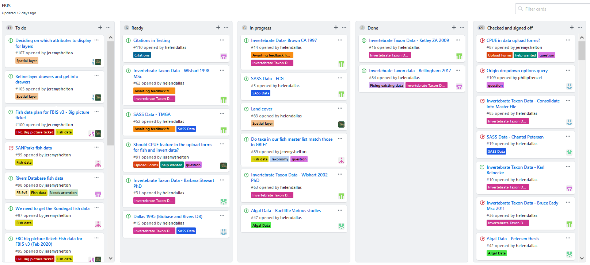
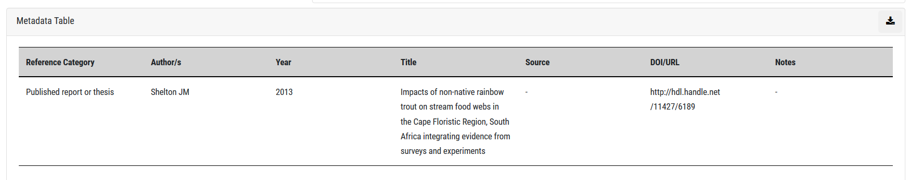

# FBIS data management guidelines

Data management guide for the Freshwater Biodiversity Information System (FBIS): a platform for housing and serving freshwater biodiversity data.

## Introduction

These document serves as a guideline for the management of freshwater biodiversity data in the Freshwater Biodiversity Information System (FBIS). It provides an overview of the recommended steps, processes and systems for sourcing, extracting, consolidating, uploading and serving biodiversity data in an information system such as FBIS. It is based on the experiences gained and systems developed during the development of the Freshwater Biodiversity Information System (FBIS) in South Africa (Freshwater Biodiversity Information System. 2020. FBIS Version 3; Dallas et al. 2022).

## Managing data consolidation

Establishing what data are available in a country is the first step in the data process. To assist with the managing of data we recommend developing a DataSet Tracker.

### Setting up a DataSet Tracker

Often the amount of data available for consolidation into an information system, exceeds the amount of data that can actually be consolidated based on time and financial constraints. It is thus critical that the FBIS data team prioritise the data for FBIS. This is best done through consultation with the end-users and stakeholders of FBIS. To manage the prioritisation of data and keep track of progress, a DataSet Tracker is used. This is an excel spreadsheet that keeps track of the data available for inclusion in FBIS, and importantly allows for prioritisation of each data set into FBIS.

The DataSet Tracker provides a list and details of data sets identified by the FBIS team and stakeholders, which are being considered for inclusion in the FBIS. Data are best divided into four broad categories, namely:

* **Biodiversity data** (e.g. wetland birds, wetland plants, fish, invertebrates, algae etc.)
* **Abiotic data** (e.g. hydrological data, physico-chemical data, wetland condition data, etc.)
* **Spatial data** (used for filters and / or spatial layers; e.g. Rivers and dams, Provinces, Freshwater Ecoregions of the World, Water Management Areas, etc.)
* **Third Party data** (existing hydrological or water quality data sites, GBIF, etc.)

For each category, the FBIS team needs to specify the following:

* Component (specify component)
* Details (provide details of data set, e.g. number of records, type of records etc)
* Accessibility (who has the data, is it freely available, is a MOU required?)
* Data priority ranking (ranking based on user workshop to evaluate the relative importance of different data sets, where 1 = high priority, 2 = medium and 3 = low; these rankings can also be linked to FBIS versions)
* Spatial scale (specify if the data are regional or national)
* Progress (record progress on obtaining data and inclusion in FBIS)

A DataSet Tracker template has been generated for FBIS (**FBIS DataSet Tracker Template.xlsx**). For spatial data it is important to indicate if this layer is to be used as a filter, spatial layer, or both (see details in [Spatial Data](#spatial-data)).

### Using GitHub for managing data consolidation

Data sourcing, extraction and consolidation requires careful, accurate and concise work to ensure quality data. A robust system for managing the data consolidation process is recommended. **[Github](https://github.com)** is an excellent tool for managing this process as it allows multiple team members to work together in one project, which allows for easy management of workflows for data consolidation. A screenshot of the FBIS Data Management project on GitHub is provided (Figure 1). Using GitHub one can:

* Create a “ticket”/ “issue” for each data set to be consolidated
* Assign each “ticket” to a team member
* Label each issue with an appropriate label such as bird data, fish data, algal data, etc.
* Easily see when a ticket is “In progress”, “Done” and “Checked and Signed off” by a senior staffer.

The FBIS will be introduced to GitHub for managing both the technical and data side of the FBIS project.

**Figure 1. Example of data management workflow in GitHub**

## Types of data

### Biodiversity data

Biodiversity data is the primary currency of FBIS. The lowest unit is an occurrence record for a **Taxon** taken at a **Site** (identified by a latitude / longitude) on a particular **Sampling Date** (so Taxon, location and date – these are mandatory attributes for each record).   For some taxa extra attributes may be included such as habitat or biotope. Additional data may be associated with each occurrence record, although this is often dependent on the group (birds, fish, invertebrates, wetland plants, algae) being focused on, and may vary somewhat from one group to another. For each occurrence record, **Presence = 1** indicates that the species was recorded at a site on a particular sampling date. In addition, we have included the option to include sampling method, sampling effort, abundance measure, and abundance for each; as well as a number of abiotic parameters associated with each occurrence record (see [Abiotic data](#abiotic-data)). Further details are provided in [Data Upload Templates](#data-upload-templates).

#### Creating Taxonomic Master Lists

A taxonomic Master List is a list of all species and/or taxa within a particular group such as birds, fish, invertebrates, wetland plants, algae, etc. For some groups a species list is easy to produce as species level is commonly identified in studies (e.g. birds, fish). For other groups, the taxonomic level (family, genus, species etc) varies considerably from study to study, and thus it is recommended that the lowest taxonomic level is used and that Taxon is used in preference to Species (e.g. invertebrates, algae).

The purpose of the Master List is threefold:

1. To provide a comprehensive and up to date list of species/taxa for a specific group in a specific region.  This needs to be done during the initial development of an information system such as FBIS, but once the system is up and running, then the further updating of the Taxonomic backbone is done using GBIF and user-defined taxonomic uploads.
2. To facilitate downloading of data from the Global Biodiversity Information Facility’s (GBIF), thereby ensuring that the correct taxa are included on the information system.
3. To provide the taxonomic hierarchy for taxa not yet on GBIF.

The generation of a Master List requires consultation with available resources, relevant publications and experts. A Master List is intended to be an updatable resource, improved and added to as new data and studies are published, or new taxa are described. If no species lists are available for a country then the GBIF Taxonomic Master List may be generated by extracting data from GBIF. This Master List should then ideally be checked and validated for accuracy by the FBIS team.

The format of the Master List is important to ensure consistency for ingestion of data into the information system. The following columns are included in the Master Lists, provided as excel file template that will be used for each FBIS group (**Master List Template final for FBIS Generic 2022_08_01.xlsx)**. It is recommended that all columns be populated, with black compulsory and blue optional (explanations given in parenthesis):

* On GBIF (Yes or No if the taxon is on GBIF)
* GBIF Link (link to GBIF taxon)
* Taxon Rank
* Kingdom
* Phylum
* Class
* SubClass
* Order
* Family
* SubFamily
* Genus
* Species
* SubSpecies
* Variety
* Taxon
* Scientific name and authority
* Taxonomic status
* Origin (Native, Non-native, Unknown)
* Endemism (Endemism categories):

  * Micro-endemic level 2 (Endemic to a single river or wetland)
  * Micro-endemic level 1 (Endemic to less than 5 rivers or wetlands)
  * Regional endemic level 2 (Endemic to a single primary catchment)
  * Regional endemic level 1 (Endemic to a single Freshwater Ecoregion, more than one primary catchment)
  * National endemic (Endemic to South Africa, occurs in more than one Freshwater Ecoregion within Botswana)
  * Subregional endemic (Endemic to southern Africa)
  * Widespread (Occurs beyond southern Africa)
  * Unknown (Endemism is unknown)

* Global Conservation status [The IUCN Red List of Threatened Species website (IUCN Red List, 2020) classifies species into eight main categories based on their extinction risk. Each species was classified:
  
  * Extinct
  * Critically Endangered
  * Endangered
  * Vulnerable
  * Near Threatened
  * Least Concern
  * Data Deficient
  * Not Evaluated

* National Conservation status [The SANBI National Red List Categories  (SANBI, 2020) classifies species into 12 main categories based on their extinction risk. Each species was classified as:

  * Extinct
  * Extinct in the Wild
  * Regionally Extinct
  * Critically Endangered, Possibly Extinct
  * Critically Endangered
  * Endangered
  * Vulnerable
  * Near Threatened
  * Critically Rare
  * Rare
  * Declining
  * Data Deficient - Insufficient Information
  * Data Deficient - Taxonomically Problematic Not Evaluated
  * Least Concern

* Common Name
* Former scientific names
* Division (algae only)
* Growth form (algae only)
* Water dependence (anurans only)
* BDI Link (anurans only)
* Wetland Indicator Status (plants only)
* SANBI RedList Links

A separate Master List of Species / Taxa needs to be created for each group for which biodiversity data are served on FBIS. The Master List is ideally created before the consolidation of data so that the correct GBIF Taxonomic Backbone (https://www.gbif.org/dataset/d7dddbf4-2cf0-4f39-9b2a-bb099caae36c) is used for the data consolidation files. The taxonomy from GBIF should be used when the taxon is on GBIF. The FBIS team can check if the taxon is on GBIF using the following link: https://www.gbif.org/species/1 and insert the relevant species, genus, family etc. in the “Select a species” box.

It is important that the correct **Taxon Rank** should always be used to ensure correct uploading of the data files into FBIS.

**Note:** It is recommended that significant time and resources are used to generate and refine the master list for each group (birds, fish, invertebrates etc) as much as possible before proceeding with data collation. This is the list around-which all of the occurrence data will pivot: the more accurate it is at the start, the more time you save in the long run when collating the biodiversity data for those taxa.

#### Sources of biodiversity data

Multiple sources of taxon occurrence data generally exist, although this is highly dependent on the country. Potential sources of biodiversity data include the following study reference categories:

* Peer-reviewed scientific articles
* Theses
* Published reports
* Databases
* Unpublished data

The following sections provide details of the recommended processes for sourcing taxon occurrence data from the different sources.

##### Peer-reviewed scientific article

Data from peer-reviewed scientific articles are best sourced by undertaking a literature search using Google Scholar. To ensure that relevant papers are identified, appropriate search term combination should be used. For example, for all native freshwater fishes in South Africa: “Genus species” & “South Africa” (where “Genus species” represents the scientific name for each taxon). Relevant articles are identified based on their titles, abstracts and methods section. The first 500 search results returned by Google Scholar should be assessed for relevancy. Each relevant article should be inspected for GPS coordinates – if these are not provided then the article may be catalogued but not included for data extraction (see [Extracting data and preparing bulk data for uploading into FBIS](#extracting-data-and-preparing-bulk-data-for-uploading-into-fbis)).

**Note:** It is important that search terms are clearly-defined and consistent, so that the process is repeatable and defensible.

##### Thesis

University theses are easily searched using relevant university search engines. Often local experts also know of relevant theses and can be contacted directly. Where possible, electronic data should be sourced directly from individuals, as this saves significant time that would otherwise be occupied in transcription of paper to digital records during data consolidation.

##### Published report

Technical and consultancy reports are often difficult to source and requires knowledge of local experts who have undertaken relevant studies. Where possible, electronic data should be sourced directly from individuals, as this saves significant time during data consolidation.

##### Database

Identify and contact relevant organisations who may have data to share that is already in a database. Data sharing agreements may be needed depending on the organisation.

##### Unpublished data

Identify individuals who may have data to share. Where possible, electronic data should be sourced directly from individuals, as this saves significant time during data consolidation.

#### Generation of a Knowledge Database for each group

A Knowledge Database is a record of all study references from which data have been extracted for a particular group (e.g. birds, fish, wetland plants, invertebrates, algae, etc.). It is a useful record of all peer-reviewed scientific articles, theses and published reports for a group and each record should ideally be linked to a GitHub ticket to keep track of the data extraction (see Section 2.2). An example of a Knowledge Database has been generated (FBIS Knowledge Database Example Template.xlsx). The following columns are included in the Knowledge Database, provided as excel file template that will be used for each FBIS group.

* Data captured (Yes / No)
* Data capturer (Name of person that entered the data)
* Author(s) (Study author(s))
* Year (Publication Year)
* Title (Publication Title)
* Source (Publication Source)
* Reference Category (peer-reviewed scientific article, thesis, published report, database, unpublished data)
* Electronic Copy (Yes / No)
* Electronic Data (Yes / No)
* Notes (Relevant notes)
* GitHub Ticket Number (Link to ticket/issue on GitHub)

### Abiotic data

Whilst abiotic data are not the main currency for FBIS, it is extremely useful to provide associated abiotic data when these have been collected concurrently with biotic data. For this reason, a number of abiotic spatial layers may be served, and a number of abiotic parameters may be included in the Data Upload Templates. These include aspects related to sampling method and effort, abundance, habitat/biotope, flow and physico-chemistry. Abiotic data associated with biodiversity data are included in the [Data Upload Templates](#data-upload-templates). Examples are given below. These abiotic factors may need to be adapted depending on the taxonomic group being dealt with – for example bird abiotic data may need different habitat related attributes. These can easily be added in the administration section.

* Sampling method
* Sampling effort measure
* Sampling effort value
* Abundance measure
* Abundance value
* Broad biotope
* Specific biotope
* Substratum
* Water Level
* Water Turbidity
* Embeddedness
* Depth
* Near Bed Velocity
* Conductivity
* PH
* Dissolved Oxygen
* Dissolved Oxygen
* Temperature
* Turbidity

### Spatial data

Spatial data often take the form of shapefiles containing geometries representing physical properties or landscape features (e.g. catchments, habitat types etc.) and that have attribute data associated with them. These spatial layers may be hidden/shown for visualisation on the map by a user, while the data in these layers may be used to facilitate spatial filters which are used to select a subset of records based on the filter specified.  Spatial layers and filters may be the same, although not always as it is dependent on the data attributes.

#### Selection of spatial filters and geocontext data

Geocontext data are contextual data for any geographical point, sourced from relevant spatial layers and aggregated as properties of a site. Often spatial layers are used for generating geocontext data. The examples below are the spatial filters used in FBIS (see [Setting up a Dataset Tracker](#setting-up-a-dataset-tracker)).

* Geomorphological Zone
* Freshwater Ecoregions of the World
* Province
* Management Area
* Catchment
* Ecoregion
* National Critical Biodiversity Areas
* National Freshwater Ecosystem Priority Area
* Strategic Water Source Area
* National Biodiversity Assessment 2018

#### Selection of spatial layers

Spatial layers, which may be turned on and off in the FBIS map, function as background layers upon which biodiversity data are displayed. The examples below are the spatial layers used in FBIS.

* Administrative boundaries
* Rivers
* Dams
* Geomorphological zones
* Freshwater Ecoregions of the World
* Water Management Areas
* Sub Water Management Areas
* River Management Units
* Catchments (Primary, Secondary, Tertiary, Quaternary, Quinary)
* SA Ecoregions (Ecoregion Level 1, Ecoregion Level 2)
* National Critical Biodiversity areas
* Protected areas
* National Freshwater Ecosystem Priority Areas
* Strategic Water Source Areas
* Land Use Classes

### Third party data

Where databases and data platforms already exist, it is recommended that links (APIs) be created to access these data from the platform. Third party databases that FBIS links to includes data from Global Biodiversity Information Facility (GBIF) (taxonomy, diatom, invertebrate and fish data), the IUCN Red List of Threatened Species database, the [MiniSASS database](https://www.minisass.org/en/map/), which provides citizen science river health data, and DWS water quality database accessed via the Integrated Water Resources Decision Support System (InWaRDS 2020), and a ‘knowledge database’, which serves as a catalogue of metadata for all occurrence records. Data from certain modules of the Virtual Museum (Fitzpatrick Institute of African Ornithology, University of Cape Town 2021) are also included. GBIF and Virtual Museum data are harvested and served in FBIS, as a separate Data Source that complements collated data. In FBIS, freshwater species occurrence data available for South Africa in GBIF includes periodically-updated data from the South African Institute for Aquatic Biodiversity (SAIAB), as well as 'Research Grade' iNaturalist data (i.e. records from non-captive individuals, with a picture, locality and date, and with two or more IDs in agreement at species level). Invertebrate data includes both aquatic and aerial stages. The FBIS team need to provide guidance on the taxonomic groups for which GBIF data should be harvested, and should be based on the Master Lists (see [Creating Taxonomic Master Lists](#creating-taxonomic-master-lists)).

## Extracting data and preparing bulk data for uploading into FBIS

FBIS includes data capture forms for adding sites, fish, invertebrate and algae data, as well as associated abiotic data. However, these forms are intended for the capture of individual site visits, and at times, especially during the development phase of an information system, it is useful to be able to upload large amounts of data at a time. To ensure that bulk data are readily ingested into FBIS, a standardised **Data Upload Template** needs to be produced for each group. This will ensure that data are cleaned and provided in a standardised manner so that the data uploading process runs smoothly and so that the resultant FBIS platform serves quality data.

### Data Extraction

Data extracted from peer-reviewed articles, theses and published reports need to be standardised to allow for comparison of data amongst studies.  Each article/thesis/report needs to be inspected for GPS coordinates. Publications without GPS coordinates cannot be included in the information system. All relevant information, as specified in Table 1, [Data Upload Templates](#data-upload-templates), pertaining to the occurrence record is then extracted from the publication and added to the Date Upload Template for the relevant group.

### Data Upload Templates

Standardised data upload templates in excel have been generated for four biodiversity groups, namely anurans, fish, invertebrates and algae. Additional upload templates may be added as new biodiversity modules are added. These templates include a number of dropdown attributes.  It is critical that all taxa in the Data Upload file for a particular biodiversity group are present in the Master List of Taxa for that group. If not, the upload process will not work. For this reason, it is recommended that where possible dropdown lists are used in the Data Upload files to ensure that all data entered in the sheet is valid. As an example, the Master List of fish species in South Africa has been included as dropdown list for the FBIS Fish Data Upload Template.
<!-- comment for formatting -->
The following data upload templates are provided:

* FBIS Fish Data Upload Template.xlsx
* FBIS Algae Data Upload Template.xlsx
* FBIS Invertebrate Data Upload Template.xlsx
* FBIS Anuran Data Upload Template.xlsx

Many of the columns are the same for each group, although some additional columns are included for algae, and the dropdown options (e.g. biotopes) sometimes vary amongst groups. The common columns used in each group are given in Table 1. Relevant dropdown lists are provided in each template and additional group-specific columns are included in the relevant templates.

**Table 1. Column headers with details used in data upload templates**

| Column Header | Details |
| -- | -- |
| UUID | A unique identifier for each record. Drag and copy the formula down. |
| Original River or Wetland name Name | Name given in study reference |
| Original Site Code | Site Code given in study reference |
| FBIS Site Code | Leave blank (autogenerated) |
| Site description | Description given in study reference |
| Refined Geomorphological Zone | As given in study reference (if available) - Select from dropdown options |
| Latitude | Decimal degrees with "-" in front & "," for decimal point |
| Longitude | Decimal degrees with "," for decimal point |
| Sampling Date | yyyy/mm/dd |
| Kingdom | Not necessary to fill in as they are derived from the Master Lists |
| Phylum | Not necessary to fill in as they are derived from the Master Lists |
| Class | Not necessary to fill in as they are derived from the Master Lists |
| Order | Not necessary to fill in as they are derived from the Master Lists |
| Family | Not necessary to fill in as they are derived from the Master Lists |
| Genus | Not necessary to fill in as they are derived from the Master Lists |
| Species | Not necessary to fill in as they are derived from the Master Lists |
| Taxon |  |
| Taxon rank | Select from dropdown options |
| Present | Fill in with "1" |
| Sampling method | Select from dropdown options |
| Sampling effort measure | Select from dropdown options |
| Sampling effort value |  |
| Abundance measure | Select from dropdown options |
| Abundance value | Leave blank if only presence data |
| Record type | Select from dropdown options |
| Broad biotope | Select from dropdown options |
| Specific biotope | Select from dropdown options |
| Substratum | Select from dropdown options |
| Water Level | Select from dropdown options |
| Water Turbidity | Select from dropdown options |
| Embeddedness | Select from dropdown options |
| Depth | Depth (m) |
| Near Bed Velocity | Near Bed Velocity (m/s) |
| COND | Conductivity (mS/cm) |
| PH | PH |
| DOPER | Dissolved Oxygen (%) |
| DO | Dissolved Oxygen (mg/L) |
| TEMP | Temperature (deg C) |
| TURB | Turbidity (NTU) |
| Collector/Owner | Full name |
| Collector/Owner Institute | Institute of collector/owner |
| Author(s) | Surname + Initials |
| Year | Year of study |
| Source | Source of data if from thesis or database |
| Title | Title of data source if thesis or published report |
| Reference category | Select from dropdown options |
| URL | Thesis handle, or article link if no DOI available |
| DOI | DOI for reference ( e.g. 10.2989/16085914.2018.1491385) |
| Document Upload Link | Link to "Documents" page on FBIS after uploading PDF of published report |
| Notes | Any details related to sampling, species, life form etc. |

## Managing citations and documents

All biodiversity data served on FBIS need to have associated Metadata (Figure 2). A Source Reference Management system have been incorporated in FBIS. This metadata allows the users to establish exactly where the data originated from and to navigate to the study reference if desired. As per [Sources of biodiversity data](#sources-of-biodiversity-data), five types of study references are served, namely peer-reviewed scientific articles, theses, published reports, databases and unpublished data. This is described in a separate document: Managing Source References.

**Figure 2. Metadata Table**

## References

Dallas HF, Shelton JM, Sutton T, Tri Ciputra D, Kajee M and Job N.  2022. The Freshwater Biodiversity Information System (FBIS) – mobilising data for evaluating long-term change in South African rivers, African Journal of Aquatic Science 47(3): 291-306, DOI: 10.2989/16085914.2021.1982672
<!-- comment for formatting -->
Freshwater Biodiversity Information System (FBIS). 2022. Downloaded from https://freshwaterbiodiversity.org on [current date]
<!-- comment for formatting -->
Freshwater Biodiversity Information System (FBIS). 2022. FBIS User Manual. Prepared by the Freshwater Research Centre and Kartoza.
