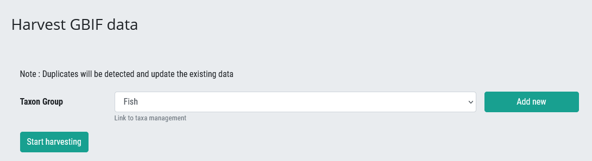
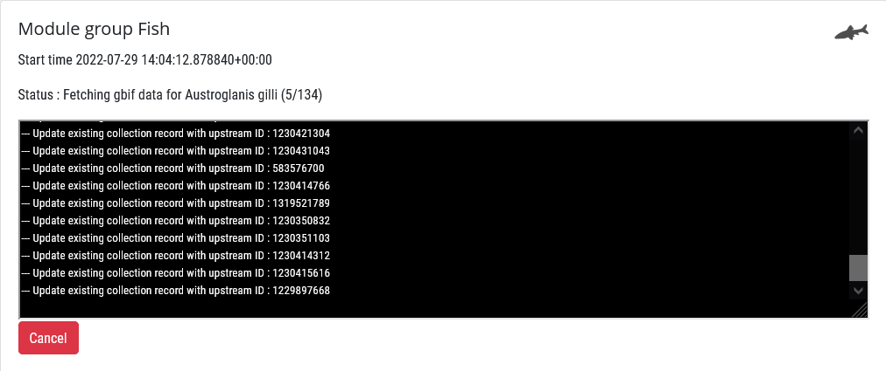

# Harvesting GBIF data

All existing taxon occurrence data are harvested per Taxon Group from the Global Biodiversity Information Facility (GBIF). This section outlines the steps for harvesting GBIF data.

Only registered users with **super user status** are able to do this, typically the administrators .

The Master List of Taxa for a Taxon Group is used to facilitate harvesting of data from GBIF, thereby ensuring that the correct taxa are included on the information system.

## Steps

Click on your profile and select **Harvest from GBIF**.

Select the Taxon Group using the dropdown and click Start harvesting.

You can keep track of progress. The more taxa in the master list, the longer the time needed for harvesting data from GBIF. You can keep it running in the background and continue with other work as it harvests the data.

You can view the GBIF data harvested via the **Download Logs**.

