# Managing BIMS Admin tables

Several backend tables can be updated and managed by administrators, including the Biodiversity Information Management System (BIMS), and are accessible via the Admin Page. Provided here, is a list of actions related to the Site Administration including the BIMS table management that an administrator (super user status) may need to edit or check. Currently, only the tables that the administrator needs to be able to revise have been described, and not all the tables in the Site Administration and BIMS. They are described chronologically as they appear in Site Administration. This document will continually need to be updated as new administration functions are added.

**Link to specific sub-sections in BIMS as well as other admin tasks:**

**Managing BIMS Admin tables**

- [Managing BIMS Admin tables](#managing-bims-admin-tables)
  - [BIMS - Biotopes](#bims---biotopes)
  - [BIMS - Chemistry units](#bims---chemistry-units)
  - [BIMS - Download request purposes](#bims---download-request-purposes)
  - [BIMS - Download requests](#bims---download-requests)
  - [BIMS - Endemism](#bims---endemism)
  - [BIMS - FBIS UUIDs](#bims---fbis-uuids)
  - [BIMS - IUCN Conservation status](#bims---iucn-conservation-status)
  - [BIMS - Location context filter group orders](#bims---location-context-filter-group-orders)
  - [BIMS - Location context filter order](#bims---location-context-filter-order)
  - [BIMS - Location context groups](#bims---location-context-groups)
  - [BIMS - Location context filters](#bims---location-context-filters)
  - [BIMS - Location sites](#bims---location-sites)
  - [BIMS - Non-biodiversity layers](#bims---non-biodiversity-layers)
  - [BIMS - Notifications](#bims---notifications)
  - [BIMS - Sampling methods](#bims---sampling-methods)
  - [BIMS - Site settings](#bims---site-settings)
  - [BIMS - Source references](#bims---source-references)
  - [BIMS - Taxa](#bims---taxa)
  - [BIMS - Taxon groups](#bims---taxon-groups)
  - [Flat pages](#flat-pages)
    - [Flat pages - about us](#flat-pages---about-us)
    - [Flat pages - citation guidelines](#flat-pages---citation-guidelines)
    - [Flat pages - Help (FBIS only)](#flat-pages---help-fbis-only)
  - [People](#people)
    - [People - Users](#people---users)

## BIMS - Biotopes

Here you manage the broad biotope categories, description and order; the specific biotope categories, description and order; and the substratum.  These biotopes are initially populated by the biodiversity data upload files, where each biotope is specified in the dropdowns. Details are provided below. Certain biotopes and substrata may be associated with one or more modules.  As more biodiversity modules are added, it may be necessary for the administrator to update biotopes.

| Module | Broad Biotope | Specific Biotope | Substratum |
| -- | -- | -- | -- |
| All | Unspecified |  |  |
| All | Mixed |  |  |
| Algae, invertebrates, anurans | Stones In Current |  |  |
| algae, invertebrates, anurans | Stones Out Of Current |  |  |
| algae, invertebrates, anurans | Marginal Vegetation |  |  |
| algae, invertebrates, anurans | Aquatic Vegetation |  |  |
| algae, invertebrates, anurans | Gravel/Sand/Mud |  |  |
| algae, invertebrates | Artificial substrate |  |  |
| Fish only | Slow-Shallow |  |  |
| Fish only | Slow-Deep |  |  |
| Fish only | Fast-Shallow |  |  |
| Fish only | Fast-Deep |  |  |
| All |  | Backwater |  |
| All |  | Bedrock |  |
| All |  | Cascade |  |
| All |  | Chute |  |
| All |  | Detritus |  |
| All |  | Mixed |  |
| All |  | Pool |  |
| All |  | Rapid |  |
| All |  | Riffle |  |
| All |  | Run |  |
| All |  | Slackwater |  |
| All |  | Unspecified |  |
| All |  | Waterfall |  |
| All |  |  | Unspecified |
| All |  |  | Mixed |
| All |  |  | Bedrock |
| All |  |  | Boulder |
| All |  |  | Cobble |
| All |  |  | Detritus |
| All |  |  | Gravel |
| All |  |  | Pebble |
| All |  |  | Sand |
| All |  |  | Silt/Mud/Clay |

If these have not been included in the data occurrence upload files, then they are blank. New biotopes can be added by clicking the “+ Add biotope”.

## BIMS - Chemistry units

Here you manage the physico-chemical data including the Chem Code (NB this needs to match the column in the physico-chemical data upload template), chem description, chem unit, whether the variable needs to be shown in abiotic form (abiotic list), minimum and maximum values. New chemistry units can be added by clicking the “+ Add chemistry unit”.

Changes can be made to each variable by clicking on the relevant Chem code and editing the appropriate field. Here one can also specify the number of decimal places.

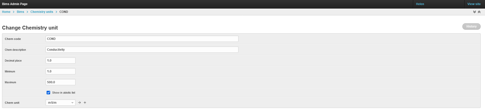

## BIMS - Download request purposes

Here you manage the download request purposes that a user chooses when requesting a download of a graph or csv file. New purposes can be added by selecting “Add download request purpose” and the sort order can be updated.

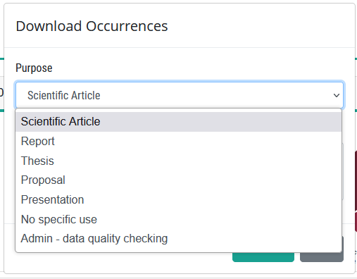

## BIMS - Download requests

Here you can see all download requests from users, including details of the requester, resource type (csv, table, chart), resource name and purpose (as specified in the download request purposes). One can find out further details of the request by clicking on the Request date link, which opens up a second form. This is useful to track the progress of the large request downloads.

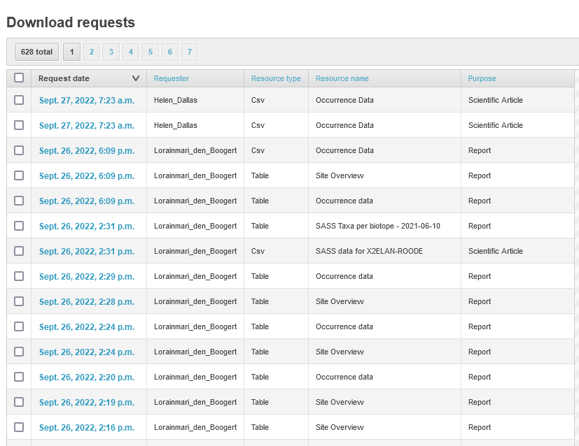

## BIMS - Endemism

Here you manage the endemism categories including the Name (what is shown on the dashboard), description and display order.  The endemism categories are added during the uploading of the taxonomic master lists. Note that if the description is used in the master list, then this will be shown on the side panel and / or dashboard. It is important to always upload the Name only.  

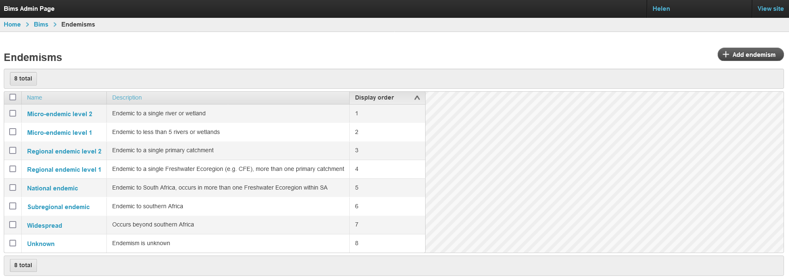

Each endemism category can be edited by clicking on the Name

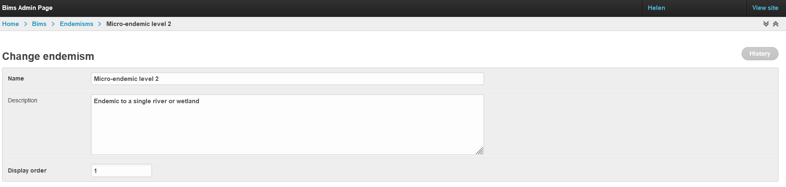

## BIMS - FBIS UUIDs

Here you can view all the uuids - this is a unique id for each occurrence record. It also allows the administrator to delete a specific record based on it uuid.

## BIMS - IUCN Conservation status

Here you can manage the Conservation status categories for global and national. Global is pulled down from the IUCN, while national is from SANBI. Status’s only applicable to national need to be opened and national checked. To change a status click on category.

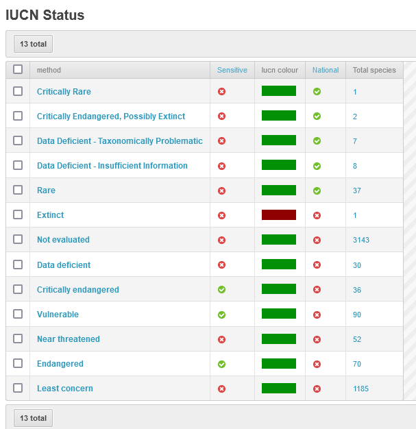

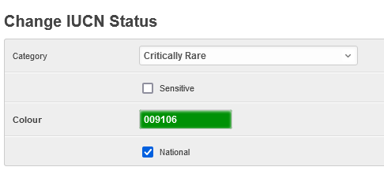

## BIMS - Location context filter group orders

Here you can manage the spatial layers shown in the side panel and dashboards, as well as the display and filter orders. This is done by clicking on the ID link, which opens up a separate form for each spatial layer.

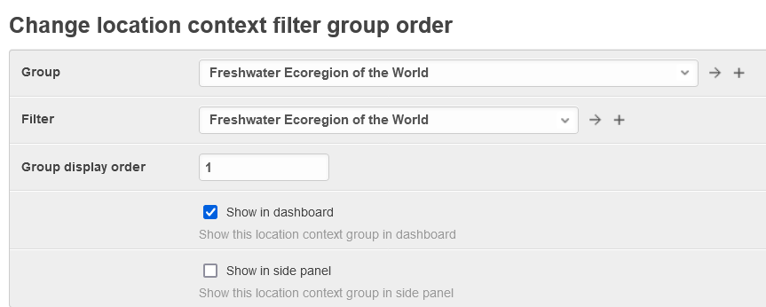

## BIMS - Location context filter order

Here you can change the display order of the spatial filters.

## BIMS - Location context groups

Here you can manage the spatial layers and groups, which relate to geocontext. Each layer can be opened to view detail.

## BIMS - Location context filters

Here you manage what is seen on the Side panel and Dashboard for a single site. Information included in the dashboards is indicated with a green tick.

To change what is displayed click the ID Number and check or uncheck the box for each. Note that there are some extra aspects that still need clarifying related to order etc.

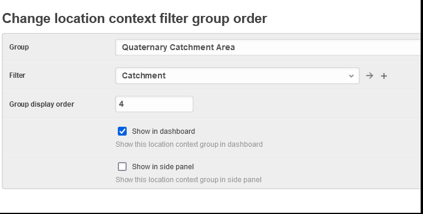

## BIMS - Location sites

Here you can view sites, filter for specific site and update site codes.

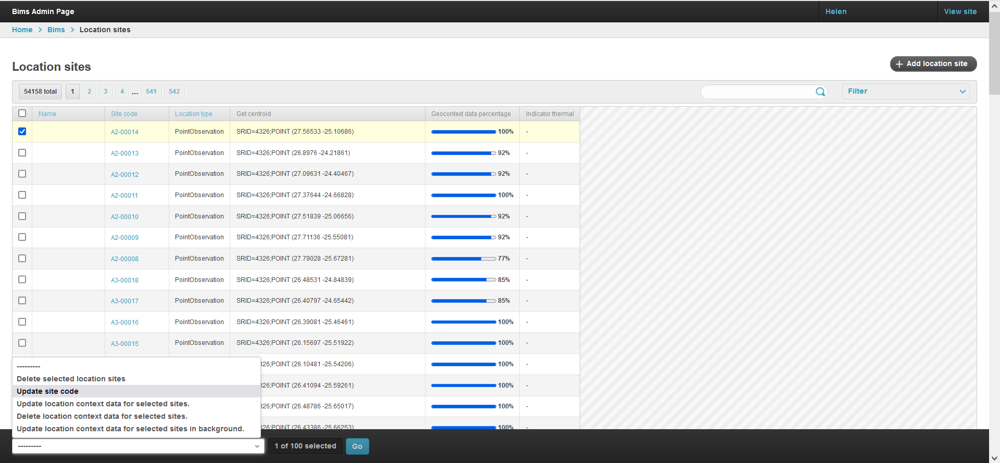

Here we are also able to update the geocontext data for each site or selection of sites.

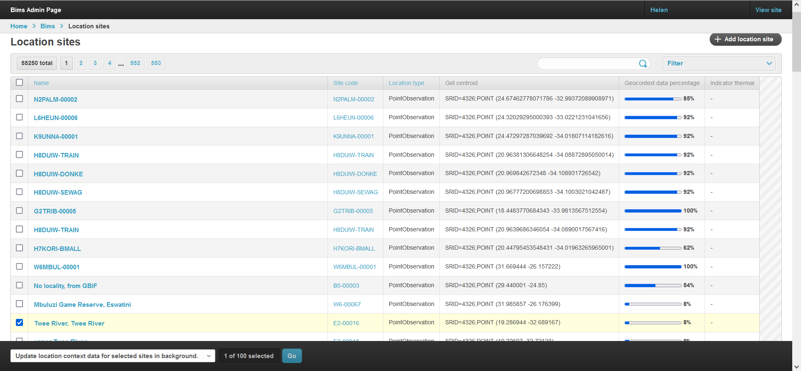

## BIMS - Non-biodiversity layers

Here you manage the order that spatial layers are shown. This includes viewing and/or editing the order, name, wms url and Wms layer name. By clicking on the order, the details of the layer can be viewed and edited. Only administrators experienced in geocontext and GGIS should edit this as it links directly to these components.

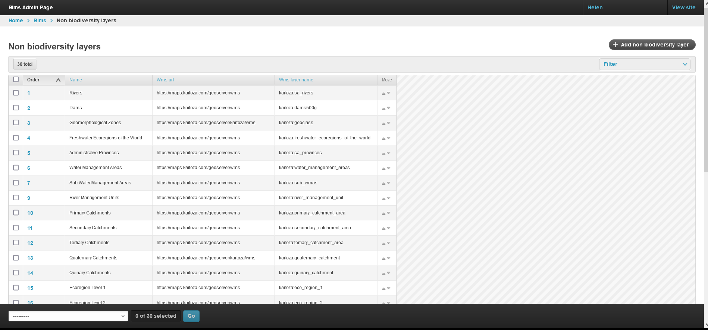

## BIMS - Notifications

`***To Be Updated***`

## BIMS - Sampling methods

Here you manage the sampling methods used for collection of biodiversity occurrence data. These sampling methods are initially populated by the biodiversity data upload files, where each sampling method is specified in the dropdowns.  Details are provided below.

For each sampling method the administrator needs to select the taxon group or groups that the method is associated with and certain sampling methods may be associated with one or more taxon groups / modules. As more biodiversity modules are added, it may be necessary for the administrator to update the sampling methods.

| Module | Sampling method |
| -- | -- |
| Invertebrates only | Baited Line |
| Invertebrates only | Box/Surber |
| Invertebrates only | Drift Net |
| Invertebrates only | Kick Net |
| Invertebrates only | Light Trap |
| Invertebrates only | Stone |
| Invertebrates, fish | Hand Net |
| Fish only | Fyke net |
| Fish only | Gill net |
| Fish only | Rod and line angling |
| Fish only | Seine net |
| Fish only | Snorkelling |
| Fish, anurans | Underwater video analysis |
| Fish, anurans | Electro-fishing |
| Fish, anurans | Visual survey |
| Anurans | Active acoustic survey |
| Anurans | Passive acoustic survey |
| Anurans | Baited trapping |
| Anurans | Non-baited survey |
| All | Unspecified |
| All | Multiple |

Changes can be made to each sampling method by clicking on the Sampling method and editing the name, order and Taxon group it is appropriate to.  To select more than one taxon group click Control Select simultaneously. If these have not been included in the data occurrence upload files, then they are blank. New sampling methods can be added by clicking the “+ Add sampling method”.

We have also added functionality to merge sampling methods, in the event that the same sampling method is added, but with a slight variation. For example:

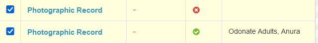

To merge these two or more sampling methods, first you need to verify the correct one, by opening the method and ticking the verify box.

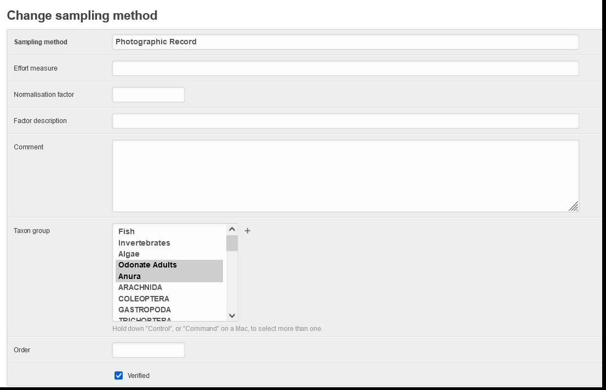

Then you use the select “Merge sampling methods” and click go.

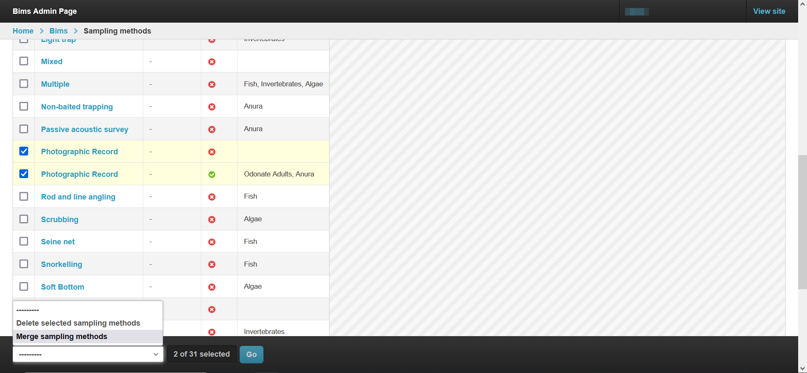

## BIMS - Site settings

Here you manage several components related to the setting of the site (i.e. webpage, url for the information systems, e.g. FBIS, RBIS, ORBIS etc.). Details of the sections that an administrator can change are provided below.

Site notice can be changed in the Site settings section.

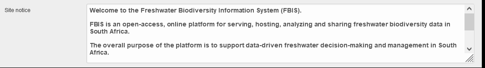

You can specify the `readme` file that is bundled with the downloaded occurrence data.

You can specify the taxonomic upload template for the Master lists. This is then downloadable on the Upload – Taxonomic data.

You can specify the occurrence upload template for the occurrence data. This is then downloadable on the Upload – Occurrence data.

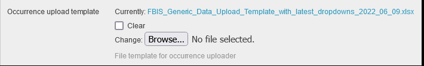

You can view and/or edit the disclaimer form text and disclaimer doc text.

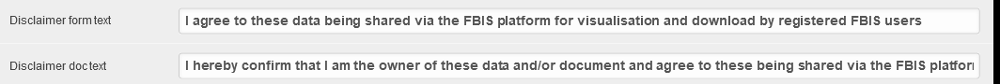

You can enable or disable the third party layer as not all information systems have links to third party data

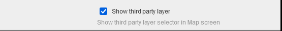

You can enable or disable sass as not all information systems have sass data

You can enable or disable water temperature data as not all information systems have water temperature data

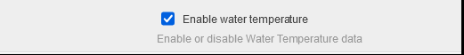

You can enable or disable download request approval. If this is disabled then the user can download the data without waiting for approval from the administrator.

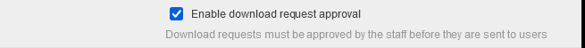

You can enable or disable the module summary on the landing page dashboard. This is not applicable to FBIS, only RBIS and ORBIS.

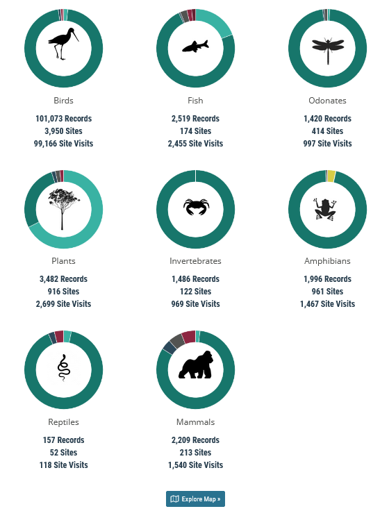

You can enable or disable the remove all occurrence tool in Taxon Management. This should never be activated on the live/production site as clicking the Remove all button, will delete all the occurrence data for the module. It can be enabled on the testing site as this allows administrators to practice the creation of new modules, uploading of taxonomic master lists and the uploading f occurrence data.

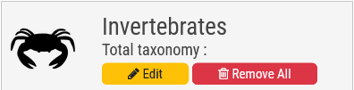

You can view and/or edit the copyright text that is visible at the bottom of the landing page.

## BIMS - Source references

Generally it is easiest to manage source references (i.e. the metadata associated with each occurrence record).

However, on occasions, issues arise whereby the source reference is duplicated, possibly because of a small typo during data capture.  In the Admin - Source references – section it is possible to merge two source references. One does this by finding the two relevant source reference, opening the correct one and selecting “Verify”, the checking the box next to the two (or more) references to be merged, and using the Merge from the dropdown lists, the Go. Note that the Source reference needs to be the same type to be able to merge.

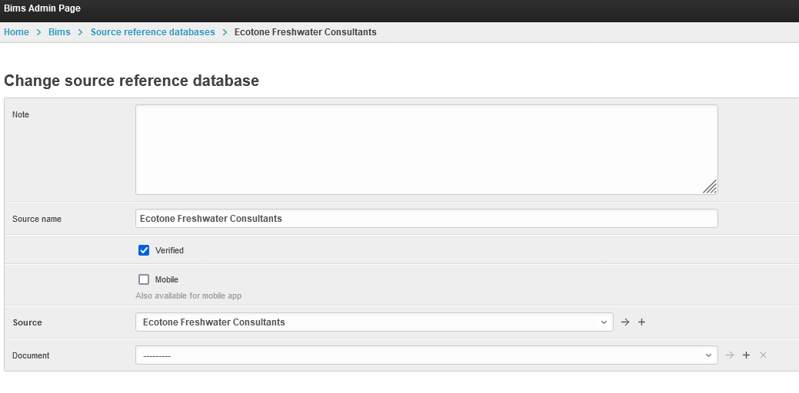

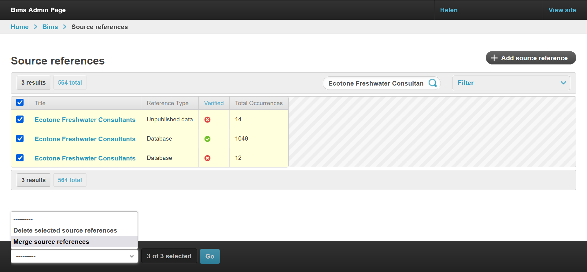

## BIMS - Taxa

Here you manage all aspects related taxa within the information system. Most of this is done easily within Taxon Management, but there are some actions that can only be done within this table, including deleting a taxon (this cannot be done if occurrence data are associated with it), merging taxa and updating taxa (when one taxon is a synonym of another).

The table includes the Canonical Name (also referred to as the "true name”), the Link to gbif, the Scientific Name, the Taxonomic Rank, the Parent, the Import date, the Taxonomic Status, the Legacy Canonical Name, and whether the taxon has been Verified.  Ultimately all taxa in the information system should be verified.

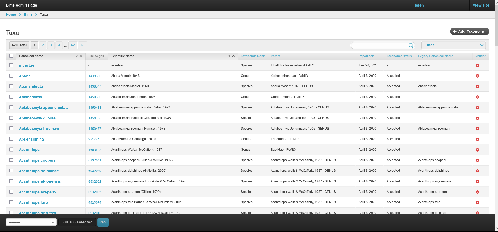

Clicking on the canonical name opens up the Change Taxonomy form for the selected species. Note that this is same as that accessed within Taxon Management.

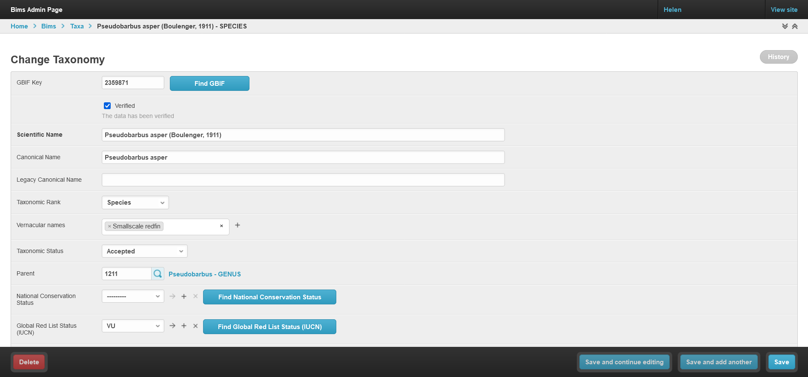

A search field and filters are also included to assist you to navigate.

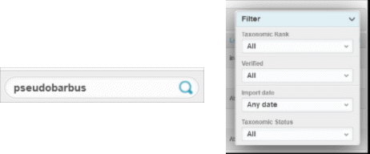

To delete a taxon, click the check box, and select Delete selected taxon, and click GO

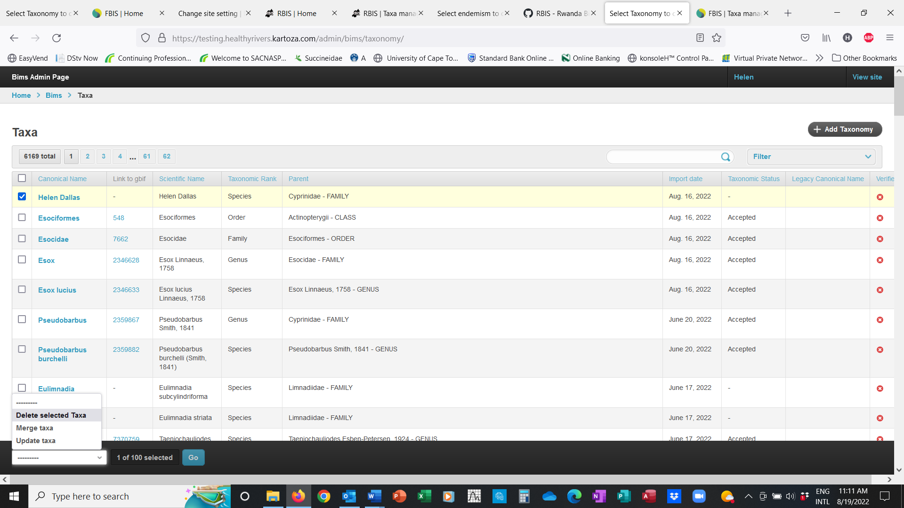

There is a check, and if you click, Yes, I am sure, then the taxon will be deleted

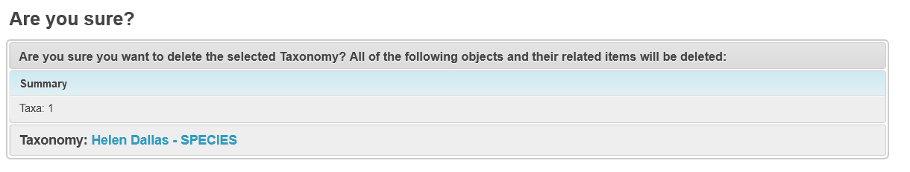

Sometimes errors are picked up in the taxa, for example there are two taxa that are the same. One the needs to merge these taxa. Prior to merging, the correct taxon needs to be checked and the verified button checked. Then to merge the two taxa, click the check box, and select Merge taxa, and click `GO`.

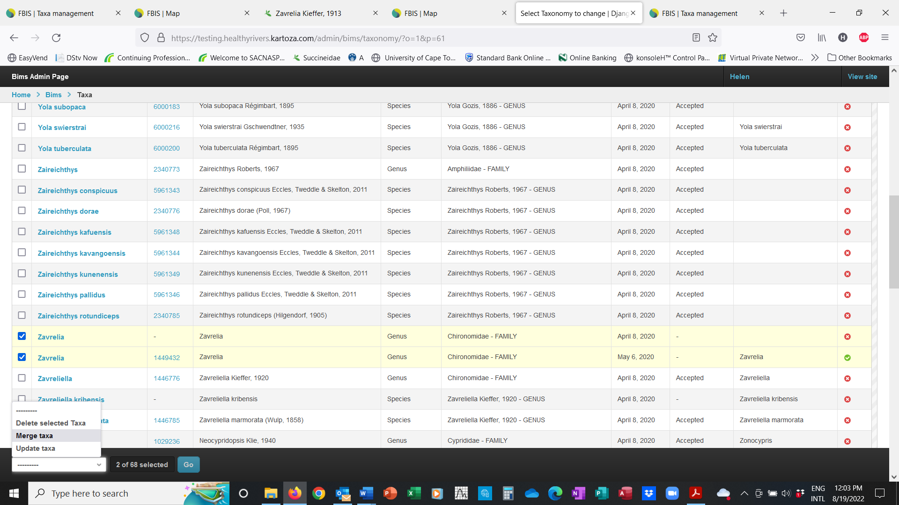

Updating is used when one wants to update a synonym with the accepted name. Prior to updating, the accepted taxon needs to be checked and the verified button checked. Then to update the synonym, click the check box of both taxa, and select Update taxa, and click GO. This functionality is currently being refined.

## BIMS - Taxon groups

Here you manage the taxon groups added to the information systems. To note is the need to add the singular name so that it is correct in the Add XXXX data form.

## Flat pages

This is access outside of the BIMS section, in Flat Pages. From here you can update the “About us”, Citation guidelines and Help page.

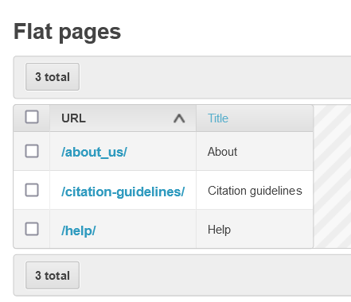

### Flat pages - about us

Text for the About Us on the menu bar can be modified here:
https://freshwaterbiodiversity.org/admin/flatpages/flatpage/3/change/

### Flat pages - citation guidelines

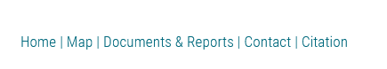

Text for the Citation on the landing page can be modified here:
https://freshwaterbiodiversity.org/admin/flatpages/flatpage/3/change/

### Flat pages - Help (FBIS only)

Text for the Help on the menu bar can be modified here:
https://freshwaterbiodiversity.org/admin/flatpages/flatpage/2/change/

Here's how to update the link to the FBIS manual:

* open this page https://freshwaterbiodiversity.org/admin/flatpages/flatpage/2/change/
* double click the user manual
        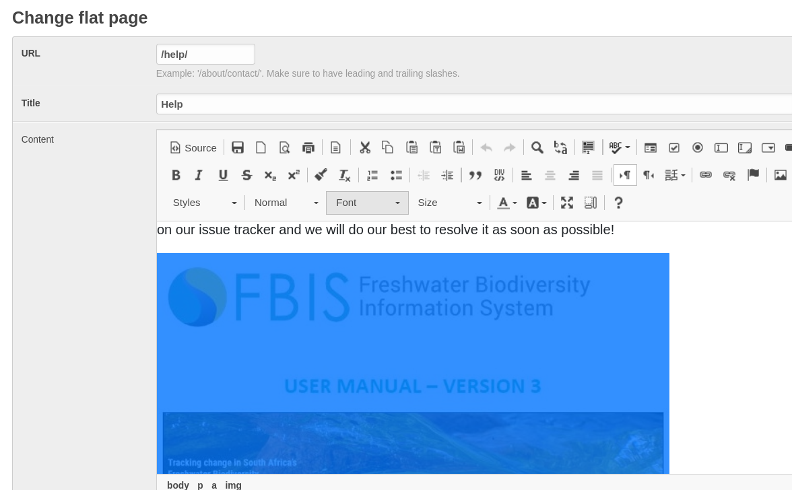
* open the Link tab, and change the url
        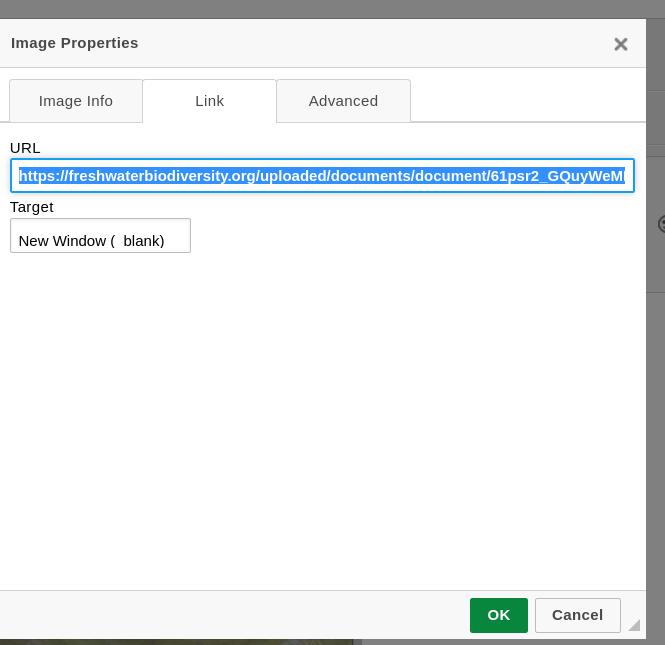
* click `Ok`, and then click `Save`

Get the url for the FBIS Manual by opening Source References and right clicking the green title, and choose 'Copy link address'. Then insert this url into the URL in the Link tab and save.

## People

### People - Users

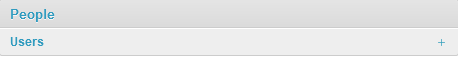

Details of all users are visible here and can be edited as needed. When a user first registers they are activated by clicking the Permission – Active box.

Several filters have been included to manage and find users

