# Preparing and checking an Occurrence Data File before uploading

## Extracting data and preparing bulk data for uploading into FBIS

FBIS includes data capture forms for adding sites, fish, invertebrate and algae data, as well as associated abiotic data. However, these forms are intended for the capture of individual site visits, and at times, especially during the development phase of an information system, it is useful to be able to upload large amounts of data at a time. To ensure that bulk data are readily uploaded into FBIS, a standardised **Data Upload Template** needs to be produced for each group. This will ensure that data are cleaned and provided in a standardised manner so that the data uploading process runs smoothly and so that the resultant FBIS platform serves quality data.

## Data Upload Templates

Standardised data upload templates in excel have been generated for four biodiversity groups, namely anurans, fish, invertebrates and algae. Additional upload templates may be added as new biodiversity modules are added. These templates include a number of dropdown attributes.  It is critical that all taxa in the Data Upload file for a particular biodiversity group are present in the Master List of Taxa for that group. If not, the upload process will not work. For this reason, it is recommended that where possible dropdown lists are used in the Data Upload files to ensure that all data entered in the sheet are valid. As an example, the Master List of fish species in South Africa has been included as dropdown list for the FBIS Fish Data Upload Template.

The following data upload templates are provided:

* <span style="color: #70ad47;">FBIS Fish Data Upload Template.xlsx</span>
* <span style="color: #70ad47;">FBIS Algae Data Upload Template.xlsx</span>
* <span style="color: #70ad47;">FBIS Invertebrate Data Upload Template.xlsx</span>
* <span style="color: #70ad47;">FBIS Anuran Data Upload Template.xlsx</span>

Many of the columns are the same for each group, although some additional columns are included for algae, and the dropdown options (e.g. biotopes) sometimes vary amongst groups. The common columns used in each group are given in Table 1. Relevant dropdown lists are provided in each template and additional group-specific columns are included in the relevant templates. <span style="color: red;">Those column headers in red have to be filled in the occurrence upload file. See section on **Check the Source Reference** for details of which columns are relevant for different reference categories.</span> Those column headers <span style="background-color:#c1ebaa;">shaded green</span> use dropdown lists in the excel file. These can be modified in the Admin page (BIMS).

**Table 1. Column headers with details used in data upload templates**

| Column Header | Details |
| -- | -- |
| <span style="color: red;">UUID</span> | A unique identifier for each record. Drag and copy the formula down. |
| Original River or Wetland Name | Name given in study reference |
| Original Site Code | Site Code given in study reference |
| Site Code | Leave blank (autogenerated) |
| Site description | Description given in study reference |
| <span style="background-color:#c1ebaa;">Refined Geomorphological Zone| As given in study reference (if available) - Select from dropdown options |
| <span style="color: red;">Latitude | Decimal degrees with "-" in front & "," for decimal point |
| <span style="color: red;">Longitude | Decimal degrees with "," for decimal point |
| <span style="color: red;">Sampling Date | yyyy/mm/dd |
| Kingdom | Not necessary to fill in as they are derived from the Master Lists |
| Phylum | Not necessary to fill in as they are derived from the Master Lists |
| Class | Not necessary to fill in as they are derived from the Master Lists |
| Order | Not necessary to fill in as they are derived from the Master Lists |
| Family | Not necessary to fill in as they are derived from the Master Lists |
| Genus | Not necessary to fill in as they are derived from the Master Lists |
| Species | Not necessary to fill in as they are derived from the Master Lists |
| <span style="color: red;">Taxon |  |
| <span style="background-color:#c1ebaa;">Taxon rank | Select from dropdown options |
| <span style="color: red;">Present | Fill in with "1" |
| <span style="background-color:#c1ebaa;">Sampling method | Select from dropdown options |
| <span style="background-color:#c1ebaa;">Sampling effort measure | Select from dropdown options |
| Sampling effort value |  |
| <span style="background-color:#c1ebaa;">Abundance measure | Select from dropdown options |
| Abundance value | Leave blank if only presence data |
| <span style="background-color:#c1ebaa;">Record type | Select from dropdown options |
| <span style="background-color:#c1ebaa;">Broad biotope | Select from dropdown options |
| <span style="background-color:#c1ebaa;">Specific biotope | Select from dropdown options |
| <span style="background-color:#c1ebaa;">Substratum | Select from dropdown options |
| <span style="background-color:#c1ebaa;">Water Level | Select from dropdown options |
| <span style="background-color:#c1ebaa;">Water Turbidity | Select from dropdown options |
| <span style="background-color:#c1ebaa;">Embeddedness | Select from dropdown options |
| Depth | Depth (m) |
| Near Bed Velocity | Near Bed Velocity (m/s) |
| COND | Conductivity (mS/cm) |
| PH | PH |
| DOPER | Dissolved Oxygen (%) |
| DO | Dissolved Oxygen (mg/L) |
| TEMP | Temperature (deg C) |
| TURB | Turbidity (NTU) |
| <span style="color: red;">Collector/Owner | Full name |
| <span style="color: red;">Collector/Owner Institute | Institute of collector/owner |
| <span style="color: red;">Author(s) | Surname + Initials |
| <span style="color: red;">Year | Year of study |
| <span style="color: red;">Source | Source of data if from thesis or database |
| <span style="color: red;">Title | Title of data source if thesis or published report |
| <span style="color: red; background-color:#c1ebaa;">Reference category | Select from dropdown options |
| <span style="color: red;">URL | Thesis handle, or article link if no DOI available |
| <span style="color: red;">DOI | DOI for reference ( e.g. 10.2989/16085914.2018.1491385) |
| <span style="color: red;">Document Upload Link | Link to "Documents" page on FIBbio after uploading PDF of published report |
| Notes | Any details related to sampling, species, life form etc. |

It is recommended that separate data upload files be created for each Source Reference, with each linked to a GitHub ticket. This ensures accurate management of data preparation and management.

## Preparing and checking an Occurrence Data File

To ensure that data are accurate, several steps should be taken before uploading occurrence data.  After consolidating the occurrence data in the data file, you should check the following:

**Apply filters for checking the data by highlighting the header row**, clicking **Data, Filter**


**UUID:** This is a unique id for each occurrence record. It needs to be copied and pasted so that the formula used to generate it is saved as a number.

**The UUID formula is available here:**
```
=LOWER(CONCATENATE(DEC2HEX(RANDBETWEEN(0,POWER(16,8)),8),"-",DEC2HEX(RANDBETWEEN(0,POWER(16,4)),4),"-","4",
DEC2HEX(RANDBETWEEN(0,POWER(16,3)),3),"-",DEC2HEX(RANDBETWEEN(8,11)),DEC2HEX(RANDBETWEEN(0,POWER(16,3)),3),
"-",DEC2HEX(RANDBETWEEN(0,POWER(16,8)),8),DEC2HEX(RANDBETWEEN(0,POWER(16,4)),4)))
```

Systematically check each column using the dropdown arrows, and look for inconsistencies. Some common issues include, #num in UUID column instead of the UUID, incorrect spelling in the **Site description** column (e.g. Gakiriro wetland, Gakirirowetland), latitude with missing “-“  (e.g. 2.60059 as latitude is incorrect – should be -2.60059), longitude.

Also check that all sites fall within the country boundary so that Site Codes may be generated correctly and geocontext data harvested for each site.

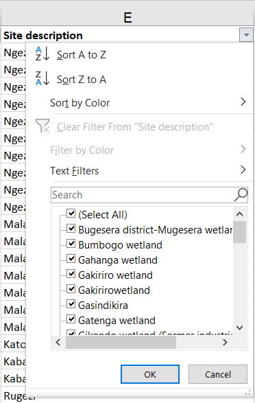
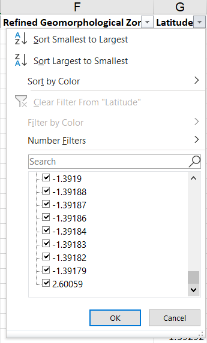

**Check that the sampling date** is in the correct format: yyyy/mm/dd. If the format is not correct then the upload will not work.

**Check that all taxa are correct and are present in the Master List.** If the dropdown of master taxa list was used then this should not be an issue.  Check that the Taxon rank is correct. It is important that the correct Taxon Rank is always used to ensure correct uploading of the data files. Taxon Rank is case sensitive so Species will upload but species will fail. Always ensure the correct Taxon Rank is applied by using the dropdown list. There should be no spaces in SubClass, SubOrder, SubFamily, SubSpecies.

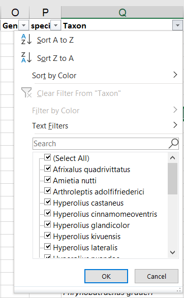

**Check presence** is all “1”, check **sampling method** is correct.

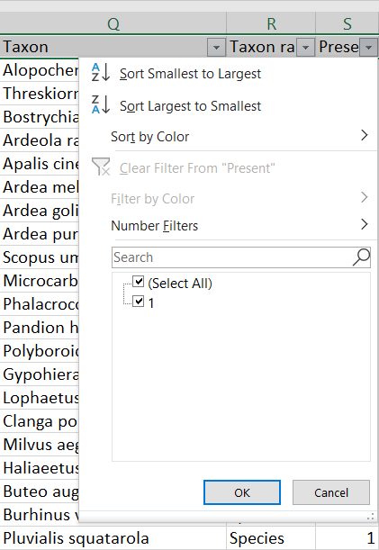


**Check Collector/Owner and Collector/Owner Institute.** Ideally CAPITALS should not be used, First name Surname if known. Do not use middle initial and punctuation.

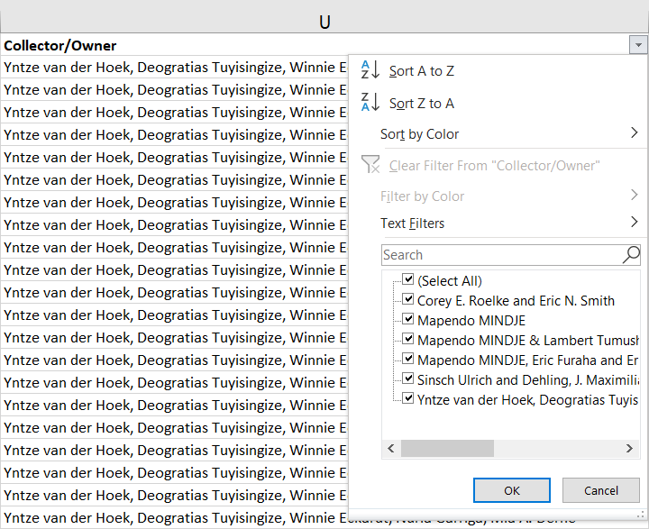

**Check the Source Reference** (Author(s), Year, Source, Title, Reference category, URL, DOI, Document Upload Link). For each study reference type, you need to populate the following columns:

* Peer-reviewed scientific article (Collector/Owner; Collector/Owner Institute; Author(s); Year; Source; Title; DOI or URL (if DOI is not available)). For Peer-reviewed scientific article the Source is the Journal, For Peer-reviewed scientific article the Title is the title of the article.
* Published report (Collector/Owner; Collector/Owner Institute; Author(s); Year; Source; Title; URL or Document Upload Link). Note the Document Upload Link is obtained after the report is added.
* Thesis (Collector/Owner; Collector/Owner Institute; Author(s); Year; Source; Title; URL or Document Upload Link)
* Database (Collector/Owner; Collector/Owner Institute; Author(s); Year; Source)
* Unpublished data (Collector/Owner; Collector/Owner Institute; Author(s); Year; Source)

**Check format of Author(s).** It needs to be: Surname + Initials, no punctuation.  (e.g. Tumushimire L, Mindje M,  Sinsch U & Dehling JM not Lambert Tumushimire, Mapendo MINDJE,  Prof. Ulrich Sinsch & Julian Maxmillian Dehling). It is important to get the authors correct (e.g. Sinsch Ulrich and Dehling, J. Maximilian, Lümkemann Katrin, Rosar Katharina, Christiane Schwarz should be Sinsch U, Lümkemann K, Rosar K, Schwarz C & Dehling M as per the doi).

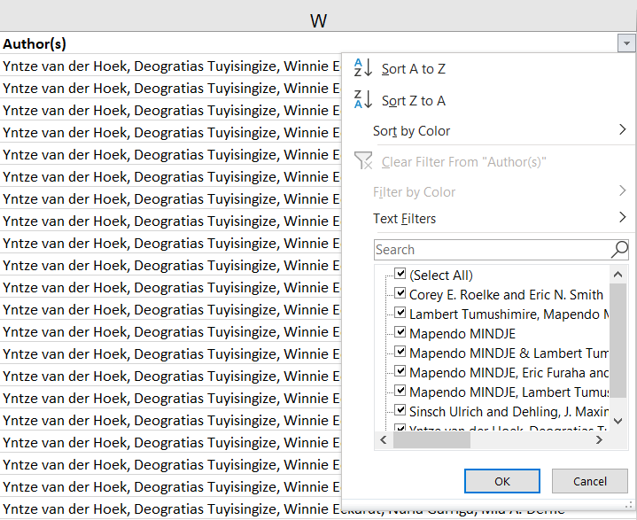

**Check the Date:** This is the publication date (so 2012-2013 should be 2019 as this is when the article was published - Ecology and Evolution. 2019. Same with all other data from this study).


**Check the Source.** Please note when to include source or not, and what to include.  (e.g. Mindje, M., Tumushimire, L., & Sinsch, U. (2020). Diversity assessment of anurans in the Mugesera wetland (eastern Rwanda): impact of habitat disturbance and partial recovery. Salamandra, 56, 27-38. Should be **Salamandra**)

* For Peer-reviewed scientific articles - the Source is the Journal.
* For Published Reports and Theses - the Source is the publisher of the Report.
* For Unpublished Data - the source is the title of the study.

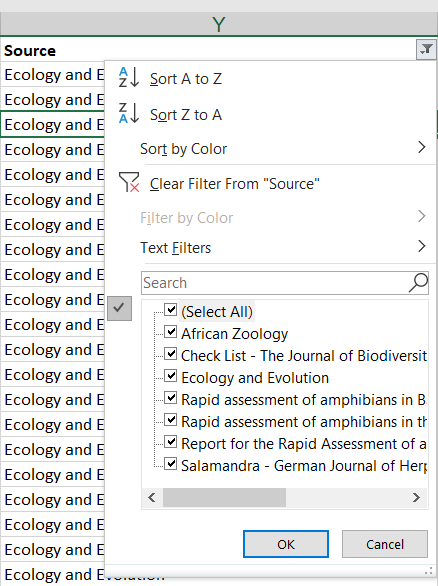

**Check the Title.** For Peer-reviewed scientific article the Title is the title of the article, for Published reports or theses, it is the title of the thesis.  Unpublished data don’t need a title.

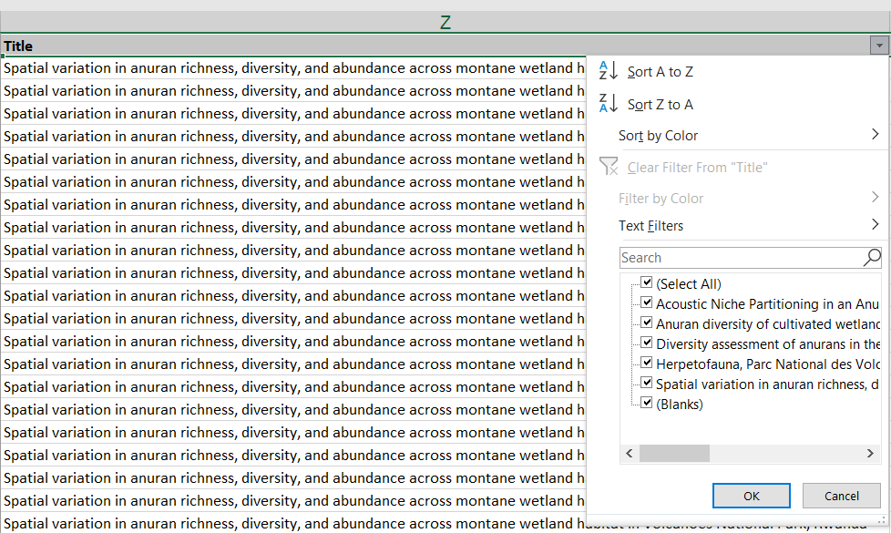

**Check all Reference Categories** are correct: options include:

* Database
* Peer-reviewed scientific article
* Published report
* Thesis
* Unpublished data


**Check URL and DOI.** Use a DOI if it is available, URL – only needed for Peer-reviewed scientific article if there is no DOI. For the DOI you only need to include the number part, so 10.1080/15627020.2012.11407524, not https://doi.org/10.1080/15627020.2012.11407524.  


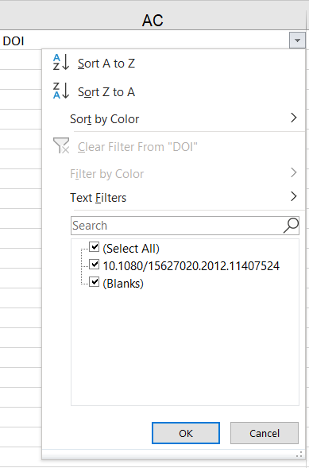

**Check the document upload link is correct.** Note the Document Upload Link is obtained after the report is added. Reports are only uploaded when there is no DOI or URL to link the data to.

**Checking for duplicate occurrence records.** Use this formula for checking for duplicates. This is a combination of Site description, latitude, longitude, sampling date, Taxon, sampling method, author, year, source and title.  Copy and paste the formula below into a new column at the end and name it “Duplicate check”.

```
=CONCATENATE(E2,G2,H2,I2,Q2,T2,W2,X2,Y2,Z2)
```

Then copy and paste the formula down to the end of the data rows. Then Highlight the column, and from the Home menu, select **Conditional Formatting, Highlight Cells Rules, Duplicate Values**.


Any duplicates will be highlighted. Check and delete duplicate occurrence records. Then delete the Duplicate Check column.

**Delete blank rows and columns**. Lastly, ensure that there are no extra blank rows or columns, by deleting them.


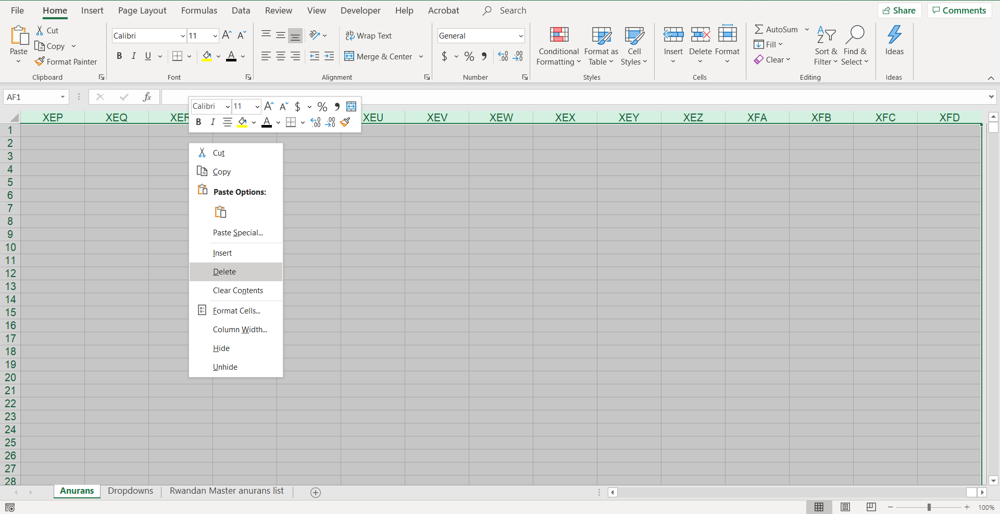

Remove the data filter, save the file in excel, and save the file as csv file.

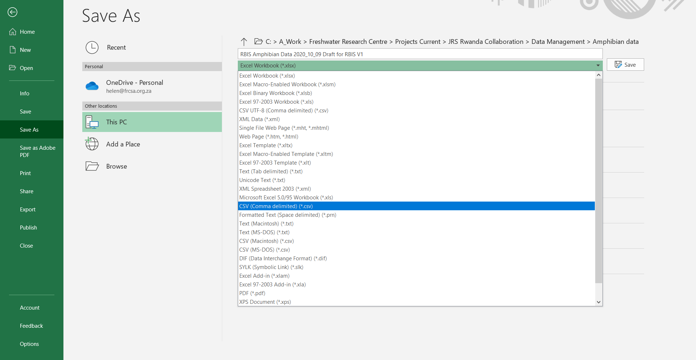
