# Adding physico-chemical data

This section explains how an administrator or user adds physico-chemical data to a site or prepares an excel template for bulk uploading of physico-chemical data for multiple sites and or sampling dates.  In either case it is important to note that physico-chemical data can only be added for a specific variable, if that variable already exists in the Admin/Bims/Chemistry units table. If the variable is missing from this table, it will not show in the list and the upload will fail. This is described in detail in a separate document: [11. Managing BIMS Admin tables](./manage-admin-tables.md)

## Adding physico-chemical data to a single site

A data capture form has been added for uploading physico-chemical data to a single site. The user needs to follow the following steps:

* Select the Date
* Select the Owner
* Select Source Reference by using search filter and selecting.
* Add specific variables by checking the **Measured** box and adding the value of each variable. Note all units have been standardised and users need to convert to these standard unit before capturing the data. Minimum and maximum values have also been included for data integrity checks.
* Click “I agree to these data being shared via the RBIS platform for visualisation and download by registered FBIS/RBIS users” and Submit.

**Adding physico-chemical data.**

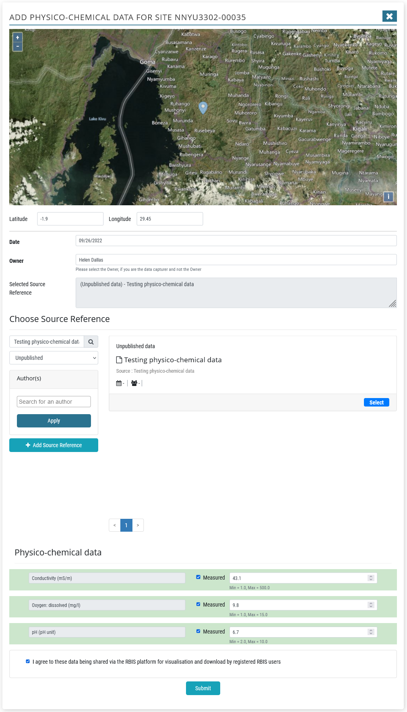

## Preparing and checking a physico-chemical data file before uploading

A physico-chemical template has been created for uploading physico-chemical records for multiple sites and sampling dates. Each line represents a unique Site-Sampling date. The template provided includes the full list of variables currently in the FBIS system, however these can be modified for the needs of the RBIS.

Here is the full list of columns included in the physico-chemical template. It resembles the occurrence data upload template for the more generic column headers.

| UUID |
| -- |
| Original Wetland Name |
| Original Site Code |
| Site Code |
| Site description |
| Latitude |
| Longitude |
| Sampling Date |
| Collector/Owner |
| Collector/Owner Institute |
| Author(s) |
| Year |
| Source |
| Title |
| Reference category |
| URL |
| DOI |
| Document Upload Link |
| Notes |

Proceeding this is each variable (with the header as the **Chem code**), each in a separate column.  Here is the master list of physico-chemical variables currently in FBIS, giving the Chem code, description and unit of measurement.

| Chem code | Chem description | Unit |
| -- | -- | -- |
| AL | Aluminium | mg/l |
| AS | Arsenic | mg/l |
| B | Boron | mg/l |
| BA | Barium | mg/l |
| BE | Beryllium | mg/l |
| BOD | Biological Oxygen Demand | mg/l (5 days) |
| CA | Calcium | mg/l |
| CACO3 | Total hardness | mg/l |
| CD | Cadmium | mg/l |
| CL | Chloride | mg/l |
| CO | Cobolt | mg/l |
| CO3 | Carbonate | mg/l |
| COD | Chemical Oxygen Demand | mg/l |
| COL | Colour | APHA units |
| COND | Conductivity | mS/m |
| CR | Chromium | mg/l |
| CU | Copper | mg/l |
| DIN | Nitrogen: dissolved inorganic (NH4+NO3+NO2)-N | mg/l |
| DO | Oxygen: dissolved | mg/l |
| DOC | Carbon: dissolved organic | mg/l |
| DON | Nitrogen: dissolved organic | mg/l |
| DOPER | Oxygen: dissolved: percentage saturation | % |
| ECOLI | Coliforms: Escherichia coli (E. coli) | Cfu/100ml |
| F | Fluoride | mg/l |
| FAECAL C | Coliforms: Total faecal colifoms | Cfu/100ml |
| FE | Iron | mg/l |
| HCO3 | Bicarbonate | mg/l |
| HG | Mercury | mg/l |
| K | Potassium | mg/l |
| KJN | Nitrogen: kjeldahl | mg/l |
| MG | Magnesium | mg/l |
| MN | Manganese | mg/l |
| MO | Molybdenum | mg/l |
| NA | Sodium | mg/l |
| NH3-N | Nitrogen: ammonia | mg/l |
| NH4-N | Nitrogen: ammonium | mg/l |
| NI | Nickel | mg/l |
| NO2-N | Nitrogen: nitrite | mg/l |
| NO2+NO3-N | Nitrogen: Nitrate + nitrite | mg/l |
| NO3-N | Nitrogen: nitrate | mg/l |
| PB | Lead | mg/l |
| pH | pH |  |
| PHALK | Alkalinity: phenolthalein | meq/l |
| PHEN | Phenols | mg/l |
| PO4-P | Phosphorus: orthophosphate | mg/l |
| POM | Particulate organic matter | mg/l |
| SALINITY | Salinity | % |
| SD | Secchi depth | m |
| SIO2 | Silica | mg/l |
| SIO4 | Orthosilicate | mg/l |
| SO4 | Sulphate | mg/l |
| SR | Strontium | mg/l |
| SRP | Phosphorus: soluble reactive | mg/l |
| TAL | Alkalinity: total | meq/l |
| TDS | Total dissolved solids | mg/l |
| TEMP | Temperature | deg C |
| TI | Titanium | mg/l |
| TIC | Carbon: total inorganic | mg/l |
| TIN | Nitrogen: total inorganic | mg/l |
| TOC | Carbon: total organic | mg/l |
| TORGS | Total suspended solids: organics | mg/l |
| TORGS% | Total suspended solids: organic fraction (%) | % |
| TOT-N | Nitrogen: total | mg/l |
| TOT-P | Phosphorus: total | mg/l |
| TSS | Total suspended solids | mg/l |
| TURB | Turbidity | NTU |
| V | Vanadium | mg/l |
| ZN | Zinc | mg/l |
| ZR | Zirconium | mg/l |

The data is added to the physico-chemical template and checked for accuracy in the same way that biodiversity occurrence data are checked prior to uploading. To ensure that data are accurate, several steps should be taken before uploading physico-chemical data.  After consolidating the physico-chemical data in the data file, you should check the following:

**Apply filters for checking the data by highlighting the header row**, clicking **Data, Filter**

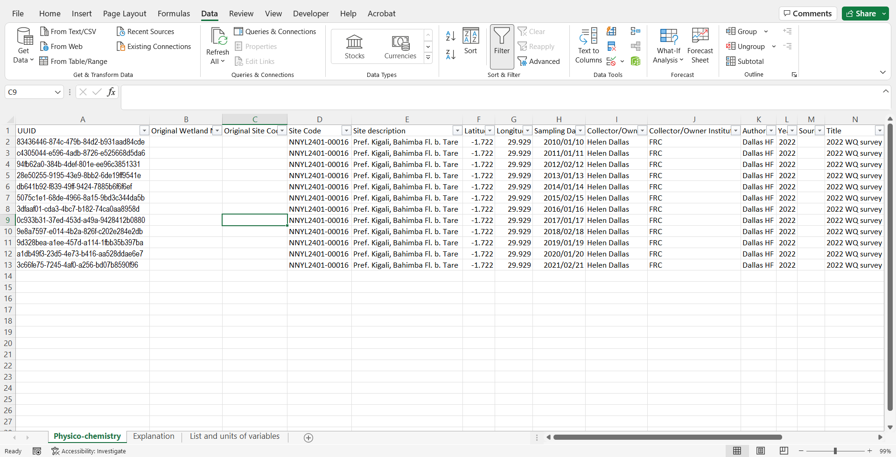

**UUID**. This is a unique if for each occurrence record. It needs to be copied and pasted so that the formula used to generate it is saved as a number. See below for guidance.  [https://docs.rbis.kartoza.com/batch-importing-taxon-occurrence-data-bims/dealing-unique-identifiers/](https://docs.rbis.kartoza.com/batch-importing-taxon-occurrence-data-bims/dealing-unique-identifiers/)

**The UUID formula is available here**:

```
=LOWER(CONCATENATE(DEC2HEX(RANDBETWEEN(0,POWER(16,8)),8),"-",DEC2HEX(RANDBETWEEN(0,POWER(16,4)),4),"-","4",
DEC2HEX(RANDBETWEEN(0,POWER(16,3)),3),"-",DEC2HEX(RANDBETWEEN(8,11)),DEC2HEX(RANDBETWEEN(0,POWER(16,3)),3),
"-",DEC2HEX(RANDBETWEEN(0,POWER(16,8)),8),DEC2HEX(RANDBETWEEN(0,POWER(16,4)),4)))
```

Systematically check each column using the dropdown arrows, and look for inconsistencies. Some common issues include, #num in UUID column instead of the UUID, incorrect spelling in the **Site description** column (e.g. Gakiriro wetland, Gakirirowetland), latitude with missing “-“  (e.g. 2.60059 as latitude is incorrect – should be -2.60059), longitude.

Also check that all sites fall within the country boundary so that Site Codes may be generated correctly and geocontext data harvested for each site.


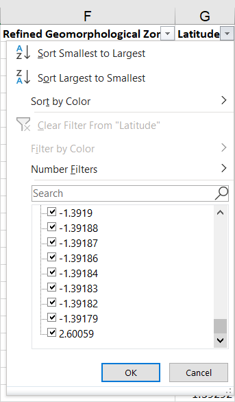

**Check Sampling date is in the correct format** : yyyy/mm/dd

**Check that all Chem codes** are correct and are present in the Chemistry units table.  New variables can be added. See Managing BIMS Admin tables – Chemistry tables.

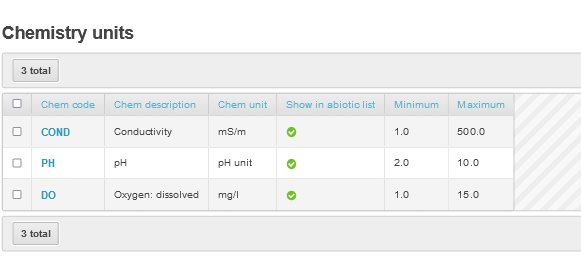

**Check** that all variables have been converted to their correct **unit of measurement**.

**Check Collector/Owner and Collector/Owner Institute**. Ideally CAPITALS should not be used, First name Surname if known. Do not use middle initial and punctuation.

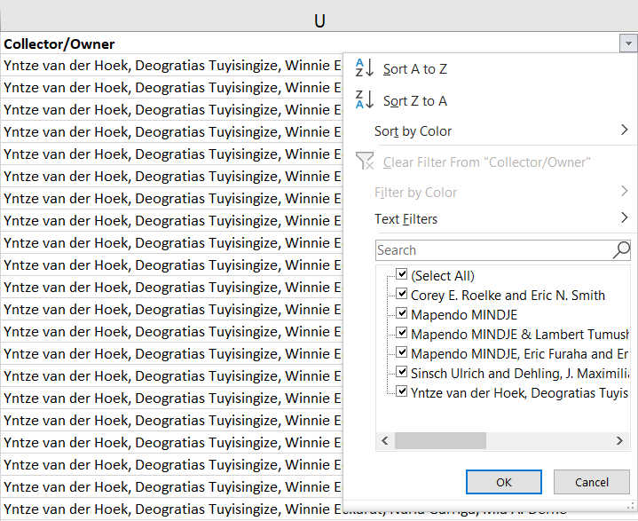

**Check the metadata** (Author(s), Year, Source, Title, Reference category, URL, DOI, Document Upload Link).  For each study reference type, you need to populate the following columns:

* Peer-reviewed scientific article (Collector/Owner; Collector/Owner Institute; Author(s); Year; Source; Title; DOI or URL (if DOI is not available)). For Peer-reviewed scientific article the Source is the Journal, For Peer-reviewed scientific article the Title is the title of the article.
* Published report (Collector/Owner; Collector/Owner Institute; Author(s); Year; Source; Title; URL or Document Upload Link). Note the Document Upload Link is obtained after the report is added.
* Thesis (Collector/Owner; Collector/Owner Institute; Author(s); Year; Source; Title; URL or Document Upload Link)
* Database (Collector/Owner; Collector/Owner Institute; Author(s); Year; Source)
* Unpublished data (Collector/Owner; Collector/Owner Institute; Author(s); Year; Source)

**Check format of Author(s)**. It needs to be: Surname + Initials, no punctuation.  (e.g. Tumushimire L, Mindje M,  Sinsch U & Dehling JM not Lambert Tumushimire, Mapendo MINDJE,  Prof. Ulrich Sinsch & Julian Maxmillian Dehling). It is important to get the authors correct (e.g. Sinsch Ulrich and Dehling, J. Maximilian, Lümkemann Katrin, Rosar Katharina, Christiane Schwarz should be Sinsch U, Lümkemann K, Rosar K, Schwarz C & Dehling M as per the doi).

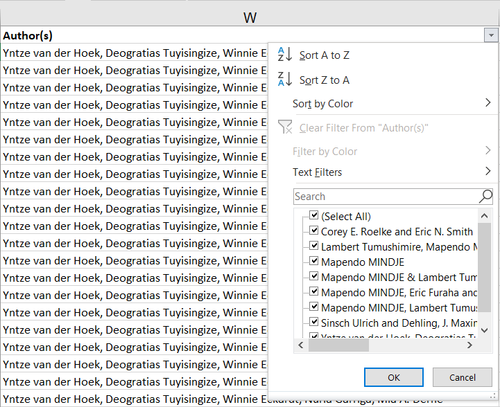

**Check the Date**: This is the publication date (so 2012-2013 should be 2019 as this is when the article was published - Ecology and Evolution. 2019. Same with all other data from this study).


**Check the Source**. Please note when to include source or not, and what to include.  (e.g. Mindje, M., Tumushimire, L., & Sinsch, U. (2020). Diversity assessment of anurans in the Mugesera wetland (eastern Rwanda): impact of habitat disturbance and partial recovery. Salamandra, 56, 27-38. Should be **Salamandra**)

* For Peer-reviewed scientific articles - the Source is the Journal.
* For Published Reports and Theses - the Source is the publisher of the Report.
* For Unpublished Data - the source is the title of the study.

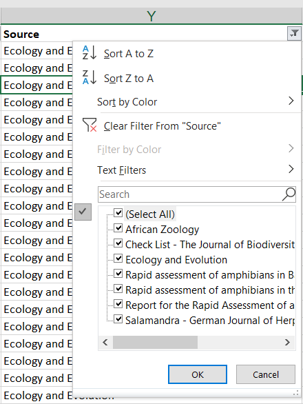

**Check the Title**. For Peer-reviewed scientific article the Title is the title of the article, for Published reports or theses, it is the title of the thesis.  Unpublished data don’t need a title.

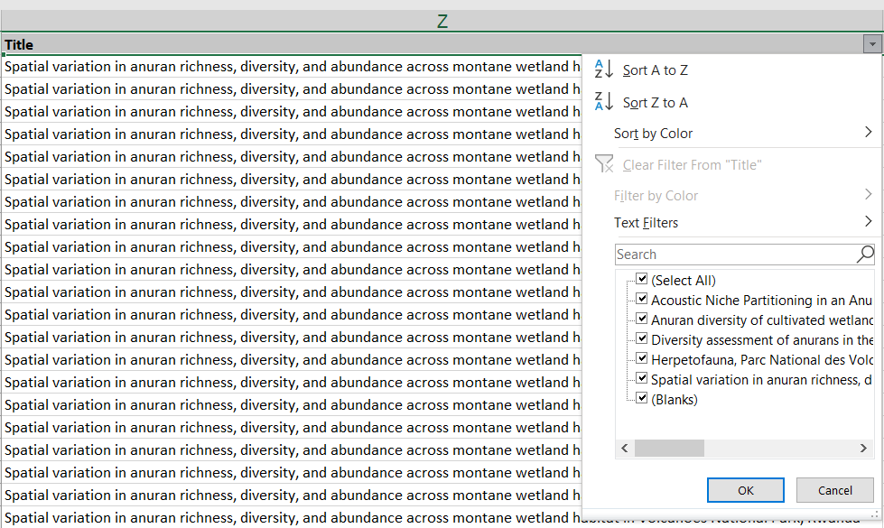

**Check all Reference Categories** are correct: options include:

* Database
* Peer-reviewed scientific article
* Published report
* Thesis
* Unpublished data


**Check URL and DOI**.  Use a DOI if it is available, URL – only needed for Peer-reviewed scientific article if there is no DOI. For the DOI you only need to include the number part, so 10.1080/15627020.2012.11407524, not https://doi.org/10.1080/15627020.2012.11407524.


**Check the document upload link is correct**. Note the Document Upload Link is obtained after the report is added. Reports are only uploaded when there is no DOI or URL to link the data to.

[Checking for duplicate occurrence records](https://docs.rbis.kartoza.com/batch-importing-taxon-occurrence-data-bims/dealing-unique-identifiers/). Use this formula for checking for duplicates. This is a combination of Site description, latitude, longitude, sampling date, Chem code, author, year, source and title.  Copy and paste the formula below into a new column at the end and name it “Duplicate check”.

```
=CONCATENATE(E2,G2,H2,I2,Q2,T2,W2,X2,Y2,Z2)
```

Then copy and paste the formula down to the end of the data rows. Then Highlight the column, and from the Home menu, select **Conditional Formatting, Highlight Cells Rules, Duplicate Values**.

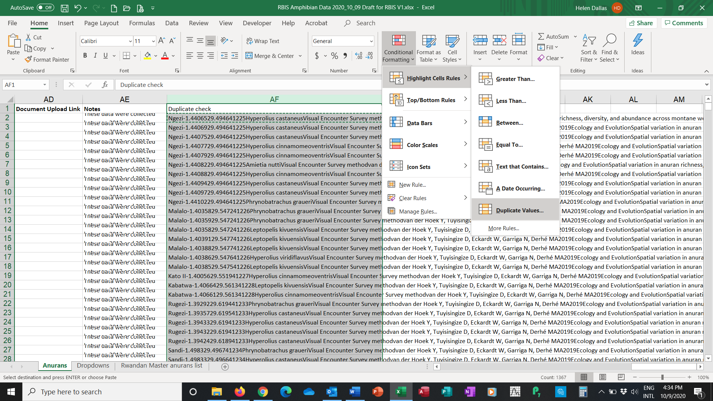

Any duplicates will be highlighted. Check and delete duplicate occurrence records. Then delete the Duplicate Check column.

**Delete blank rows and columns**. Lastly, ensure that there are no extra blank rows or columns, by deleting them.

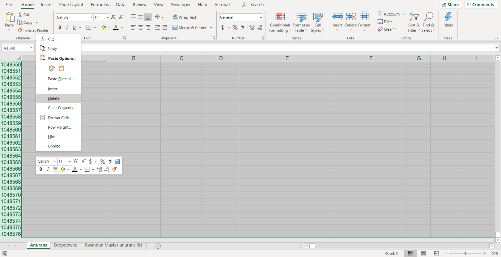

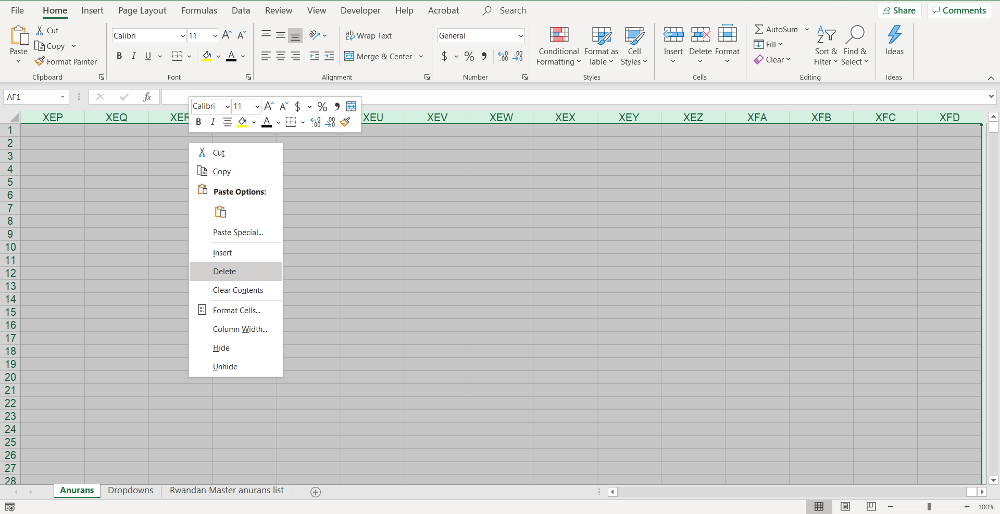

Remove the data filter, save the file in excel, and save the file as csv file.


## Uploading a physico-chemical data file

**Go to Profile – Upload Physico-chemical data**


This opens the Upload Physical Chemical Data form.  Browse to the correct file and click upload.


On completion the following success file is shown.

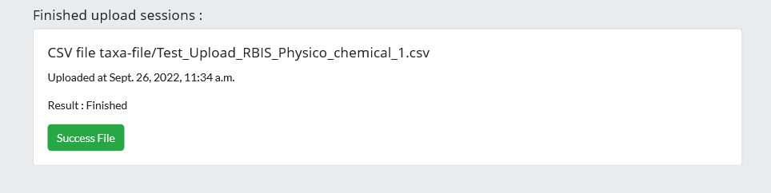
