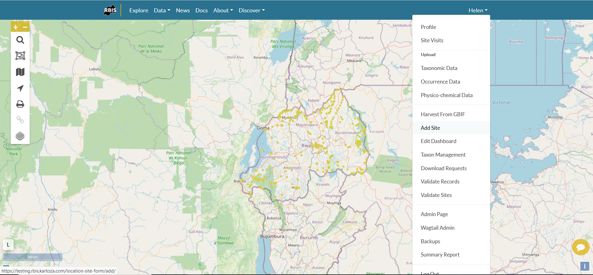
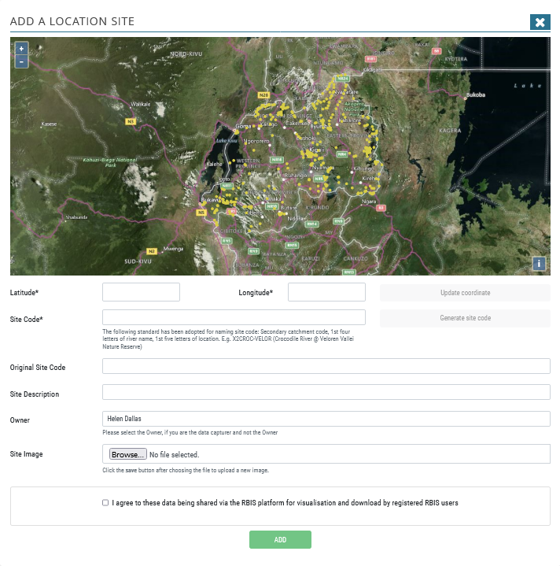
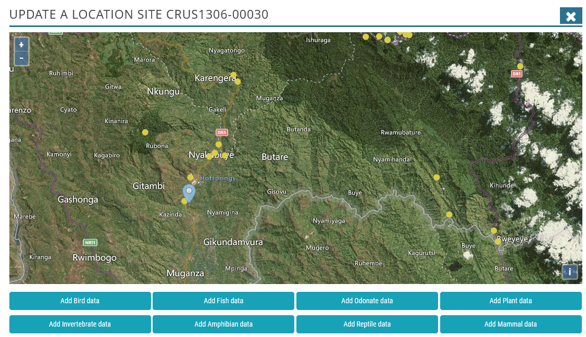
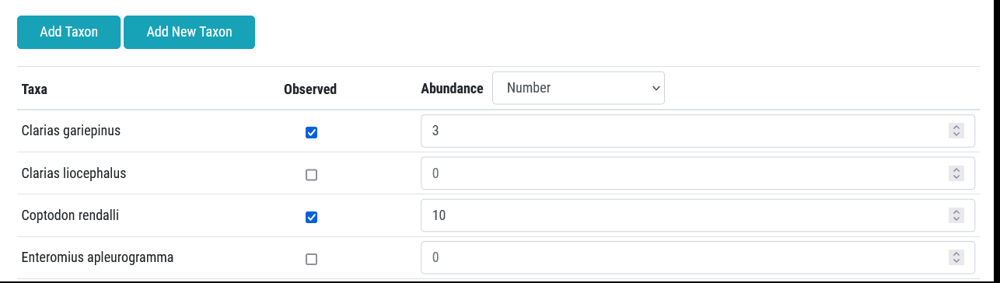
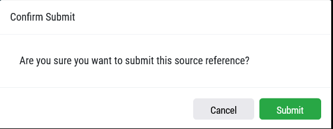

# Adding a site and biodiversity data

This section explains how an administrator or user adds a site and data to a site.

## Adding a site

An administrator or user can add a new site using the Add Site button on the menu bar.

This opens the Add a Location Site form:

The user then adds the latitude and longitude by inserting the co-ordinates or clicking on correct location on the map, click Generate Site Code. This is automated and includes the Catchment + Province ID +District ID + Site count.

An original site code can also be added if this was included in the source reference, as well as a description of the site. The owner is specified using the dropdown if the logged in user is not the owner. Site images can be added. Lastly, the user agrees to these data being shared via the RBIS platform for visualisation and download by registered RBIS users, and click Add. The new site is thus created.

## Adding new biodiversity records

New occurrence data can be added from both the site form and by using the **+ Add** on the side panel.

Clicking Add on either, opens the data capture form for a specific biodiversity module. The administrator or user needs to add the Date, specify the owner, and select the broad biotope, specific biotope, substratum, sampling method, sampling effort and record type using the relevant dropdowns. Note that only options specified in the Administrations tables are available for selection here (see separate documentation on Managing BIMS Admin tables). If this information is not available then it is left blank. A site image can be added.

Occurrence data is then added. The taxa included in the form include all taxa recorded within a 25km radius of the site as a default. The user then needs to check the box, and add a number recorded. If abundance has not been recorded then this is left blank. The user can add abundance as number, percentage abundance and density (m2) by changing the selection in the Abundance dropdown.

If the species observed is not shown in the default list, then the user can click Add Taxon, which links to the master list for the taxon group, or Add New Taxon, which open GBIF and allows the administrator or user to select a species in GBIF.  After completion of the data, the user agrees to these data being shared via the RBIS platform for visualisation and download by registered RBIS users, and clicks Next, and Submit.

This opens the Abiotic form, which is populated using the dropdowns, check boxes and value fields. If no abiotic or physico-chemical data have been recorded then these fields are left blank. Units for measurement are specified for each and the user needs to convert their physico-chemical data to the correct unit before adding values. After completion of the data, the user agrees to these data being shared via the RBIS platform for visualisation and download by registered RBIS users, and clicks Next, and Submit.

The last form is for adding the Source Reference

Then confirm Submit

