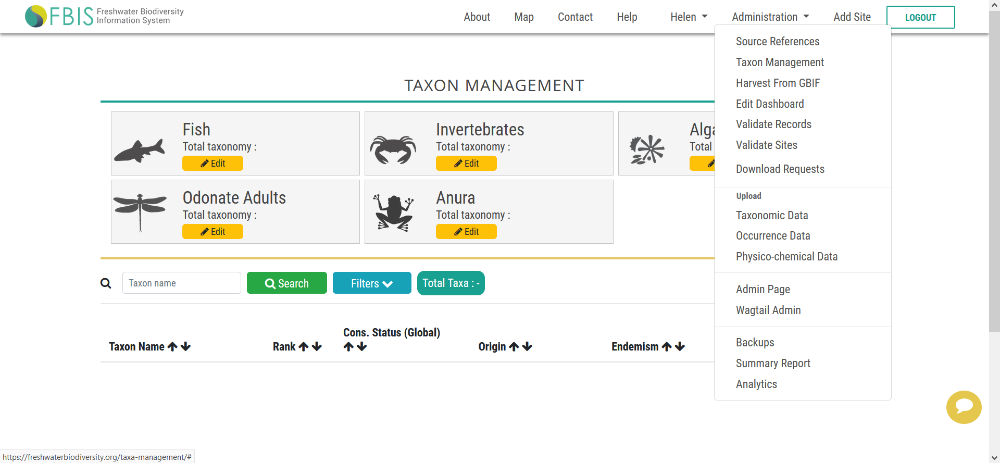
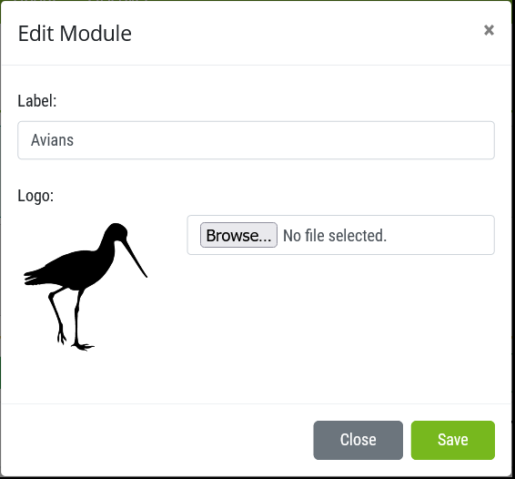
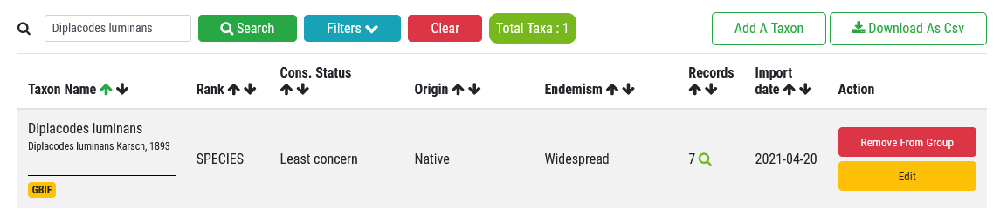
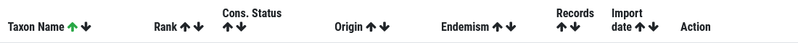
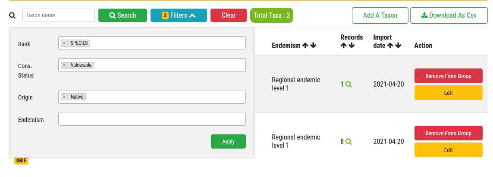
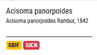
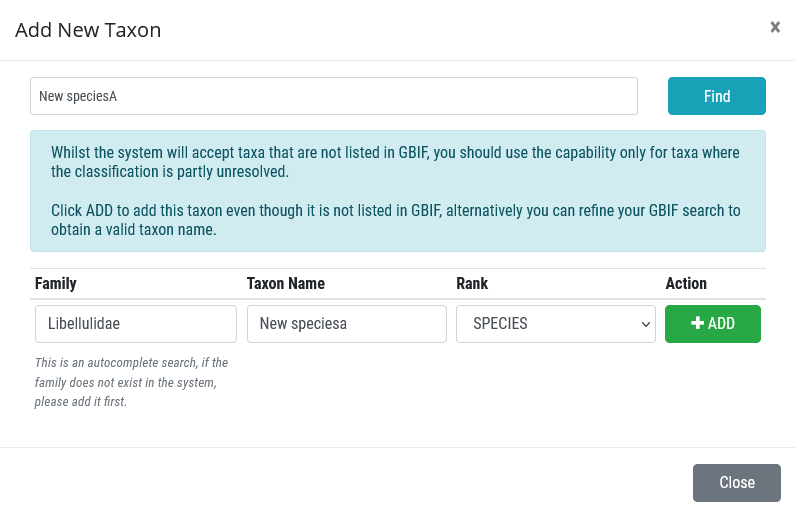
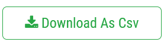
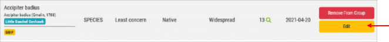
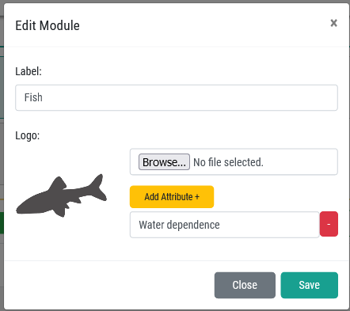

# Managing taxa in Taxon Management

A specific administration module has been developed to allow administrators to manage taxa within the information system. The taxa shown in Taxon Management are those taxa that have been uploaded via the “Upload Taxonomic Data”.

Only registered users with super user status are able to access Taxon Administration, typically the administrators .

## Taxon Management allows you to do the following

* Updating the Taxon Group Name and logo
* Searching for a specific taxon
* Sorting taxa
* Filtering taxa
* Checking and/or changing a taxon’s origin, endemism, conservation status and common name
* Checking the GBIF link
* Checking the IUCN link
* Adding a new taxon
* Removing a taxon from the taxon group
* Viewing records associated with the taxon
* Downloading all taxa in a group as a CSV file
* Adding images of a taxon
* Adding additional attributes specific to a taxon group

### Updating the Taxon Group Name and logo – Edit Module

The name of the Taxon Group and logo can be updated easily by highlighting the group, and clicking “Edit”, then typing the new name in “Label”, and browsing to the correct logo.

### Searching for a specific taxon

* Search for a specific taxon within a taxon group.

**The taxon is then shown:**

### Sorting taxa

* Taxa can be sorted using up ↑↓  arrow, by each of the headers given below.

### Filtering taxa

* Filter for specific taxa – by Taxonomic Rank, Conservation Status, Origin and/or Endemism category. The number of taxa returned is shown.

### Checking and/or changing a taxon’s origin, endemism, conservation status and common name

Click “Edit” to open up a pop up, which allows you to edit the details of a taxon.

Several fields (indicated with a red arrow) can be edited and changed if they are incorrect including, GBIF Key, Scientific Name, Canonical Name, Legacy Canonical Name, Taxonomic Rank, Vernacular or common name, Taxonomic status, Parent taxon, National Conservation Status (SANBI Red Listing), Global Conservation Status (IUCN Red Listing), Endemism and Origin. Most of these are auto-populated when a taxon is uploaded using the Master List or added as a new Taxon in Taxon Management.

### Checking the GBIF link

Click the “GBIF” to link to the species on GBIF:

### Checking the IUCN link

Click the “GBIF” to link to the species on GBIF:

### Adding a new Taxon

If a new taxon needs to be added to the group, click the “Add a Taxon” button, type in the species name, and click “Find”.  

If the Taxon is on GBIF it will provide the link to the GBIF taxonomic backbone, then click “Add” to confirm the addition of the new taxon to the taxon group.

If the taxon is not on GBIF, the administrator may add the new taxon, after which they must assign it to the appropriate Family and indicate the taxonomic rank. Note only genus and or species may be added.

Then edit details of the taxon by following the [Checking and/or changing a taxon’s origin, endemism, conservation status and common name](#checking-andor-changing-a-taxons-origin-endemism-conservation-status-and-common-name) process.

### Removing a taxon from the taxon group

This needs to be used with caution. If data are associated with the taxon, then you will not be able to delete the taxon.

### Viewing records associated with the taxon

Click on the magnifying glass symbol, to return the records associated with a specific taxon.

### Downloading all taxa in a group as a CSV file

Click on the CSV button to download the CSV file of all taxa within a taxon group, or the subset of taxa selected using the filters.

These can then be viewed in excel.

### Adding images of a taxon

By default images of a taxon are harvested from GBIF is they exists. In some instances an administrator may want to add images of a taxon themselves. To do this:

* Open Taxon Management
* Select the Taxon Group
* Select the Taxon and click Edit
        
* Go to the bottom of the “Change Taxonomy” form and add an image by browsing to the file. This image will then replace any GBIF image. Several images may be added for a taxon if desired.
* Click “Save”.

### Adding additional attributes specific to a taxon group

It may be desirable to add attributes for specific taxon groups such as “Water dependence” (Highly dependent, Moderately dependent, Minimally dependent, Terrestrial). These additional attributes are assigned to each taxon during the uploading of the master lists as long as the additional attribute is added in Taxon Management before uploading.
This is done in the Edit Module form, Add attribute. The attribute needs to match the attribute column header in your Master List for uploading.

You can add taxon specific attributes to a taxon group by adding additional column to the Master list and uploading , or individually by adding to the “**Change Taxonomy**” form:

* Open Taxon Management
* Select the Taxon Group
* Select the Taxon and click Edit
