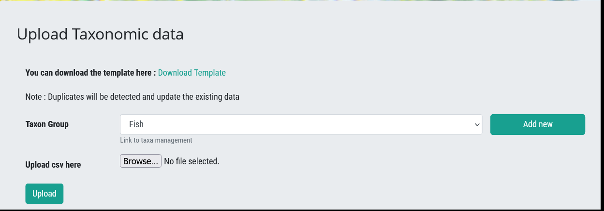

# Uploading a new Taxon Group (Module) and adding a Master List of Taxa for the Taxon Group

Only registered users with **super user status** are able to do this, typically the administrators.

## Steps

Click on your name and select **Upload Taxonomic Data**

Click Add new – to add a new Taxon Group

Add the new taxon group by adding the Taxon Group name and selecting the logo using the “Browse”

Select the new Taxon Group using the dropdown and browse to the file containing the Master List of Taxa for the Taxon Group, click upload.

> **Note:** The Excel file needs to be saved as a csv using the following option:

Progress is shown:

A Success File will indicate taxa uploaded to the system. An **Error** file will give details of taxa not uploaded. The last column in this csv file provides an indication of the reason the taxon was not uploaded. The administrator then needs to check the data and correct before uploading again.

Once the Master List of Taxa has been added it can be viewed in the Taxon Management section.
An **Error File** provides details of the problem in the last column of the csv. Once these have been corrected, the file can be uploaded again.

New taxa may be added individually using the **Taxon Management**, or if there are multiple new taxa to be added, then the steps can be repeated, to upload the additional new taxa for the Taxon Group.
