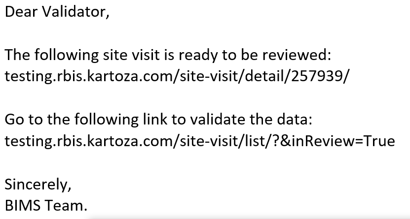
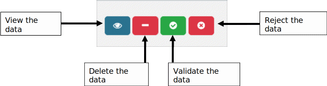
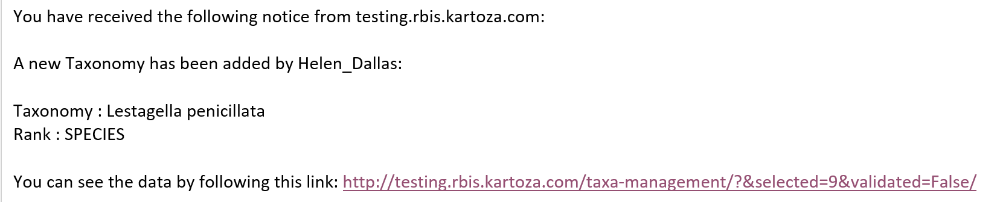
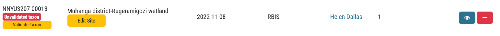
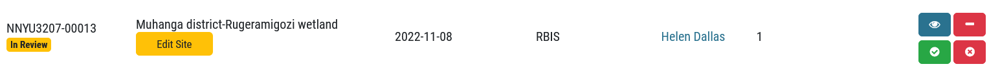

# Validating records (occurrence data) and new taxa

This section explains the process when a user adds data to RBIS, and how the administrator views, checks and validates the occurrence record or new taxon.

Data served on the platform includes both validated and unvalidated data, where validated implies some degree of checking that the record is accurate.  The user is able to select one or the other using the filter:

All data added to platform by administrators using the Upload Occurrence data template, is given the status of validated on the assumption that the administrator has checked the data prior to uploading.

However, when a user adds data directly to the platform, this data remains unvalidated until the administrator checks the data.

## Validating new biodiversity occurrence records

When a user adds new occurrence data, the data is automatically assigned an unvalidated status. The administrator is sent an email alerting them to the new record.

This unvalidated record is also added to the Validate Records form, which the administrator has access to.

This form includes functionality to **See Unvalidated data**, and filter by Owner, Site Code, Source Collection or Module. The administrator can then undertake the following actions, using these buttons

## In summary

**Viewing**: the data is viewed by the administrator and checked for accuracy in terms of all entries including the taxa recorded. If a taxon is outside of its expected geographical range, then the administrator would reject the data with a reason to the person who uploaded the data.

**Reject**: the data is rejected and the user receives an email notification with the reason. The user then has the opportunity to edit their data and resubmit for validation.

**Validate**: the data is validated by the administrator if everything is correct.

**Delete**: this is only used when data have been accidentally added to a site but is generally easier done via the data forms.

## Validating a new taxon

Generally a user should not need to add a new taxon often as the master lists for each biodiversity module are updated and represent the full expected checklist of species for a country. However, in the event that the user records a new taxon not currently in the master list, they are able to add this taxon to the information system. This new taxon then goes through a validation process by the administrator, and the new taxon is either accepted or rejected (with reasons).

The administrator receives a message alerting them to a new taxon that has been added. They then follow the link and validate the taxon, then accepting or rejecting it with reasons, which are provided by email to the user who uploaded the new taxon.

Follow the link to Taxon Management:

Check the taxon, and if it is acceptable to add to the Master List, then click Validate. Note the administrators may need to seek expert taxonomic input. The user receives an email indicating that the data has been approved.

If it is not acceptable, the Reject the taxon. An email will be sent to the user who uploaded the records, with reasons for the rejection.

**Note**: A new occurrence record (site visit) cannot be validated if the new taxon has not been validated. On Validate records it is shown as an **Unvalidated taxon**. First the administrator must validate the taxon by following the link in the email, or by clicking on the **Validate Taxon** button below. The taxon is then either validated or rejected. Once the new taxon has been validated, then the record can be validated.  
Before the taxon is validated:

After the taxon is validated:

