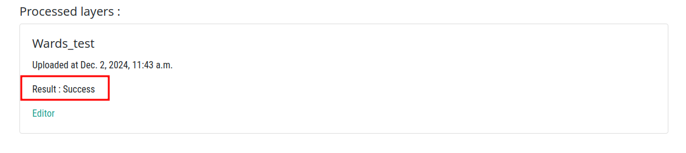
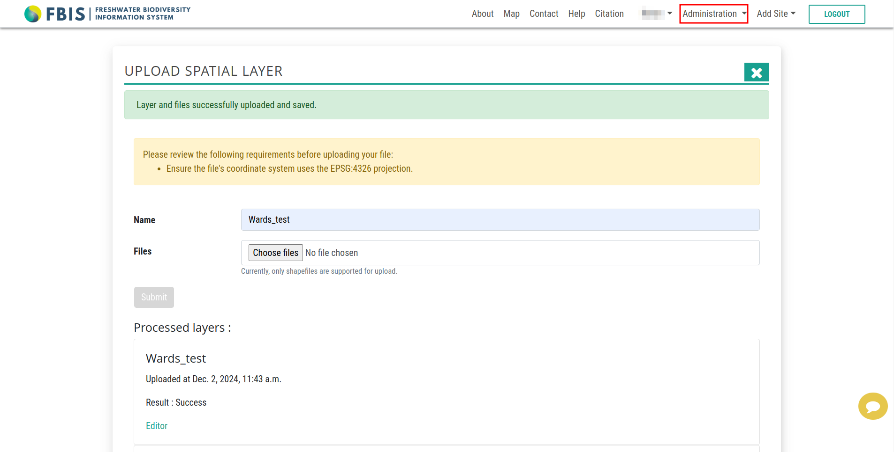
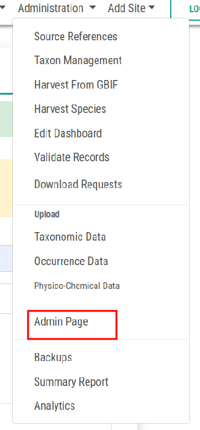
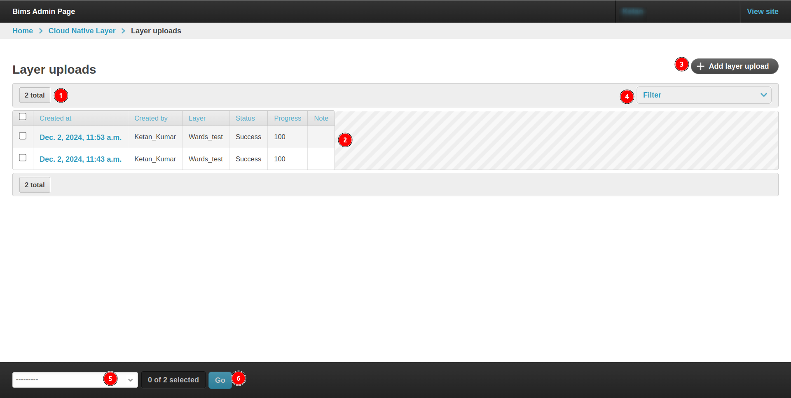
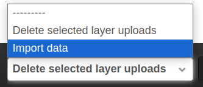

# BIMS: Upload Spatial Layers

>Note: Only admin/super users can upload spatial layers.

Click [here](https://bims.site.com/upload-spatial-layer/) to access the upload spatial layers page.

This is how it looks.

* **Name:** Enter the name of the layer.

* **Choose files:** Select the shape file and auxiliary files to upload.

* **Submit:** Uploads the files.

* **❎:** Close the form.

## Upload Layers

Click on the `Choose files` button to select the shape file and auxiliary files to upload.

This will open the file explorer from where user can select the necessary files for their layer.

> Note: Users should select multiple files at the same to upload.

* **Cancel:** Cancel the process.

* **Open:** After selecting the files, click on the `Open` button to upload the files.

* **✅ Open files read only:** Open the files in read only mode.

* **None:** File extension.

This process will take some time to complete.

## 413 Request Entity Too Large

This error appears when the uploaded files exceeds the maximum size limit.

## Current Process:

### Status: Start

Indicates that the process has started.

### Status: Running

Indicates that the process is in progress and may take some time to complete.

### Status: Success

Indicates that the files have been uploaded successfully.

* Users will receive a success message.

    

### Status: Failed

Indicates that the files failed to upload.

## Access Editor

After successfully completing the process, the user will gain access to the editor page.

Click on the `Editor` button to access the editor page

This is the UI of the `Editor` page.

## Admin page 

* To access the admin page, hover on the `Administration` drop down menu from the top navigation bar.

    

* Choose the `Admin Page` option from the drop down menu. This will open the admin page.

    

### Access the Uploaded Layers

* Navigate to the `Cloud Native Layer` section from the left menu.

    

    Click on the `Cloud Native Layer` heading to navigate to this section on a new page. 

    

    1. **Layer uploads:** By clicking on this, users will be able to see all the uploaded layers.

        

        **1. total:** Displays the total number of layers uploaded.

        **2. Data:** This is the list of uploaded layers with the corresponding details.

        **3. Add layer upload:** This button is used to upload a new layer.

        **4. Filter:** By using this, users can filter the data. After clicking on this a dropdown menu will appear.

        

        * **Layer:** This is used to filter the layers by name.

        * **Status:** This filter allows users to arrange the layers by their current status such as success, failed, etc.

            

        **5. Dropdown menu:** This menu allows users to perform some actions on the data. This are the available options.

        

        * **Import data:** This option allows users to import the data.

        * **Delete selected layer uploads:** This option is used to delete the selected layers. Users can delete multiple layers at once.

        **6. Go:** This button allows users to proceed with the actions they have selected from the dropdown menu.

    2. **Layers:** By clicking on this users will be able to see the list of the layers they have uploaded including their details.

        

        **1. total:** Total number of layers.

        **2. Data:** This is the list of layers with their details such as id, status, created_by, etc.

        **3. Add layer:** This button allows users to upload a new layer from the admin panel.

        **4. Dropdown menu:** This menu allows users to perform some actions on the data. This are the available options.

        

        * **Delete selected layers:** This option is used to delete the selected layers. Users can delete multiple layers at once.

        * **Go:** This button allows users to proceed with the actions they have selected from the dropdown menu.
