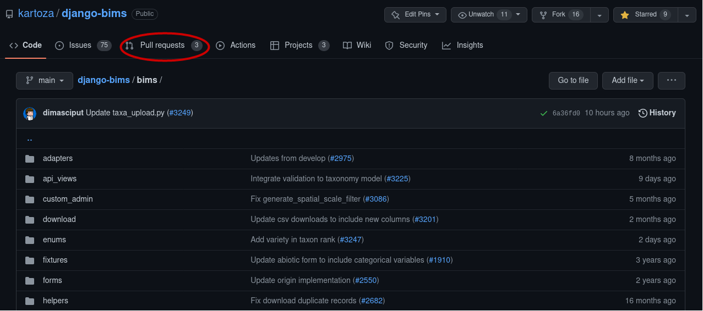

# Developer workflow

The source code of django-bims is hosted on [GitHub](https://github.com/). You need a personal account on GitHub to be 
able to create repositories or collaborate on other projects.

### Getting code upstream

In an open-source project, users must properly integrate their contributions with others. To ensure 
that all contributors are pulling from the same place, you need to copy the upstream repository into a user's account, 
and git provides an option called _**fork**_.


Generally, after cloning the project, you have a remote **origin**

```
git remote -v
origin	git@github.com:kartoza/django-bims.git (fetch)
origin	git@github.com:kartoza/django-bims.git (fetch)

```

The original repository refers to the **upstream**, and the forked repository refers to the **origin**. With the remote 
command, you can easily add, rename or remove a remote.

```
git remote rename origin upstream
```

Verify that you have **upstream** now.

```
git remote -v
upstream	git@github.com:kartoza/django-bims.git (fetch)
upstream	git@github.com:kartoza/django-bims.git (push)

```

To add the **origin** remote execute the following command.

```
git remote add origin git@github.com:yourusername/django-bims.git
```

To check that the **origin** is added

```
git remote -v
origin	git@github.com:Fanevanjanahary/django-bims.git (fetch)
origin	git@github.com:Fanevanjanahary/django-bims.git (push)
upstream	git@github.com:kartoza/django-bims.git (fetch)
upstream	git@github.com:kartoza/django-bims.git (push)

```

#### Sync the latest code from upstream

To keep your local code and the original's sync, you can fetch the latest version of the **upstream** repository.
You can use these commands every time you want to get updates

```
git pull upstream main
```

or,

```
git fetch upstream
```


#### Working with branch

A branch uses to isolate development work without affecting others in the repository. A repository contains one default 
branch and can have multiple other branches.


In **django-bims** the default branch is **main**.

A branch allows you to develop features, fix bugs. Generally, you create a new branch from an existing one, most of the 
time, from the default one.

To list all branches:

```
git branch
  csv_download
  filter
  gbif-link
  landing_page
  main
  sa_province
  sampling_method
  sass
  sorted_dropdown
* taxon_rank_variety
  unvalidated
  update_site_code
  upstream
  wt

```

To create a new branch: 

```
git branch new_feature
```

To work on the new branch, switch to it and make your changes.

```
git checkout new_feature
```

Or if the branch does not exist:

```
git checkout -b new_feature
```

Using a pull request, you can merge a branch into another upstream branch.

#### Pull Request (PR)

A pull request or a PR is a manner for a developer to tell other collaborators about the change they have made.



Once you have submitted a PR, other contributors can review your work. You can push commits from your local branch to your 
existing PR.

[//]: # (maintaining separation between instance specific code and stuff that should be upstreamed)

### Tickets <!--- working to tickets (raise ticket, size ticket, project board, scrum sprint planning etc)-->


#### Open new ticket


[//]: # (### Patch and Pull Request )
<!--- making your patch, submitting a PR -->


[//]: # (maintaining separation between instance specific code and stuff that should be upstreamed)

### GitHub action

### Deploying to staging

### Deploying to production

### Backups <!--- restoring backups , gettinng backups and basic sysadmin workflows-->

