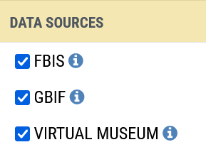

# Biodiversity Data

In FBIS we have provision for freshwater fish, invertebrate, algal, adult odonate, anuran and wetland plant data, as well as SASS (invertebrate) data. Biodiversity data served include data collated for FBIS, data harvested from GBIF and data harvested from the Virtual Museum.

## Taxonomy

A Master List of Species or Taxa has been created for each biodiversity module. In each case, best available information has been used, and consultation with relevant experts undertaken where possible. It is envisaged that these lists will be updated as new data are included and new species described.

## FBIS Fish data

FRC has collated and cleaned fish data (23,243 records from scientific papers, reports, theses, and other unpublished datasets) for South Africa, which are now being served by the FBIS. An additional 22,312 records are harvested from GBIF. These data are primarily from the South African Institute for Aquatic Biodiversity. The fish data include formally described native and non-native species that occur in South Africa. Primary and secondary freshwater species, as well as diadromous species, are included, but marine species are excluded.

## FBIS Invertebrate data

Legacy data from the Biobase (Dallas et al. 1999) for South Africa and collated and cleaned invertebrate data from scientific papers, reports, theses, and other unpublished datasets, are now being served by the FBIS. 255,326 records of invertebrates (including SASS data, see section 8.4) are thus served in FBIS. An additional 78,758 records are harvested from GBIF.

## SASS (invertebrate) Data

Approximately 10,000 records of SASS data from the legacy Rivers Database (River Health Programme, 2007) were imported into FBIS. Data from 12,961 SASS assessments are currently served on FBIS.

> **Note:** SASS data imported from the Rivers database have not yet been thoroughly corrected or validated. Errors in the original Rivers Database will systematically be checked in FBIS V3. Please advise us of any errors that you note during your exploration (fbis@frcsa.org.za).

## FBIS Algal data

Collated and cleaned algal data (approximately 6,152 records from scientific papers, reports, theses, and other unpublished datasets) for South Africa, are now being served by the FBIS. An additional 6,260 records are harvested from GBIF.

## Odonate adult data

Odonate adult data currently served on FBIS is sourced from the Virtual Museum (99,302records).

## Anuran data

Anuran data currently served on FBIS is sourced from collated and cleaned data (5 records from Unpublished data), from GBIF (28,252 records) and from the Virtual Museum (8873 records).
