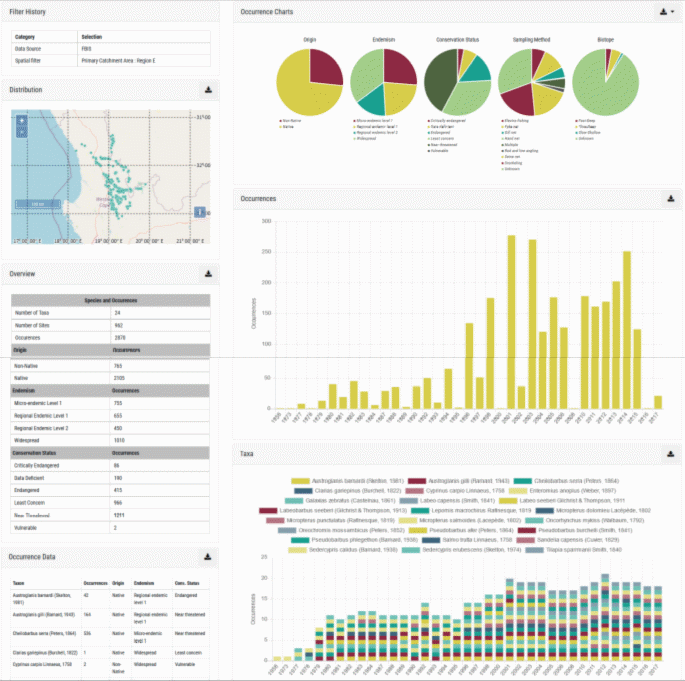

# Multi-site biodiversity dashboards

This biodiversity dashboard is a collation of all the dashboard components marked as ‘multi-site dashboard’ above. For demonstration purposes we have generated it for a fish species, although the same applies for invertebrate, algal, adult odonate and anuran species as well. It is presented to the user whenever an interaction (search / filter / click on map) results in multiple sites being highlighted. See below for an example – note only the first section has been shown as the remainder are the same as the single-site dashboard.

**Multi-site fish dashboard.**

