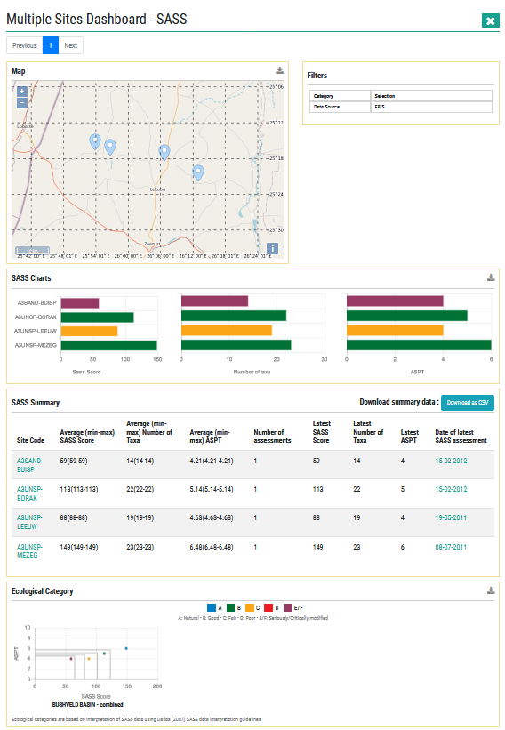
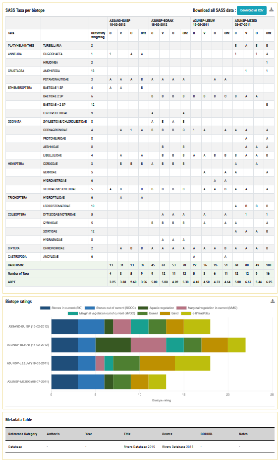

# Multi-site SASS dashboard

This dashboard is a collation of all the dashboard components marked as ‘multi-site SASS dashboard’ above. It is presented to the user whenever an interaction (search / filter / click on map) results in multiple sites containing SASS data being highlighted. See below.

**SASS Multi-site dashboard – Part 1.**

**SASS Single-site dashboard – Part 2.**

