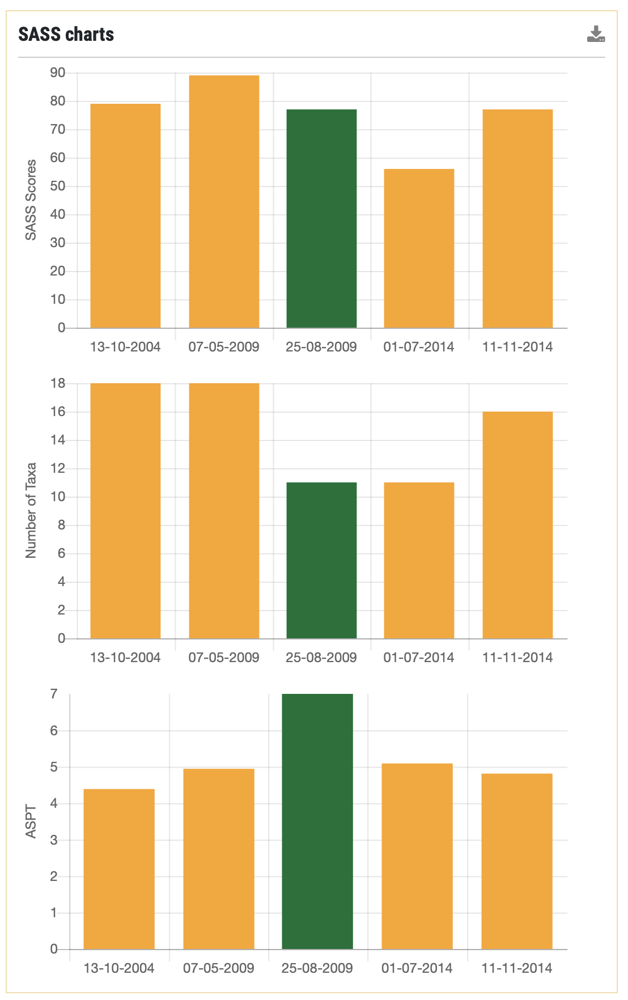
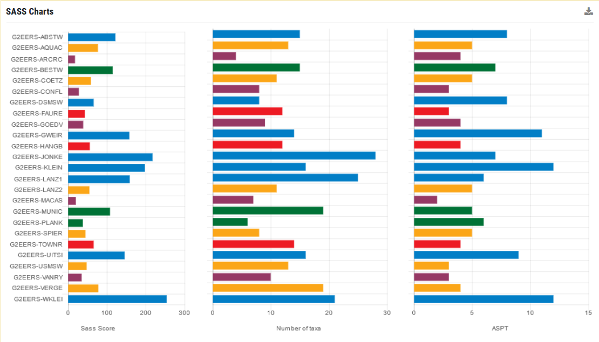
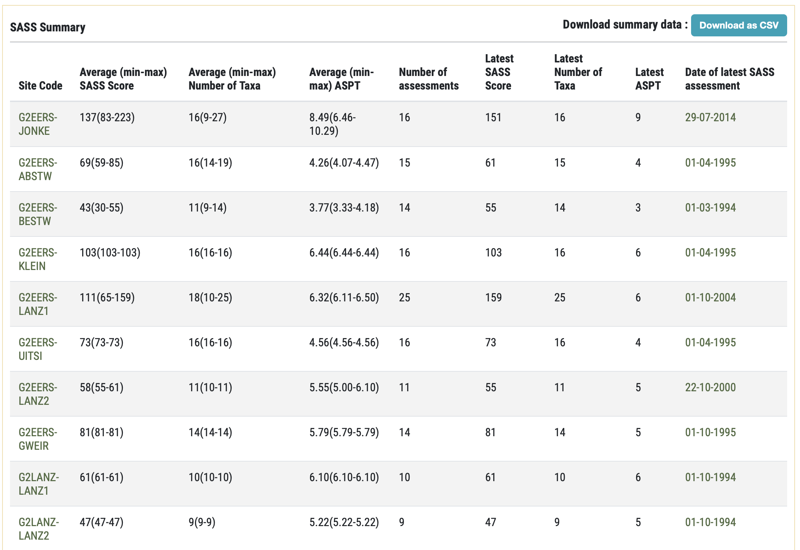
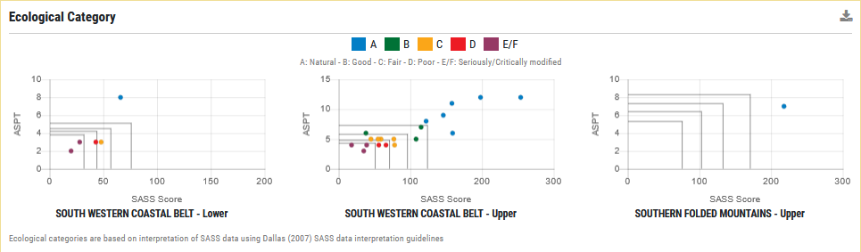
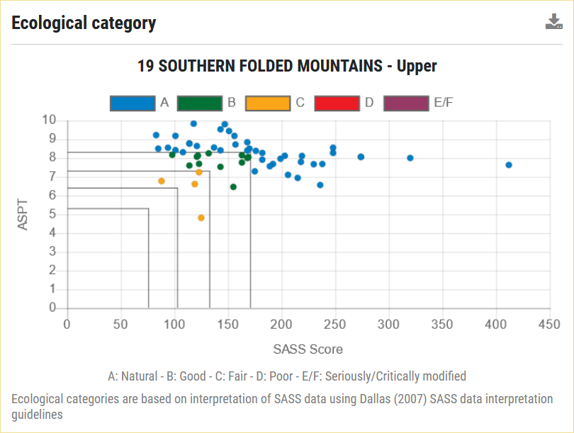
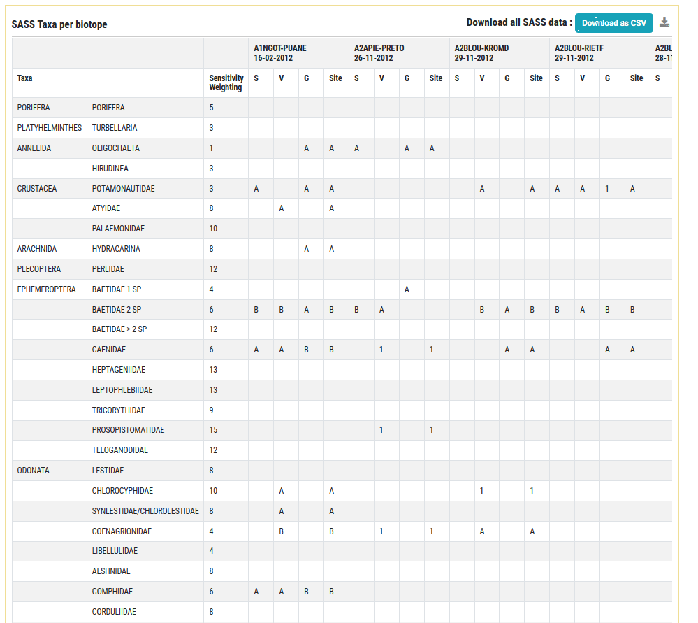
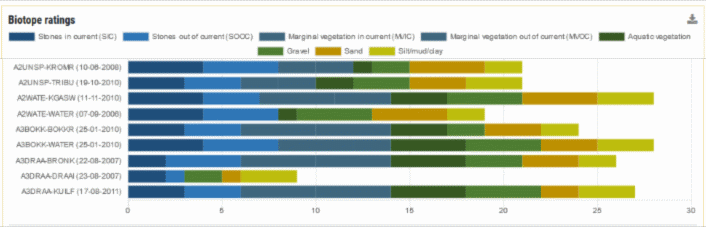
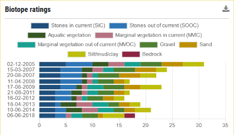
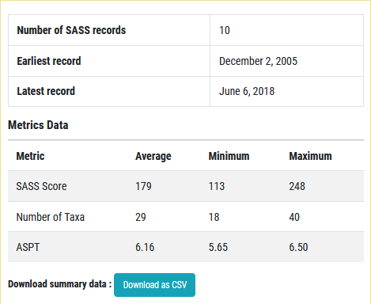
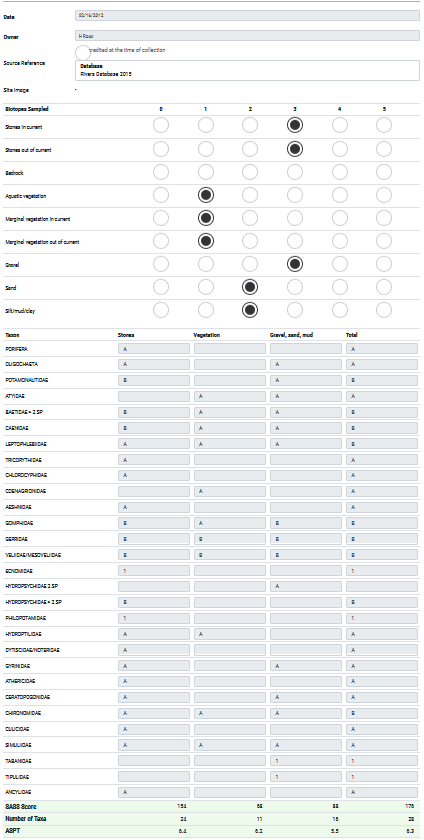

# SASS Dashboard components

## SASS Charts

This component shows a collection of SASS Charts indicating the SASS Score, Number of Taxa and ASPT (Average Score Per Taxon) for each site (in the case of the single-site SASS dashboard) or a group of sites (in the case of a multi-site SASS dashboard). The numbers shown are for the most recent survey for each site. In the multi-site version, the display order of sites is currently not significant. The charts are colour-coded according to the ecological category.

**SASS Charts for a single-site showing changes in SASS metrics and ecological category over time**

**Multi-site SASS charts showing the most recent survey in at each site.**

This component is present in these dashboards:

* Single-site SASS dashboard
* Multi-site SASS dashboard

## SASS Summary

The SASS Summary component is a table that provides a detailed breakdown of the latest SASS surveys for a collection of sites selected by the user. The table provides detailed information about the SASS surveys carried out at each site. The numbers in parentheses show the minimum/maximum value for each site. The whole table can be downloaded as a CSV document to be opened in a spreadsheet application.

**SASS Summary table.**

This component is present in this dashboard:

* Multi-site SASS dashboard

## Ecological category

The ecological category component represents the condition of a collection of sites or a single-site (Figure 33) selected by the user. In the former case, the plots show the last recorded SASS survey’s ecological category for each site. In the latter case, the plot shows the history of SASS surveys over time. For the multi-site plots the charts are separated by ecoregion and, due to space constraints, only the first three ecoregions are provided on the report. The Y-Axis represents the ASPT value for each site, the X-Axis represents the SASS score. The scatterplot points are colour coded according to their ecological category (which is a factor of the ASPT value and SASS Score). The meanings of these ecological category are described in the table below:

| Ecological Category | Ecological Category Name |
| -- | -- |
| A | Natural |
| B | Good |
| C | Fair |
| D | Poor |
| E | Seriously modified |
| F | Critically modified |

**Multi-site ecological category scatterplots.**

**Single-site ecological category scatterplots.**

This component is present in these dashboards:

* Single-site SASS dashboard
* Multi-site SASS dashboard

## SASS Taxa per biotope

The SASS Taxa per biotope dashboard component is again rendered slightly differently depending on whether the dashboard is a multi-site SASS dashboard or a single-site SASS dashboard. It provides a tabular display in format similar to the SASS data capture sheet familiar to any certified SASS data collector. The table lists SASS scores per biotope and per taxon. In cases where no biotope recordings have been made for a given taxon in the original SASS survey, those taxa rows are omitted from the report. In the multi-site rendering, the table includes a column group for each site consisting of: sensitivity weighting, stones [S], vegetation [V], gravel, sand and mud [G] and the site score. In multi-site dashboards, the SASS Taxa per biotope displayed represent the latest SASS survey per site and the date of the most recent survey is indicated under the site code.

**Multi-site SASS taxa per biotope table.**

For single-sites, only the most recent survey is displayed as illustrated below. Both configurations provide the ability to download the table as editable text (CSV) data for further analysis offline.

**Single-site SASS taxa per biotope table.**

This component is present in these dashboards:

* Single-site SASS dashboard
* Multi-site SASS dashboard

## Biotope ratings

> **Note:** SASS versions 1 to 4 did not require biotope ratings, and therefore data associated with this method will not have biotope ratings.

The SASS biotope ratings dashboard component is also rendered slightly differently depending on whether the dashboard is a multi-site SASS dashboard or a single-site SASS dashboard. It provides a stacked graph display showing the biotope rating for each recorded SASS survey. In the multi-site rendering, the chart includes an entry on the Y-Axis for each SASS survey site. In the case of single-site dashboard, the Y-Axis contains an entry for each date on which a SASS survey was carried out. In both permutations, the X-Axis represents the cumulative biotope rating across different biotopes.

**Multi-site biotope ratings graph.**

**Single-site biotope ratings graph.**

This component is present in these dashboards:

* Single-site SASS dashboard
* Multi-site SASS dashboard

## SASS Record Summary

This dashboard component summarises the SASS Score, Number of Taxa and ASPT values for all SASS surveys at a given site. It also shows the total count of SASS records and the data range of those records. The data presented in the table can be downloaded as a CSV file for offline use.

**SASS single-site dashboard summary.**

This component is present in this dashboard:

* Single-site SASS dashboard

## Proportion of sensitive to tolerant taxa

This component, presented as a pie chart, provides a visualisation of the proportion of taxa in different sensitivity categories. These data are derived from the latest SASS survey for a given site.  It is based on the following categorisation of SASS sensitivity weightings: Highly tolerant (1 to 3), Tolerant (4 to 7), Sensitive (8 to 11), Highly sensitive (12 to 15).

**Single-site SASS visualisation of taxon sensitivity.**

This component is present in these dashboards:

* Single-site SASS dashboard

## SASS Records

This component, presented as a table, provides a summary of previously conducted SASS surveys for a site. The data can also be downloaded for offline use (as a CSV file). The table provides a ‘drill down’ link for each record which will take the user to the actual completed SASS survey data sheet for that row.

This component is present in these dashboards:

* Single-site SASS dashboard

**Summary table for SASS surveys for a site.**

**Read-only view of a SASS form for a site.**

