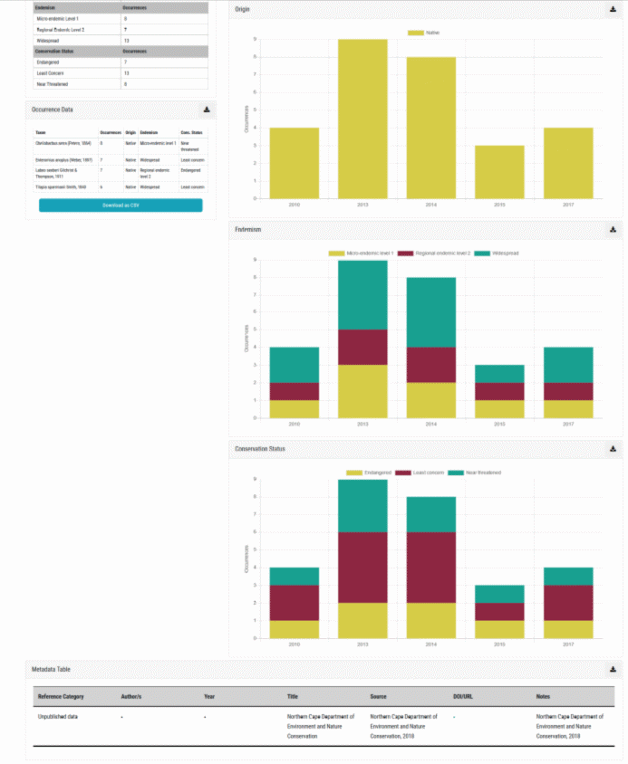

# Single-site biodiversity dashboards

This biodiversity dashboard is a collation of all the dashboard components marked as ‘single-site dashboard’ above. For demonstration purposes we have generated it for a fish species, although the same applies for invertebrate, algal, adult odonate, anuran and plants species as well. It is presented to the user whenever an interaction (search / filter / click on map) results in a single-site being highlighted. See below for an example.

**Single-site fish dashboard part 1.**

**Single-site fish dashboard part 2.**

