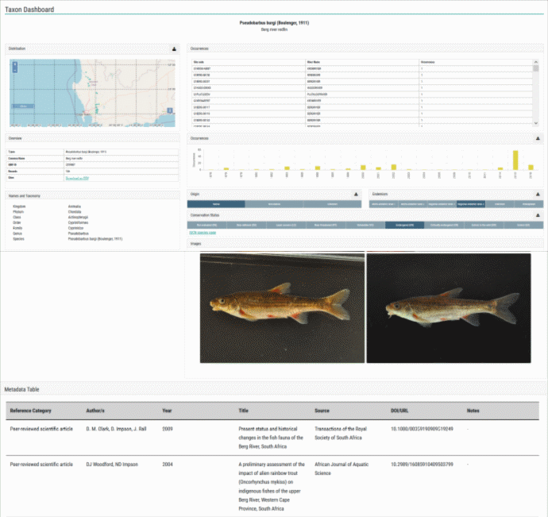

# Taxon dashboard

This dashboard provides details of a single taxon or species. It is presented whenever an interaction (search / filter / click on map) results in a single taxon being highlighted. For demonstration purposes we have generated it for a fish species, although the same applies for invertebrate and algal species as well.

**Single taxon dashboard.**

