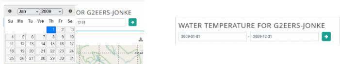
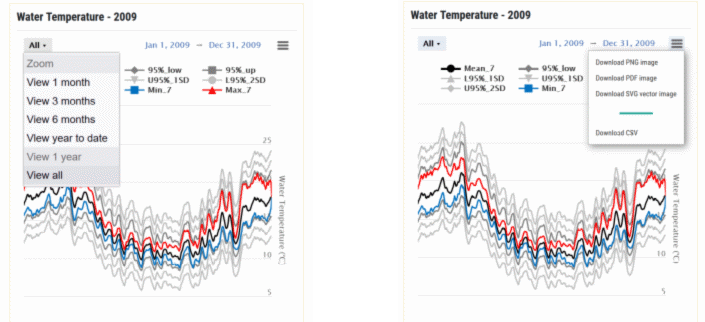
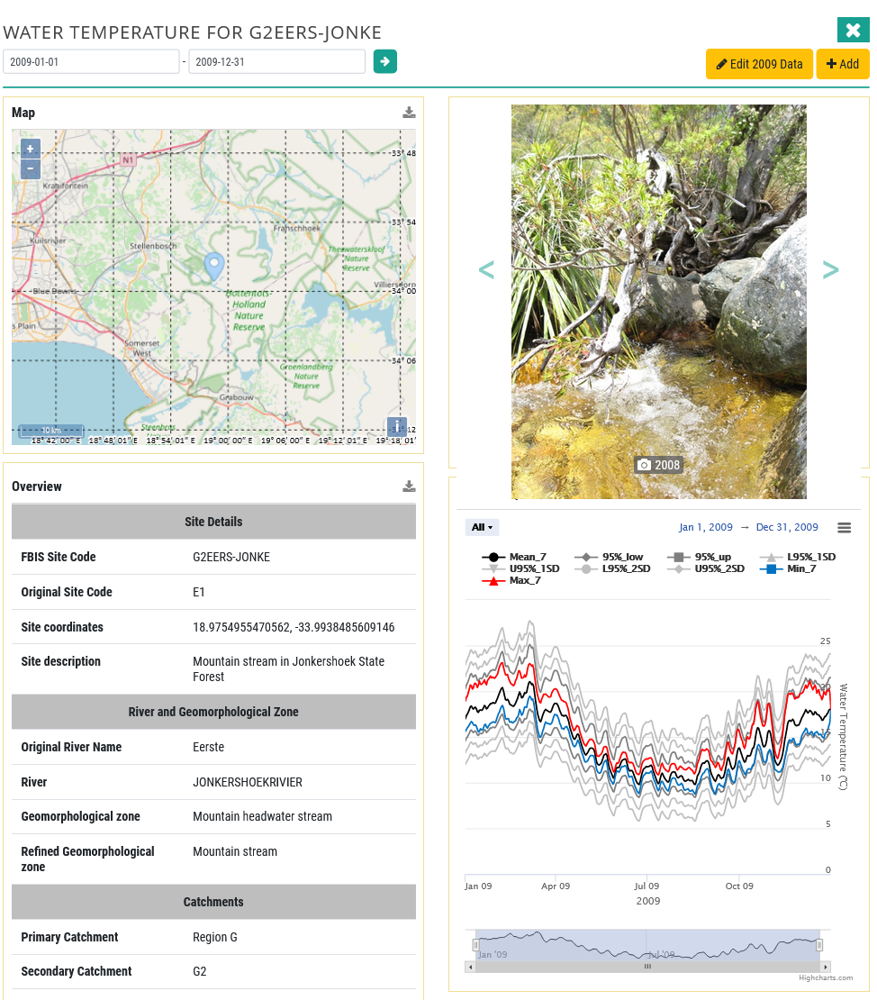
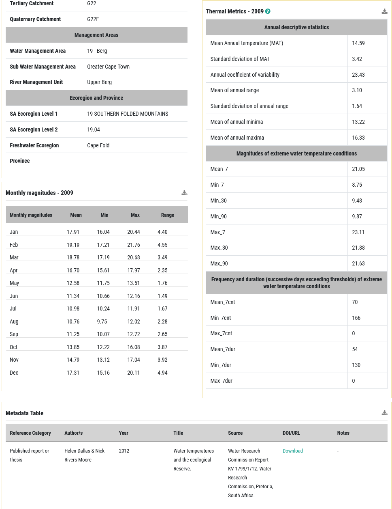

# Water temperature time series dashboard

This dashboard includes some of the components in the biodiversity dashboards such as map, site photograph and overview, which provides geocontext data for the site, and metadata.  The water temperature data is shown for one year at a time, so the user need to first select the day, month and year for the start and end of the data series. Note: it is not possible to select data for longer than 1 year, and the start and end year need to be the same.

A thermograph is provided for the site based on the one year of water temperature data time series specified. Sub-daily data are transformed into daily data and plotted as smoothed daily temperature means based on a seven-day moving average, and smoothed daily range using daily minima and maxima. For Reference thermograph the reference condition thermal envelope plus one and two standard deviations are shown. Further manipulation of the time series is possible using the All dropdown (view 1 month, 3 months, 6 months etc) and the graph may be downloaded in different formats.

Tables of thermal metrics and monthly magnitudes (mean, minimum, maximum and range) are provided. The user is referred to Dallas and Rivers-Moore (2019, 2022) for more details. Thermal metrics describe an annual thermal regime using broad descriptive statistics, such as mean annual temperature, annual coefficient of variability, predictability and maximum daily range, as well as water temperature events in terms of their magnitude, frequency, duration of extreme events (Rivers-Moore et al. 2013).

**Water temperature dashboard – Part 1.**

**Water temperature dashboard – Part 2.**

