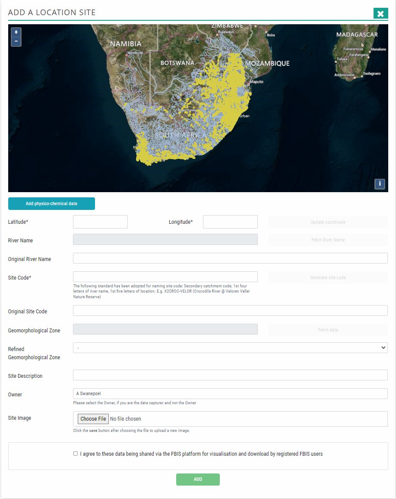
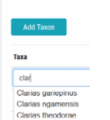
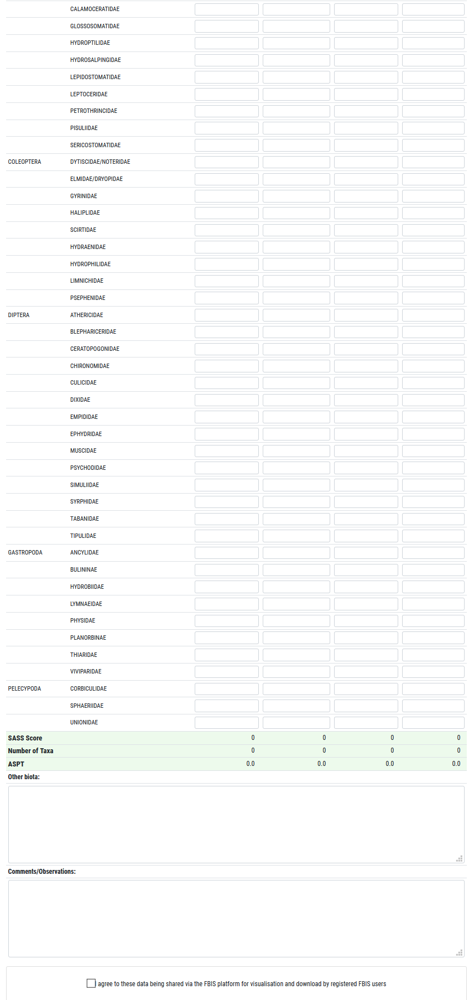
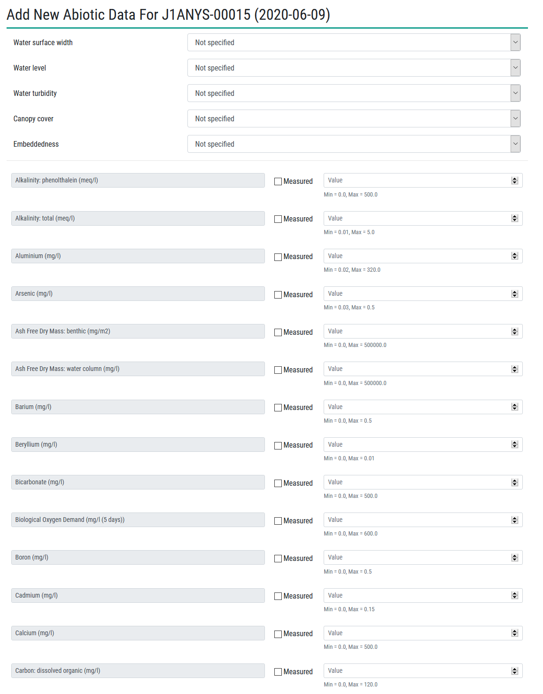
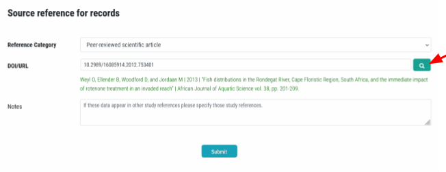
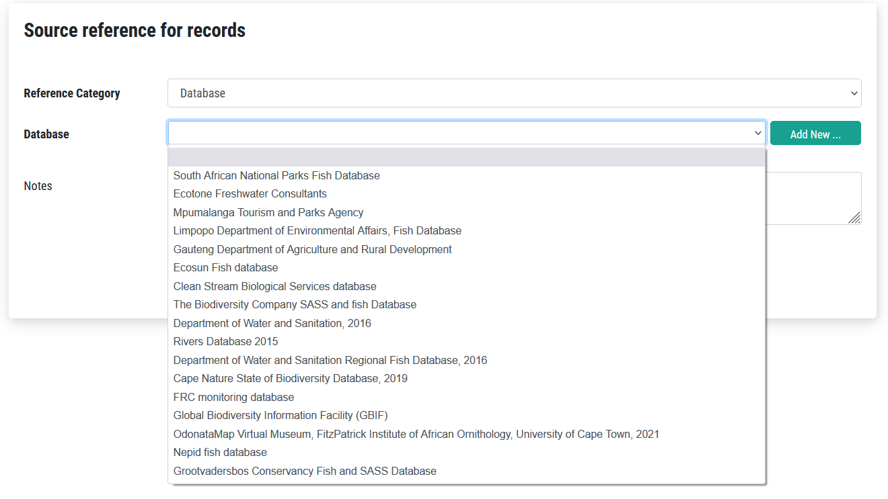
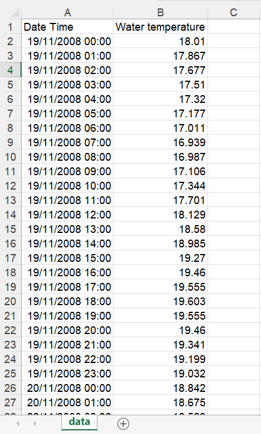
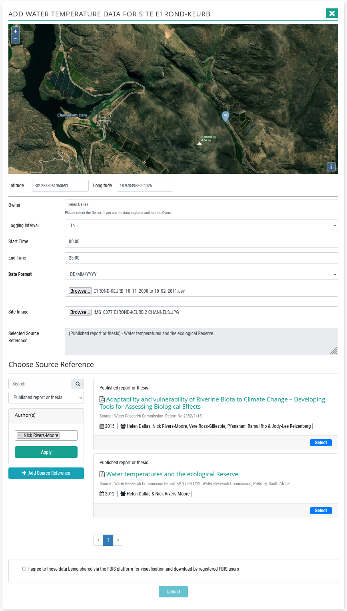
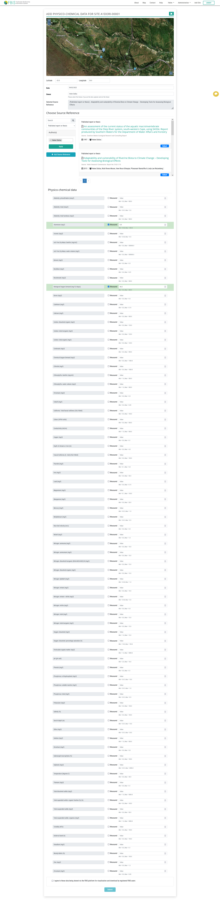

# Data Upload Forms

Data upload forms have been created for creating a site, capturing biodiversity data, SASS data, water temperature time series data and physico-chemical data.

## Create a site

A site is added using the **Add Site** on the navigation bar. The **Add a location site** forms then opens.

**Add Site button to create a new site.**

**The Add Site form**

The user should fill in the new site details on this form.

* Coordinates can either be manually entered, or the site can be selected on the map and this will auto-populate the latitude and longitude.
* River Name is auto-generated based on the closest river to the selected site location (click fetch river name) If the user specifies the Original River Name, then this will be used. This is useful for tributaries that are not named on the 1: 500 000 DWS river map, where the names are derived.
* A site code can be auto-generated (click generate site code) or the user can fill in their own site code using the standard described. Original Site Code can be added if known.
* The geomorphological zone is auto-generated from the geomorphological zone layer (from a DTM) currently in FBIS. A user can update this by adding a Refined Geomorphological Zone, which is the ground-truthed zone and is programmed to override the geomorphological zone derived from the DTM.
* Add a site description of the site (optional).
* The owner field will auto-populate to the logged in user. It may be assigned to someone else if the data capturer is not the owner by using the dropdown list. Site image(s) can be uploaded.
* Add a site image (optional).
* Lastly, the user has to agree to the data being shared via the FBIS platform for visualisation and download by registered FBIS users.

Biodiversity data, SASS data, water temperature and physico-chemical data may be added to the newly created site by clicking the appropriate button. The user will then be taken to the relevant form (Figures 53, 54, 55, 56, 60 and 61) to enter the data.

**Add fish, add invertebrate data, add SASS data, add algal data, add odonate adults data, add anura data, add water temperature data and add physico-chemical data buttons.**

## Adding fish data

A fish data upload form allows for the capture of fish occurrence data as well as associated abundance, biotopes (broad, specific, substratum), sampling method and effort. Through this form, we hope to encourage collectors to also record abundance, biotope type, sampling method and effort so we developed the form with these capabilities.

Details as follows:

* Broad biotope: Unspecified, Mixed, Slow-Shallow, Slow-Deep, Fast-Shallow, Fast-Deep
* Specific biotope: Unspecified, Mixed, Backwater, Bedrock, Cascade, Chute, Detritus, Pool, Rapid, Riffle, Run, Slackwater, Waterfall
* Substratum: Unspecified, Mixed, Bedrock, Boulder, Cobble, Detritus, Gravel, Pebble, Sand, Silt/Mud/Clay
* Sampling method: Unspecified, Multiple, Electro-fishing, Fyke net, Gill net, Hand net, Rod and line angling, Seine net, Snorkelling, Underwater video analysis
* Sampling effort measure: Time (min), Area (m2), Replicates
* Abundance measure: Number, Percentage Abundance, Density (m2)
* Record type: Visual observation, Photographic record, Specimen record, Acoustic survey, DNS sample

We also added ‘smart’ logic that pre-populates the form with taxa that have previously been identified in the local area, and then it is up to the user to check (or not check) the boxes associated with each taxon. If the taxon you need to add a record for is not listed, you can also add an existing or new taxon on this form, by clicking Add Taxon, and typing a few letters of the taxon. 

If the taxon name is not in the list, then the user can also add a New Taxon by clicking Add New Taxon. This opens up a new sub-form where you type in the name of the taxon, which then links to GBIF and the taxon is returned. By clicking Add this taxon is then added to FBIS. Final approval of this new taxon requires validation by the FBIS administrators.

After adding fish data, the user has the option to add **Abiotic data** (optional) (see section 11.6), followed by **Adding Source reference for records** (see section 11.9).

**Fish data form.**

## Adding invertebrate data

An invertebrate data upload form allows for the capture of invertebrate occurrence data as well as associated abundance, biotopes (broad, specific, substratum), sampling method and effort. Through this form, we hope to encourage collectors to also record abundance, biotope type, sampling method and effort so we developed the form with these capabilities. 

Details as follows:

* Broad biotope: Unspecified, Mixed, Stones In Current, Stones Out Of Current, Marginal Vegetation, Aquatic Vegetation, Gravel/Sand/Mud
* Specific biotope: Unspecified, Mixed, Backwater, Bedrock, Cascade, Chute, Detritus, Pool, Rapid, Riffle, Run, Slackwater, Waterfall
* Substratum: Unspecified, Mixed, Bedrock, Boulder, Cobble, Detritus, Gravel, Pebble, Sand, Silt/Mud/Clay
* Sampling method: Unspecified, Multiple, Baited Line, Box/Surber, Drift Net, Hand Net, Kick Net, Light Trap, Stone
* Sampling effort measure: Time (min), Area (m2), Replicates
* Abundance measure: Number, Percentage Abundance, Density (m2)
* Record type: Visual observation, Photographic record, Specimen record, Acoustic survey, DNS sample

We also added ‘smart’ logic that pre-populates the form with taxa that have previously been identified in the local area, and then it is up to the user to check (or not check) the boxes associated with each taxon. If the taxon you need to add a record for is not listed, you can also add an existing or new taxon on this form, in the same way as for fish.

After adding invertebrate data, the user has the option to add **Abiotic data** (optional) (see section 11.6), followed by **Adding Source reference for records** (see section 11.9).

**Invertebrate data form.**

## Adding algal data

An algal data upload form allows for the capture of algal occurrence data as well as associated abundance, biotopes (broad, specific, substratum), sampling method and effort. Through this form, we hope to encourage collectors to also record abundance, biotope type, sampling method and effort so we developed the form with these capabilities. In addition, for algae, we have included details related to the curation process, and allowed for capture of biomass (Chlorophyll A and Ash Free Dry Mass) and the autotrophic index value.

Details as follows:

* Broad biotope: Unspecified, Mixed, Stones In Current, Stones Out Of Current, Marginal Vegetation, Aquatic Vegetation, Gravel/Sand/Mud, Artificial substrate
* Specific biotope: Unspecified, Mixed, Backwater, Bedrock, Cascade, Chute, Detritus, Pool, Rapid, Riffle, Run, Slackwater, Waterfall
* Substratum: Unspecified, Mixed, Bedrock, Boulder, Cobble, Detritus, Gravel, Pebble, Sand, Silt/Mud/Clay
* Sampling method: Unspecified, Multiple, Scrubbing, Soft Bottom, Vegetation, In situ
* Sampling effort measure: Time (min), Area (m2), Replicates
* Abundance measure: Percentage Abundance, Species valve/frustule count, Density (cells/m2), Density (cells/mL)
* Curation process: Acid cleaned, Frozen, Preserved lugols
* Biomass indicator: CHLA-B: Whole cobble, Soft Bottom, In situ, Artificial substrate
* Biomass indicator: AFDM-B: Whole cobble, Soft Bottom, Artificial substrate

We also added ‘smart’ logic that pre-populates the form with taxa that have previously been identified in the local area, and then it is up to the user to check (or not check) the boxes associated with each taxon. If the taxon you need to add a record for is not listed, you can also add an existing or new taxon on this form, in the same way as for fish.

After adding algal data, the user has the option to add **Abiotic data** (optional) (see section 11.6), followed by **Adding Source reference for records** (see section 11.9).

**Algal data form.**

## Adding anuran data

An anuran data upload form allows for the capture of anuran occurrence data as well as associated abundance, biotopes (broad, specific, substratum), sampling method and effort. Through this form, we hope to encourage collectors to also record abundance, biotope type, sampling method and effort so we developed the form with these capabilities. 

Details as follows:

* Broad biotope: Unspecified, Mixed, Stones In Current, Stones Out Of Current, Marginal Vegetation, Aquatic Vegetation, Gravel/Sand/Mud
* Specific biotope: Unspecified, Mixed, Backwater, Bedrock, Cascade, Chute, Detritus, Pool, Rapid, Riffle, Run, Slackwater, Waterfall
* Substratum: Unspecified, Mixed, Bedrock, Boulder, Cobble, Detritus, Gravel, Pebble, Sand, Silt/Mud/Clay
* Sampling method: Unspecified, Electro-fishing, Hand net, Active acoustic survey, Passive acoustic survey, Baited trapping, Visual observation, Non-baited trapping, Photographic record
* Sampling effort measure: Time (min), Area (m2), Replicates
* Abundance measure: Number, Percentage Abundance, Density (m2)

We also added ‘smart’ logic that pre-populates the form with taxa that have previously been identified in the local area, and then it is up to the user to check (or not check) the boxes associated with each taxon. If the taxon you need to add a record for is not listed, you can also add an existing or new taxon on this form, in the same way as for fish.

After adding invertebrate data, the user has the option to add **Abiotic data** (optional) (see section 11.6), followed by **Adding Source reference for records** (see section 11.9).

## Adding SASS data

A standard SASS data capture form, which is based on the field datasheet, facilitates the capture of SASS data. The form includes validation and is designed to streamline the process of digital capture of SASS data and also to reduce the possibility for errors when calculating SASS metrics. All standard SASS sampling protocols have been included such as rating biotopes and adding abundances for taxa per biotope. It will constrain user input to valid entries, to auto-calculate the SASS score for each taxon (with allowances for overriding of abundances at site level where appropriate) and will auto-calculate the overall SASS, Number of Taxa and ASPT for the survey. The owner is the person who undertook the SASS assessment, and if accredited at the time, it should be recorded.

After adding SASS data, the user has the option to add **Abiotic data** (optional) (see section 11.6), followed by **Adding Source reference for records** (see section 11.9).

**SASS data form – Part 1.**

**SASS data form – Part 2.**

**SASS data form – Part 3.**

## Adding abiotic data

Once occurrence or SASS data have been captured the user has the option to add associated abiotic data that was collected at the same time as the survey data. This is done using the Add new abiotic data form. Five variables have been categorised namely, water surface width, water level, water turbidity, canopy cover and embeddedness. The remaining variables are added by checking the Measured box and adding the value of each variable. Note all units have been standardised and users need to convert to these standard unit before capturing the data. Minimum and maximum values have also been included for data integrity checks.

**Adding abiotic data.**

## Adding Source reference for records

All data added to FBIS needs metadata associated with it. The user needs to select the Reference category, and then follow the relevant upload form to add the details of the database, DOI, report / thesis details, and URL or PDF.

**Adding the source reference for the records.**

**Peer-reviewed scientific articles**
Select the reference category and insert the DOI or URL and click the search button. The citation is then retrieved via an online citation management system and inserted. Click Submit to save.

**Published reports and theses**
Select the reference category and select from the dropdown list of titles, if the published report or thesis is already uploaded, or select “Upload new” to add a new published report or thesis.

When uploading a new published report or thesis, complete the fields using the format indicated including Author(s), Year, Source, Title, Description (if desired) and Url or upload file. Confirm that you are owner of the document being added and Upload. This is then submitted.

**Databases**
Select the reference category and select from the dropdown list of database, if the database is already created, or select “Add new” to add a new database.

When adding a new database, complete the name and provide a description. Add the url if it exists and click create. Add notes if desired.

**Unpublished data**
Select the reference category and select from the dropdown list under notes. If the unpublished dataset exists, select the unpublished dataset name, or if the unpublished dataset needs to be created, select “Add new” to add a new unpublished dataset. In the notes, add the name of the person, details of the study and date if possible or applicable.

## Adding water temperature data

A data capture form has been added for uploading water temperature time series data. The user needs to follow the following steps:

* Select the Owner if not the logged in owner
* Select the logging interval (0.5h, 1h, 2h, 3h, 24h)
* Start time and end time
* Date format
* Upload file as a csv, with the following column headers: Date Time; Water temperature (see excel sheet below)
* Add site image
* Select Source Reference by using search filter and selecting.
* Click “I agree to these data being shared via the FBIS platform for visualisation and download by registered FBIS users” and Submit

**Format of excel file for preparing water temperature data.**

**Adding water temperature data.**

## Adding physico-chemical data

A data capture form has been added for uploading physic-chemical data. The user needs to follow the following steps:

* Select the Date
* Select the Owner
* Select Source Reference by using search filter and selecting.
* Add specific variables by checking the Measured box and adding the value of each variable. Note all units have been standardised and users need to convert to these standard unit before capturing the data. Minimum and maximum values have also been included for data integrity checks.
* Click “I agree to these data being shared via the FBIS platform for visualisation and download by registered FBIS users” and Submit

**Adding physico-chemical data.**

