# Filtering

Two types of filters are supported on FBIS: Contextual filters, which filter based on the site or collection record attributes in the database, and map based filters which operate by selection of sites on the map.

## Contextual filters

One of the key technologies ‘under the hood’ in FBIS is the use of Kartoza’s GeoContext service. GeoContext provides a way to, in a single query, obtain contextual data for any geographical point across multiple Open Geospatial Consortium (OGC) web services (WMS, WFS). The results are aggregated into a single document and made available to FBIS which then stores this aggregate data as properties of a site. Having this rich collection of GeoContext data for each site allows us to filter the records shown on the map and in dashboards in fairly arbitrary ways. For example, selecting only records from a given catchment or ecoregion. A description of each filter is provided in Table 1.  

Filtering is done using a hierarchical ‘tree view’ in the filter panel (Figure 4). Tree nodes can be expanded or collapsed and selecting a specific node or set of nodes will allow you to apply the selected filters to the records displayed on the map and search result areas as shown below:

**Example of some of the filters available for querying the data.**

To apply the filter click **Apply**; to clear the click **Clear**.

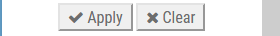

### Table 1. Details of the filters provided in FBIS

<!-- The  's in the 'spatial' and 'Origin and endemism' cells are to allow for the lists -->
| Filter | Description |
| -- | -- |
|  | **Biodiversity module:** Filter records for fish, invertebrates, algae, adult odonates or anuran only by clicking the appropriate icon. To filter records for sites that have more than one biodiversity module (e.g. fish and invertebrates), use the Shift Click function to select multiple modules. |
| 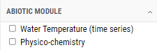 | **Abiotic module:** Filter records for sites that have water temperature time series data, or physico-chemical data. |
| 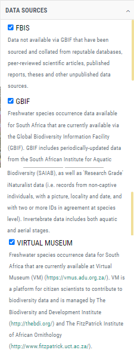 | **Data sources:** The default setting in FBIS is all data collated specifically for FBIS, existing GBIF records and existing Virtual Museum records are provided. Uncheck those sources that you do not want records for. Note that neither GBIF or Virtual Museum data have not been validated by the FBIS team. |
| 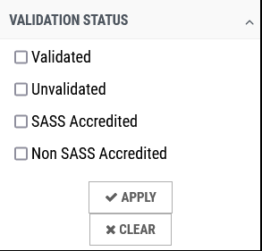 | **Validation status:** The default setting in FBIS is that all Validated, unvalidated, SASS Accredited and Non SASS Accredited data are provided. Validated data have been checked by FBIS admin and /or designated expert, while unvalidated data have not been checked. SASS Accredited and Non SASS Accredited relates specifically to whether the assessor was SASS accredited at the time of doing the SASS assessment. Filter records by checking the relevant boxes to include specific data only. |
|  | **Temporal:** Filter records using the sliding scale to specify year(s), and/or check specific months. |
| 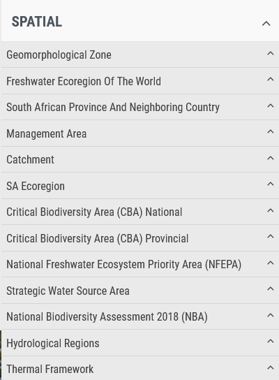 | **Spatial:** Thirteen spatial filters are currently provided for users to filter the records shown on the map and in dashboards. For example, selecting only records from a given province, catchment or SA ecoregion. Further details are provided in [section 7.2](mapping.md). The current list of spatial filters lodged in FBIS include:  - Geomorphological Zones  - Freshwater Ecoregions of the World  - South African Province and Neighbouring Country  - Management Area  - Catchments  - SA Ecoregions  - National and Provincial Critical Biodiversity Areas  - National Freshwater Ecosystem Priority Areas  - Strategic Water Source Areas  - National Biodiversity Assessments 2018  - Hydrological Regions  - Thermal Framework |
| 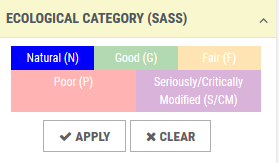 | **Ecological category (SASS):** Filter records based on ecological categories, interpreted from SASS data interpretation guidelines of Dallas (2007). |
| 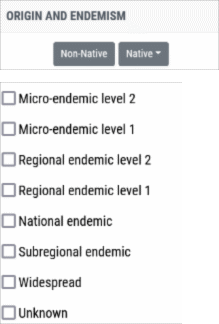 | **Origin and endemism:** Filter records based on origin: native or non-native, where non-native includes both alien and extralimital taxa. Filter records based on endemism, where taxa are divided into eight categories as follows:  - Micro-endemic level 2 (Endemic to a single river or wetland)  - Micro-endemic level 1 (Endemic to less than 5 rivers or wetlands)  - Regional endemic level 2 (Endemic to a single primary catchment)  - Regional endemic level 1 (Endemic to a single Freshwater Ecoregion (e.g. CFE), more than one primary catchment)  - National endemic (Endemic to South Africa, occurs in more than one Freshwater Ecoregion within SA)  - Subregional endemic (Endemic to southern Africa)  - Widespread (Occurs beyond southern Africa)  - Unknow (Endemism is unknown) |
| 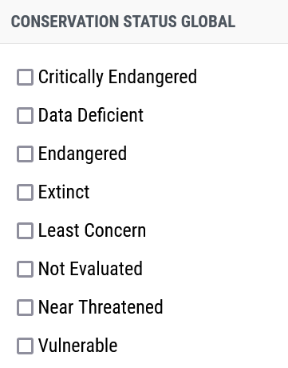 | **Conservation status:** Derived from the International Union for Conservation of Nature’s (IUCN) Red List of Threatened Species, a user may filter records based on global conservation status. |
|  | **Reference category:** Filter records based on type of reference. |
| 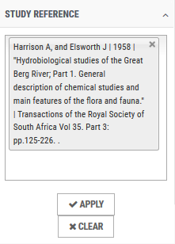 | **Study reference:** Filter records by selecting a specific study reference. |
|  | **Owner:** Filter records collected by a specific person. |
| 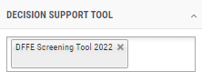 | **Decision support tool:** Filter records that have been used to support management and conservation decision making by contributing to a specific Decision Support Tool. |

Applying a filter returns a subset of the data based on your filter criteria, for example records in SA Ecoregion = Western Folded Mountains.  When a filter is in effect, you will see a yellow highlight of the ‘drawers’ which have filter options enabled (highlighted in yellow). The filter system only displays filter options for categories that have sites associated. For example, if you do not see an option in the ‘Provinces’ filter for Northern Cape, it means we do not have any data (sites) for that province.

**Filtering sites to show only those in SA Ecoregion = Western Folded Mountains:**

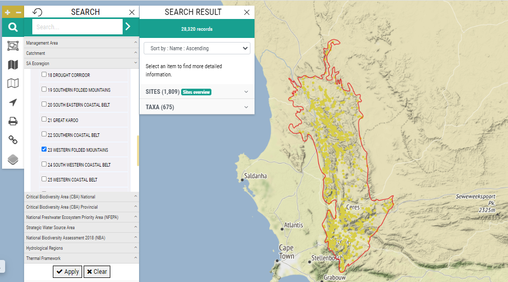

**Highlighting drawers where a filter condition is active:**

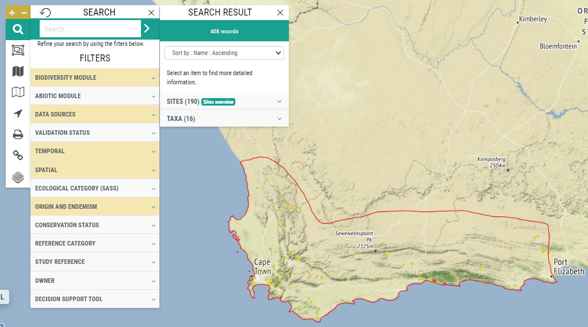

## Map based filtering

Sites may also be selected by using Lasso Control. This feature allows the user to draw a polygon around specific sites to include in dashboards. By clicking “Update search” the user will see the search results for all the sites in the polygon. Note that to close your lasso selection you must click on the starting point again.  The “Merge sites” feature allows the administrator to merge the data from the sites in the polygon into one site. The clear Polygon, resets to zero.

**Drawing a polygon to select and group sites:**

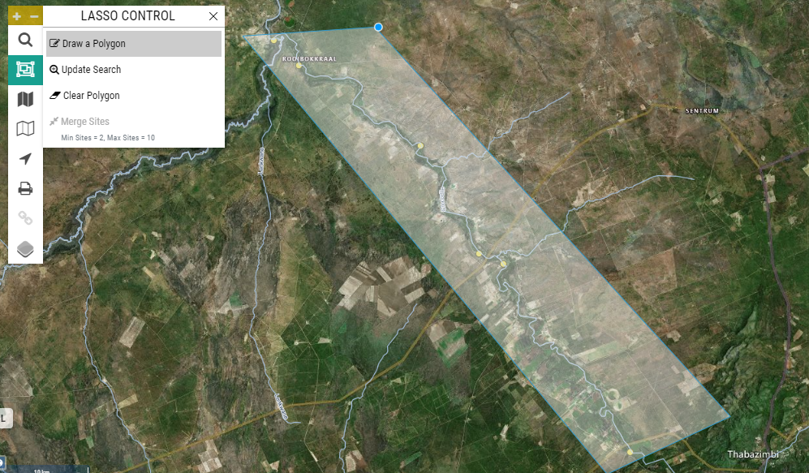
