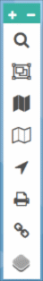

# Overview of the map interface

## Navigation bar

* **About** provides details of the FBIS, including the funders and partners.
* **Map** is where you explore the data.
* **Contact** to send us a query or question.
* **Help** provides access to a User Manual and video tutorials demonstrating FBIS functionality.
* **“Your Name”** is for editing your profile and viewing your contributions.
* **Add Site** is a shortcut to add a new site and associated data to FBIS.

## Tool bar

|  |  |
| -- | --|
|  | <ul style="line-height:220%"><li>Zoom in and out on the map</li><li>Search and filter records</li><li>Lasso Control to select and group specific sites using a polygons</li><li>Turning on and changing transparency of layers</li><li>Select third party data (MiniSASS and water quality data served by InWARDS)</li><li>Locate options using coordinates and farm codes</li><li>Print a PNG of your map</li><li>Copy a shareable link for your map</li><li>Change the base map. Options include Bing Satellite Hybrid, Terrain, Topography, Aerial photograph or Plain B & W.</li></ul> |

<table style="border: none">
    <tr style="border: none">
        <th style="border: none"></th>
        <th style="border: none"><ul style="line-height:220%; text-align:left; font-weight:normal"><li>Zoom in and out on the map</li><li>Search and filter records</li><li>Lasso Control to select and group specific sites using a polygons</li><li>Turning on and changing transparency of layers</li><li>Select third party data (MiniSASS and water quality data served by InWARDS)</li><li>Locate options using coordinates and farm codes</li><li>Print a PNG of your map</li><li>Copy a shareable link for your map</li><li>Change the base map. Options include Bing Satellite Hybrid, Terrain, Topography, Aerial photograph or Plain B & W.</li></ul></th>
    <tr>
