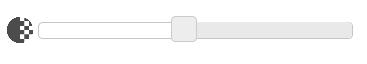
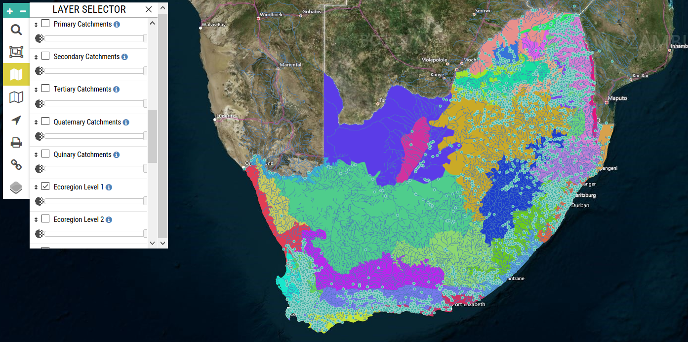
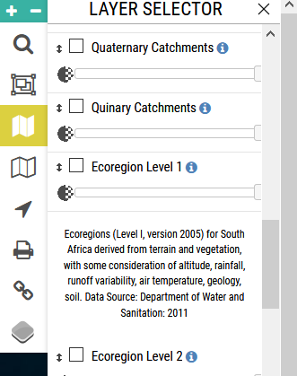

# Mapping

## Spatial Layers

Spatial layers, which may be turned on and off in the FBIS map, function as background layers upon which biodiversity data are displayed. Often spatial layers are used for generating geocontext data. Geocontext data are contextual data for any geographical point, sourced from relevant spatial layers and aggregated as properties of a site. Spatial layers served in FBIS are based on stakeholder discussions and user requirement assessments. Layers are used both as contextual underlays (e.g. “show catchment boundaries in the background of the map”) on the interactive web map and as the basis for filtering biodiversity data (see section 6.1, e.g. “show me all sites in catchment G2”). The current list of spatial layers lodged in FBIS is enumerated below.

* Sites
* Rivers
* Dams
* Geomorphological Zones
* Freshwater Ecoregions of the World
* Water Management Areas
* Sub Water Management Areas
* River Management Units (currently only Western Cape)
* Catchments (Primary, Secondary, Tertiary, Quaternary, Quinary)
* SA Ecoregions (Ecoregion Level 1, Ecoregion Level 2)
* Fish sanctuaries
* National Critical Biodiversity Areas
* Protected areas
* National Freshwater Ecosystem Priority Areas
* National Ecological Support Areas
* Strategic Water Source Areas
* Land Use Classes
* Hydrological Regions
* Hydrological Region Flow Type
* Thermal Framework

Each layer may be turned on by checking the relevant box, and the transparency of each layer may be increased or decreased using the slider (Figure 8).

The order of layers in the side panel can also be adjusted by dragging layers up and down with the mouse. Layers at the top of the layer list will be shown in the foreground.

**Selection of spatial layers for displaying biodiversity data:**

To view the metadata for each layer, click on the blue source ‘i’ button.

**Map layer metadata display in FBIS Version 3:**

