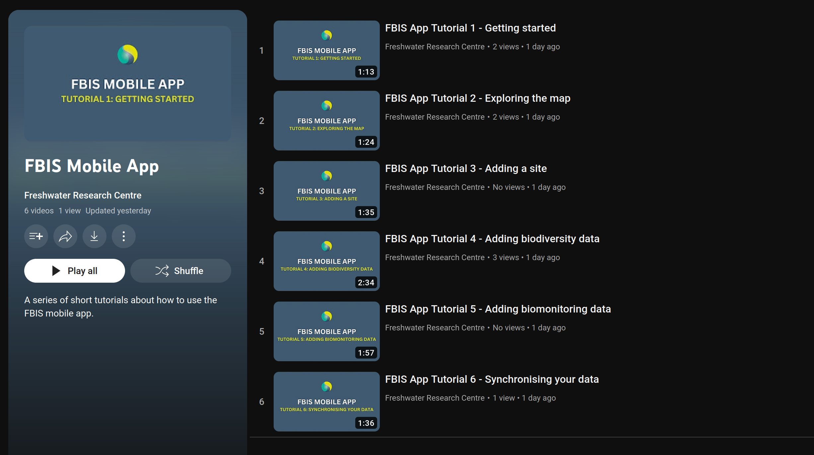

# Mobile Application Tutorial Videos

The six videos below are a set of tutorials for you to learn how to effectively use the FBIS mobile application.

You can go directly to a [playlist of all of the videos](#playlist-of-tutorial-videos), or you can watch the videos individually on this page in the [Individual Tutorials section](#individual-tutorials).

## Playlist of Tutorial Videos

Click on the image to go to a playlist of all the tutorial videos:

## Individual Tutorials

### Tutorial 1

### Tutorial 2

### Tutorial 3

### Tutorial 4

### Tutorial 5

### Tutorial 6

