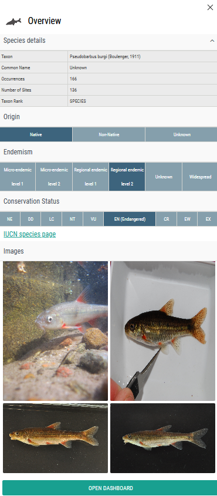
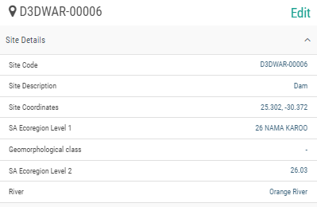
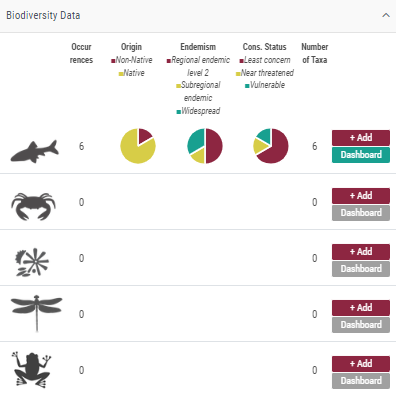
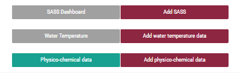
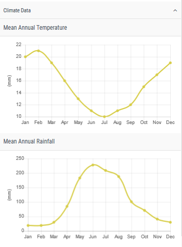

# Overview panels

The overview panels - visible on the side of the map - are used for quick visualisation / summaries of single taxon, single-site and multi-site search results.

## Single taxon overview panel

The single taxon overview panel provides an at-a-glance overview of records for the taxon, and the taxon’s origin, endemism and conservation status. It also includes an outbound link to the IUCN status page for that taxon, and fetches specimen images from GBIF if available.

By clicking **Open Dashboard**, the user can then open the Dashboard to see further information on the taxon.

**Single taxon overview panel:**

## Single-site overview panel

For single-sites, we display summary data, including useful context information (GeoContext-derived data) such as the Geomorphological Zone and Ecoregions (Figure 13). The number of occurrences for each module (fish, invertebrates, algae, odonate adults and anura), pie charts showing the proportion of taxa in each Origin (see section 10.1.8), Endemism (see section 10.1.9) and Conservation Status (see section 10.1.10) category, as well as number of taxa is shown for each group.

The “dashboards and forms” on the overview panel provides onward links to available fish, invertebrate, algal and SASS dashboards (see Section 10) and forms for uploading data (see Section 11). Temperature and rainfall charts (data for which is also harvested from GeoContext) can be found at the bottom of the panel. See below which illustrates the bottom section of the overview panel.

**Single-site overview panel - top:**

**Single-site overview panel - Bottom:**

## Multi-site overview panel

For multiple sites, ‘multi-sites’, we display the filter history for selecting records, but not the detailed contextual site information found in the single-site overview panel because these data will not be the same across all the sites in a multi-site. The number of occurrences and number of sites for each module (fish, invertebrates and algae), pie charts showing the proportion of taxa in each Origin (see section 10.1.8), Endemism (see section 10.1.9) and Conservation Status (see section 10.1.10) category, as well as number of taxa is shown for each group.

The “dashboards” on the overview panel provide onward links to available biodiversity and abiotic (see Section 10), where you are able to also drill down to the detailed multi-site dashboards for each module.

**Multi-site overview panel:**

