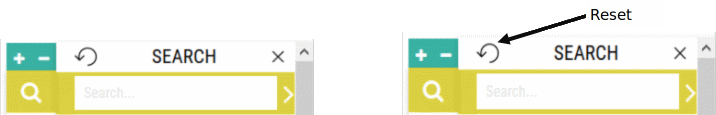
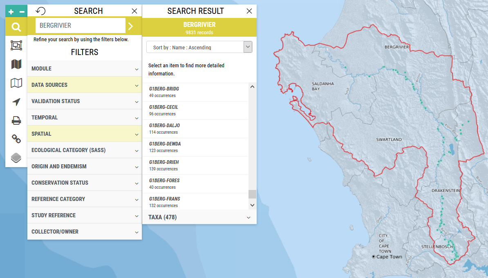
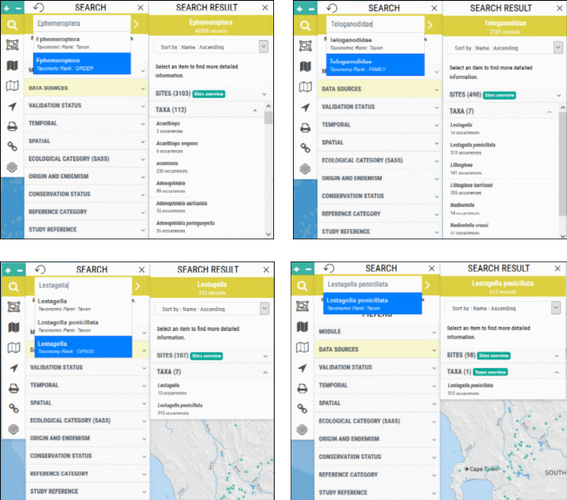

# Search

FBIS supports search auto-completion based on FBIS site code, taxon name (scientific) and river name. With this implementation it is very easy to, for example, quickly extract all of the sites along a given river as per the example shown below (Figure 2).

**Accessed by**: Clicking on the magnifying glass search icon and then entering a taxon name, FBIS site code or river name into the search box. A user can search using **Taxon Rank** (species, genus, family or order) as well as Taxon, which is the lowest taxon provided in a study reference (Figure 3).

To clear search criteria use "**Reset**".

**Search based on river name:**

**Search based on Taxon Name and Rank, showing Order Ephemeroptera, Family Teloganodidae, Genus Lestagella and Species Lestagella penicillata:**

