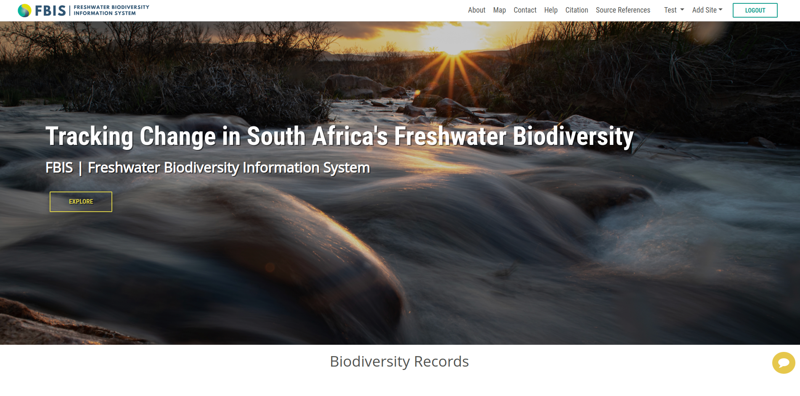

# About

This `About` section provides detailed information about the BIMS project. It offers insights into the project's objectives, purpose, and significance, helping users understand its scope and how it aims to address specific challenges. 

1. **About:** Click on the `About` tab from the navigation bar to access the about page.

## The Where?

South Africa’s unique freshwater biodiversity is under enormous pressure from human activities, habitat transformation, climate change and invasive species impacts. River health is deteriorating faster than it can be measured, and existing data suggest that human impacts have, and continue to, severely compromise biodiversity and aquatic ecosystem function. This can also have serious adverse consequences for ecosystem services, such as the provision of food and safe, clean drinking water.

## The What?

Managing our freshwater systems and biota requires reliable information on ecosystem change, as well as a backdrop of sound baseline data against which to gauge current trends. Rising to this challenge, the Freshwater Biodiversity Information System (FBIS) is a platform for hosting, visualising and sharing freshwater biodiversity information for South African rivers. Through consultations with data users and contributors, and through collaborations with key partners and stakeholders, the FBIS aims to provide South Africa’s first platform for rapid and reliable assessments of change in freshwater biodiversity and associated ecosystem condition. The project seeks to mobilize and import to the system baseline biodiversity data, identify strategic long-term monitoring sites, and train key organizations on how to use the information system. Through the use of map-based visualisations, user-friendly dashboards and rapid data extraction capabilities, the system will improve knowledge of freshwater biodiversity and long-term river health trends, thereby supporting better-informed river management decisions and conservation planning projects.

## The How?

The system accepts and serves data on species occurrence, abundance and associated habitat parameters, for freshwater algae, invertebrates and fish. In addition to data gleaned from scientific papers, reports and university theses, the FBIS serves (1) invertebrate data from the former ‘Rivers Database’ (national SASS (South African Scoring System) data), (2) invertebrate data from the legacy ‘Biobase Database’ (national aquatic invertebrate data), (3) fish data from the Global Biodiversity Information Facility (GBIF) database, which includes fish data records from the South Africa Institute for Aquatic Biodiversity (SAIAB).​​​​​​Through links with other systems (like the Department of Water and Sanitation’s Water Management System and [SANBI’s Biodiversity GIS platform](https://bgis.sanbi.org/)), the FBIS offers powerful spatial and temporal data filtering functionality designed to cater for the needs of end users ranging from consultants to conservation planners.

## The Who?

The FBIS project is led by the [Freshwater Reserach Centre (FRC)](https://www.frcsa.org.za/) in partnership [Kartoza Open Source Geospatial Solutions](https://kartoza.com/) and the [South African National Biodiversity Institute (SANBI)](https://www.sanbi.org/). The project is funded by the [JRS Biodiversity Foundation](https://jrsbiodiversity.org/) and the South African National Biodiversity Institute (SANBI).
