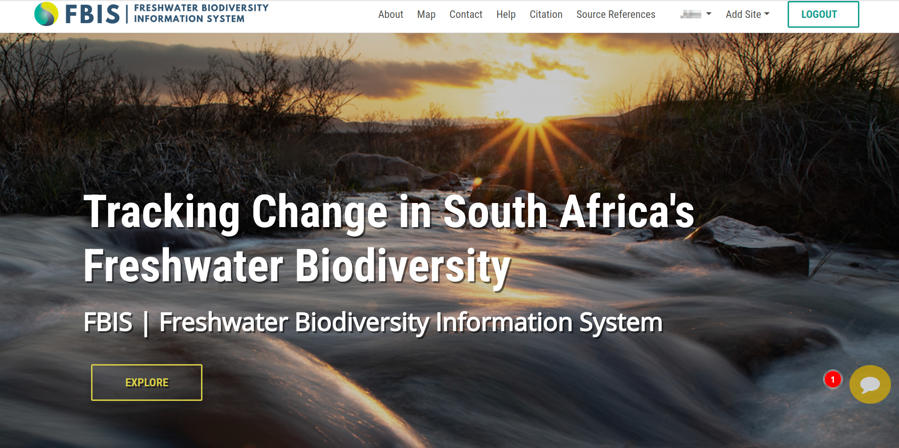
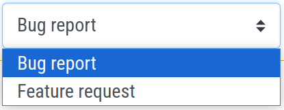

# Feedback Form

> Note: Users are required to log in to submit the feedback form. While they can access the form without logging in, submission is restricted until they are logged in.

1. **:** Click on this chat icon to open the feedback form.

1. **x:** Click on the `x` to close the feedback form.

2. **Bug report:** Users must select the type of feedback they want to submit from the dropdown menu.

    

3. **Summary:** The users are required to provide a brief summary of the feedback.

4. **Detailed description:** The users are required to provide a detailed description of the feedback.

5. **Github:** All issues are public and available through [Github](https://github.com/kartoza/django-bims/issues?q=is%3Aissue+is%3Aopen+label%3Auser-feedback).

6. **Submit:** After filling in all the necessary information, users can submit their feedback by clicking on the `Submit` button.
