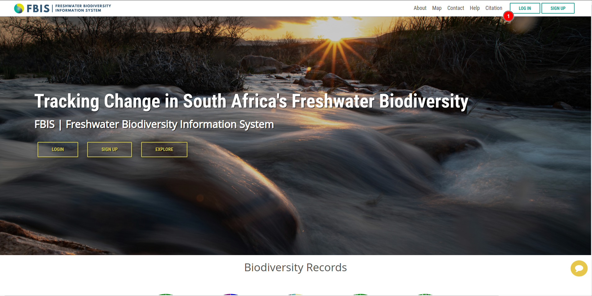
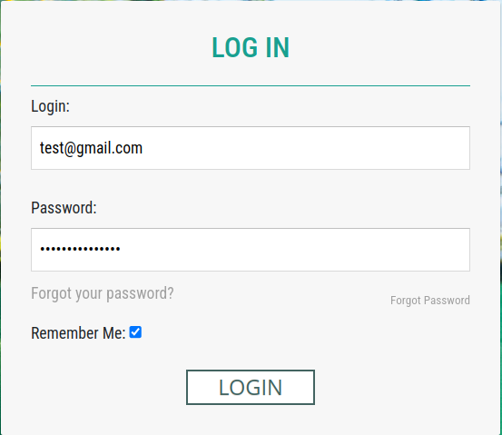
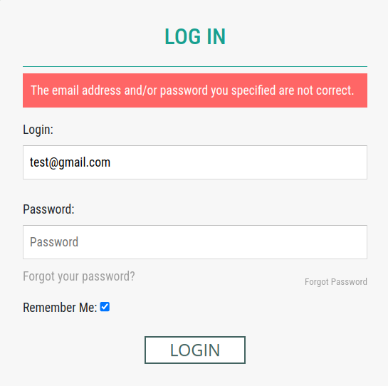

# Login

* **LOG IN:** By clicking on this button user will be redirected to the login page.

    

* **Email:** Users must enter the email address associated with their registered account.

* **Password:** Users must enter the password associated with their registered account.

* **Forgot your password?:** Allows users to reset their password.

* **Remember Me ✅:** Allows users to save their login credentials for future use.

* **LOGIN:** After entering the correct email and password, users can click on this button to log in.

    * If the email address or password is incorrect, user will encountered with this error.

        

After successful login, user will be redirected to the map page.
