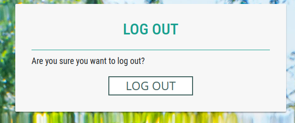
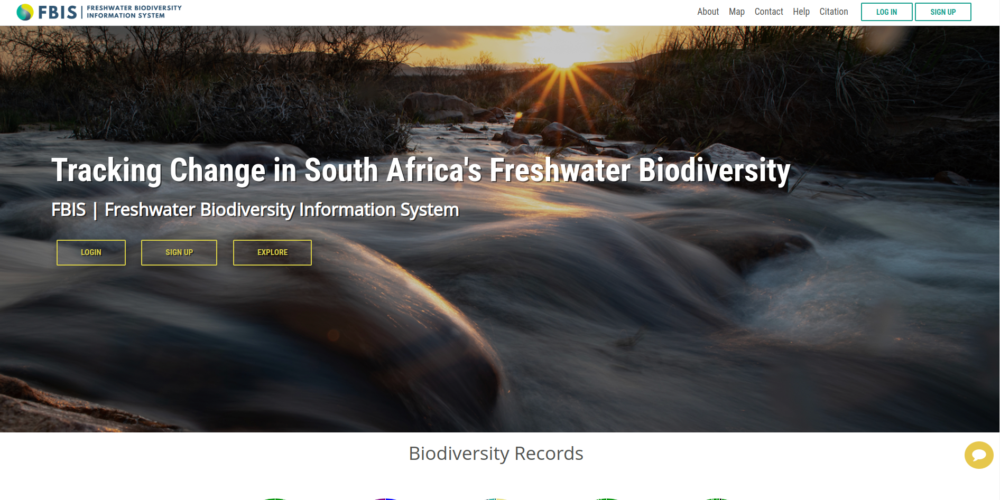

# Log Out

1. **LOGOUT:** Users can log out from the site by clicking on this button, which will redirect them to a logout confirmation page.

* Click on the `LOG OUT` button to confirm the logout action.

This will redirects the users to the home page.

