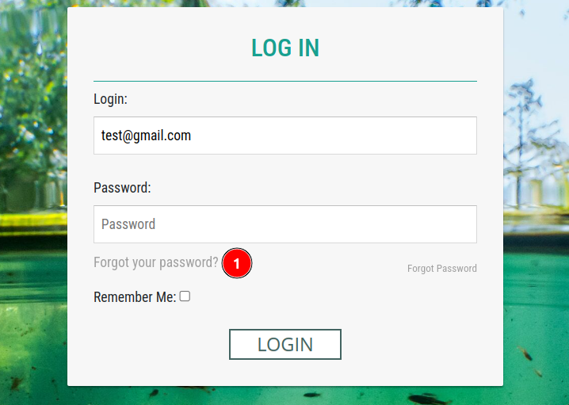
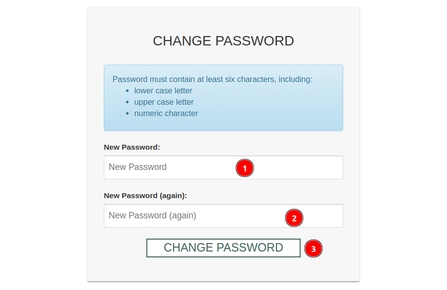

# Password Reset

1. **LOGIN:** Click on this button to access the login page.

1. **Forgot your Password?:** By clicking on this link user will be redirected to the password reset page.

1. **Email:** Users are required to enter the email address associated with their account.

2. **Reset My Password:** Once the email is entered, click on this button to submit the password reset request.

* After submitting the request this message will be displayed and a password link will be sent to the user's email.

    

* User will receive an email with a password reset link.

    

* Click on the password reset link to reset the password. This will redirect the user to the `CHANGE PASSWORD` page.

    

    **1. New Password:** Enter a new password for your account.

    **2. New Password(again):** Re-enter the new password to confirm.

    **3. Change Password:** Click on this button to submit the request.

* After submission, a message will be displayed confirming that `Your password is now changed`.

    

After completing the process, the user will be able to login with their new password.