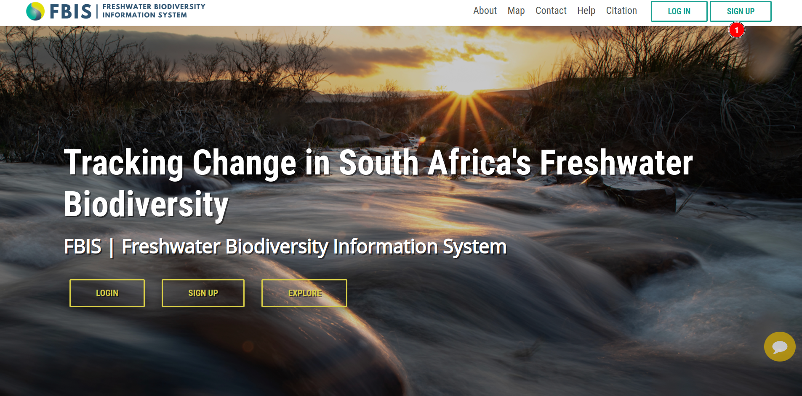
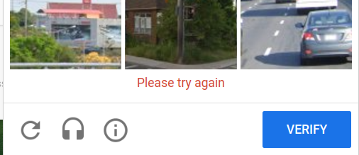

# Sign Up

1. **SIGN UP:** By clicking on this button users will be redirected to the sign up page.

* **Email:** Users will be required to enter their valid email address.

* **First Name:** First name of the user.

* **Last Name:** Last name of the user.

* **Organisation/Institution:** The name of the organisation or institution the user is associated with.

* **Role:** The user's specific role within their organisation.

* **Password:** Users are required to create a strong password that includes a combination of uppercase and lowercase alphabets, along with numeric characters.

* **Password(again):** User will be required to enter the same password again for confirmation.

* **I'm not a robot:** Users are required to click on the checkbox and complete the `ReCAPTCHA` to confirm they are not a robot.

* **SIGN UP:** Once all the details are filled in, users can click on this `SIGN UP` button to complete the sign up process.

After submitting the request, the user will see the following message, indicating that their account approval is pending. Once approved, the user will receive a confirmation notification.

This is the `Registration Confirmation` email user will receive once their account is approved.

## I'm not a robot

Clicking on the checkbox will prompt a captcha challenge for users to solve.

1. **Instructions:** The user will be provided with instructions on how to complete the `CAPTCHA`.

2. **Images:** The user will be presented with a series of images that they need to identify and select.

3. **Refresh Button:** The user can refresh the challenge by clicking on this button.

4. **🎧 Icon:** Users can also complete the challenge by listening to the audio by clicking on this button.

    

    **1. PLAY:** The user can play the audio challenge by clicking on this button.

    **2. Input Field:** Users are required to type what they hear in the audio.

    **3. Refresh button:** Users can refresh the challenge by clicking on this button.

    **4. Eye Icon:** Users can switch to an image challenge by clicking on this button.

    **5. Help Icon:** Users can get help by clicking on this button. Click [here](https://support.google.com/recaptcha/#6175971) to access the official `Google reCAPTCHA` documentation.

    

    **6. VERIFY:** Once the user completes the challenge, they can click on this button to verify their answer.
    
    * If the user's input is incorrect, an error message will be displayed.

        

    * If the user's input is correct, the ReCAPTCHA will close automatically, and the checkbox will be marked as checked upon successful completion of the challenge.

        

5. **Help Icon:** Users can get help by clicking on this button. Click [here](https://support.google.com/recaptcha/#6175971) to access the official `Google reCAPTCHA` documentation.

6. **VERIFY:** Once the user completes the challenge, they can click on this button to verify their answer.

    * If the answer is not correct, an error message will be displayed.

        

    * If the user's input is correct, the ReCAPTCHA will close automatically, and the checkbox will be marked as checked upon successful completion of the challenge.

        
        