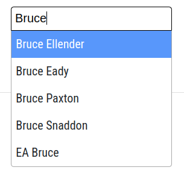
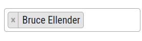
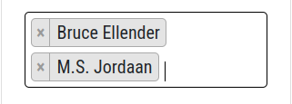
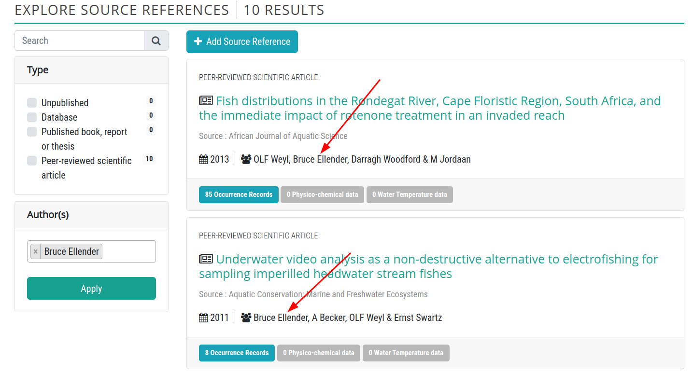
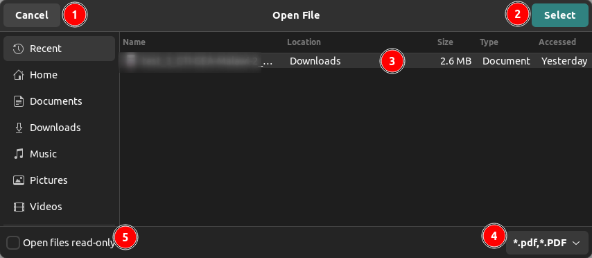
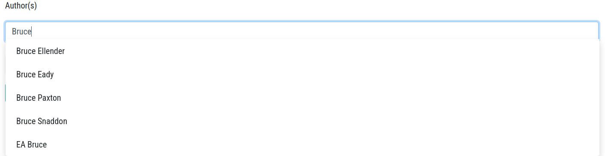
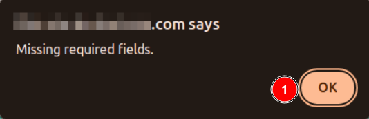

# Source References

1. **Source References:** Users can access the `Sources References` page by clicking on this tab.

1. **Search:** Users can search for specific sources by typing in the search bar.

    

    **1. Search field:** For example if a user type 2001 in field and then click on search button, the page will display all the sources that have 2001 in their name.

    **2. Source List:** The search results display entries containing the text in their name the user searched for.

2. **Type:** Users can filter sources by selecting the type from the menu.

3. **Author(s):** Users can filter sources by entering the author(s)' name in the search field. 

    

    **1. Search field:** Users are required to type the author's name in the search field to filter results. A minimum of 3 characters must be entered in the search field.

    

    * When users enter a name, related suggestions will appear in the list, and they must select the appropriate name from the list other wise the input field will remains empty.

        
    
    * **Remove Name:** Users can also remove the from the search field by clicking on the `x` mark.

        

    * **Multiple Names:** Users can also enter multiple names in the search field.

        

    * The image below demonstrates applying the filter for the `Author(s)` name `Bruce`. The arrow highlights the search result, which includes `Bruce` in the source name.

        

    **2. Apply:** Users can apply the filter by clicking on the `Apply` button.

4. **Add Source Reference:** Users can add a new source reference by clicking on the `Add Source Reference` button.

5. **Sources:** This is the list of sources that are currently available in the system.

## Type: Filter By Type

 >Note: Users can apply multiple filters at once.

1. **Type:** Users can apply filters by selecting the checkbox corresponding to their preferred type.

2. **Records:** These are the number of records available for each type.

### Apply Filter

>Note: If the user selects a specific type, the records for all other types will display as 0.

1. **RESULTS:** This shows the number of records that match the applied filters.

2. **Types:** These are the selected filters.

The arrows indicate that the results include the applied filter.

## Add Source Reference

> Note: Users are required to log in to add a source reference.

1. **❎:** Users can cancel the process by clicking on the `❎` mark.

2. **Type:** Users must select the type of source reference they wish to add from the drop-down menu.

    

3. **Url:** User are required to provide the file or URL of the source reference.

    * **Provide url:** User can provide the URL of the source reference into the input field by clicking on the `Provide url` button.

        

    * **Upload a file:** User will be able to upload the file by clicking on the `Upload a file` button.

        

    > Note: User can only upload a single file in a form.
    
    **1. Choose file:** Users can select the file they wish to upload from their system by clicking on this field. After clicking on the field, a file dialog box will appear.

    

    1 **Cancel:** Users can cancel the file selection process by clicking on the `Cancel` button.

    2 **Select:** After selecting the file, users can click on the `Select` button to upload the file.

    3 **File:** This is the selected desired file.

    4 **Format:** This is the format of the selected file.

    5 **Open file read-only:** Users can open the file in read-only mode by checking this box.

    * After this the file will be added to the field.

        

4. **Title:** Title of the source reference.

5. **Source:** Description of the source reference.

6. **Year:** Year of the source user wants to reference.

7. **Notes:** Additional notes about the source reference.

8. **Author(s):** Author(s) of the source reference. If the author already exists in the database, users can start typing, and the system will automatically suggest the author's name, which users can select.

    

9. **Add new author:** Users can add a new author by clicking on the Add New Author button. Upon clicking, a new input field will appear where users can enter the author's name. Simply type the name and press Enter to add the author.

* When adding a new author, users must follow this format for the author's name: [First Name] [Space] [Last Name] (e.g., John Smith).

    

    * User can add multiple authors to a single source reference.

10. **Submit:** After filling in all the required fields, users can submit the source reference by clicking on the `Submit` button. If any detail is missing at the time of form submission, the system will display an error message.

    

    **1. OK:** Users can click on the `OK` button to close the error message.
