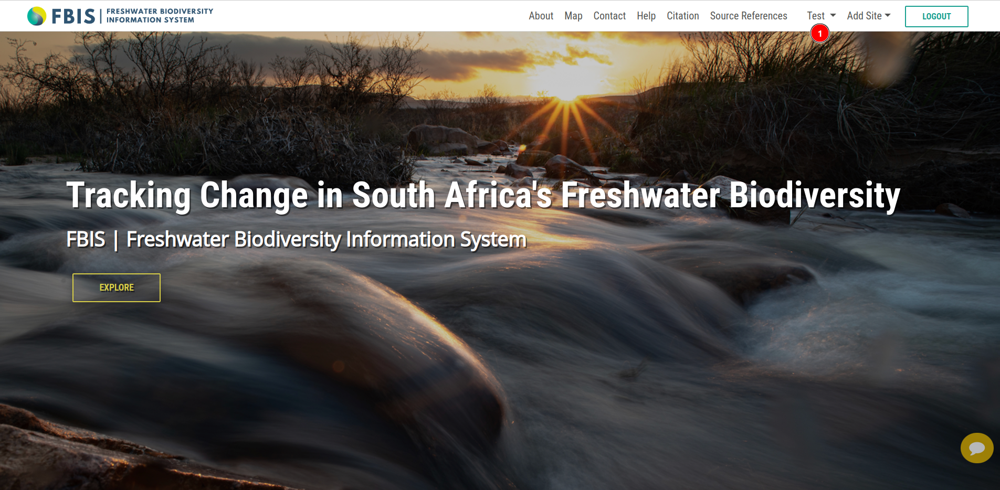
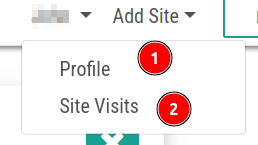
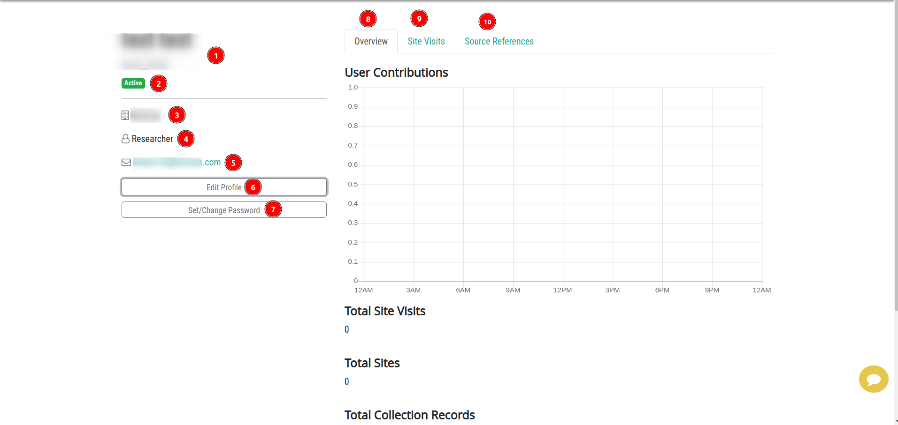
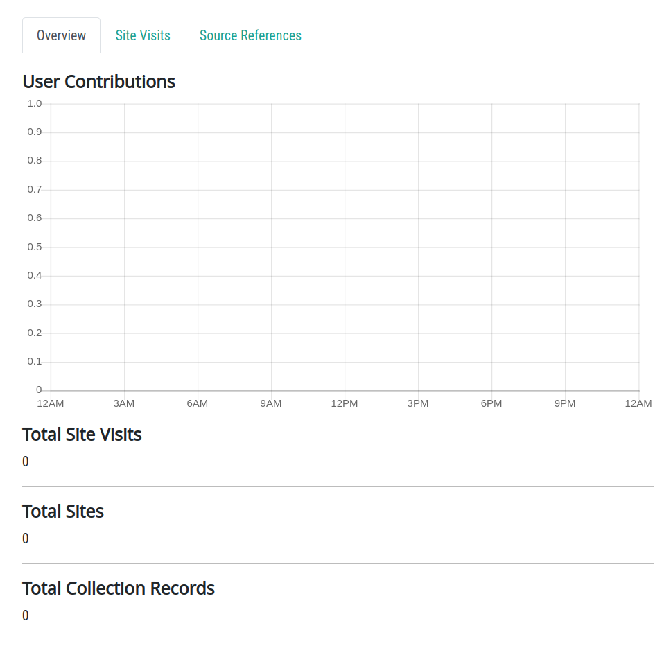
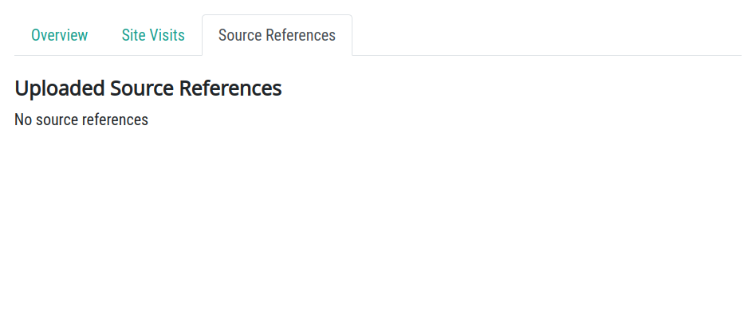
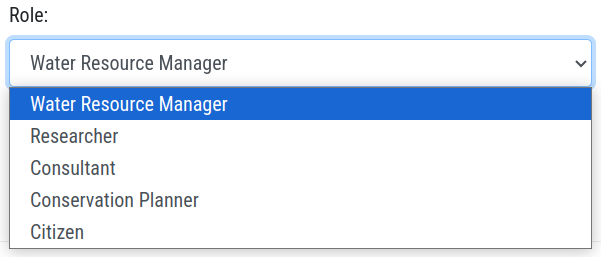
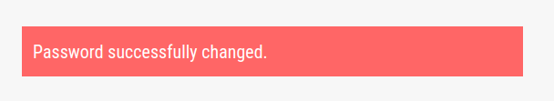
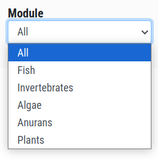
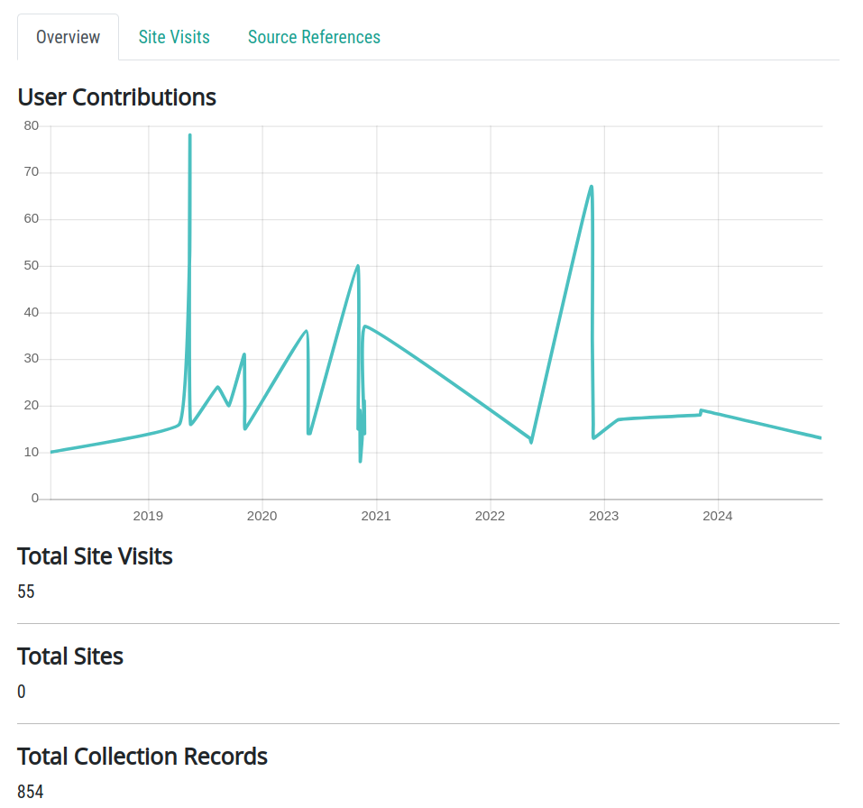
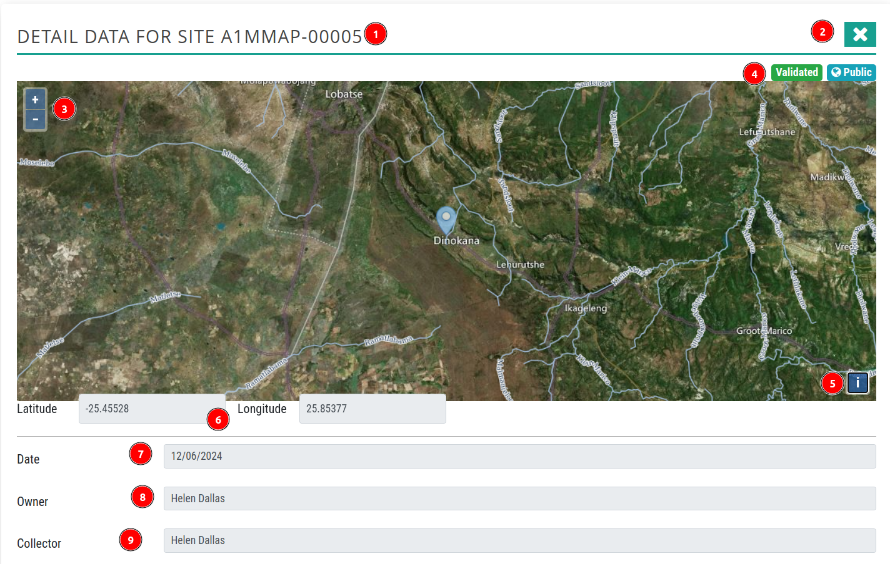

# User Profile

1. **Username (Test):** Users can their profile by clicking on the username, this will open a drop down menu with options `Profile` and `Site Visits`.

    

    1 **Profile:** This will open the user profile page, where users can view their profile information, edit their profile and change their password.

    2 **Site Visits:** This will open a page showing the user's site visit activities.

## Access Profile

1. **Profile:** This will open the user profile page, where users can view their profile information and edit it.

    

    1 **Username:** User name.

    2 **Active:** User status.

    3 **Organisation:** The organisation name to which the user belongs.

    4 **Role:** Role of the user in their organisation.

    5 **Email:** User email address.

    6 **Edit Profile:** Users can edit their profile information.

    7 **Set/Change Password:** Users can change their password.

    8 **Overview:** The user profile overview provides detailed insights into their activity, including information about their contributions, the total number of site visits by the user, the total number of sites, and the total collection of records uploaded by the user.
    
    

    9 **Site Visits:** This will open the `Site Visits` tab, where users can track activity on their sites, including details on how many users have visited their site.

    

    10 **Source References:** This will open the `Source References` tab, allowing users to view all the source references they have uploaded. To upload source references click [here](./source-reference-page.md).

    

### Edit Profile

1. **x:** Close the edit profile form.

2. **First Name:** User's first name.

3. **Last Name:** User's last name.

4. **Role:** User's role in their organisation. They can choose role from the dropdown menu.

    

5. **Organisation:** Users can also update their organisation name.

6. **Update:** After filling in the updated details click on the `Update` button to update the profile.

* After completing the process here is the updated profile.

    

### Set/Change Password

1. **Current Password:** The current password of the user.

2. **Rules For Password Creation:** These are the rules for creating a new password. User must follow these rules to create a new password otherwise it will show an error message.

    

3. **New Password:** The new password of the user.

4. **New Password (again):** User must have to enter the new password again to confirm it.  

5. **Change my password:** After filling in all the input fields click on the `Change my password` button to change the password. If the password is changed successfully it will show a success message.

    

## Site Visits

1. **SITE VISIT:** Shows the number of users who have visited the site..

2. **See Unvalidated Data:** Users can view only the unvalidated data uploaded to the site by clicking the `See Unvalidated Data` button.

    

3. **Metrics:** Metrics contains the information about the site visits. It includes the number of visits, number of total sites, and the number records.

4. **Filters:** Users can arrange the data according to their preference by using the filters.

5. **Results:** Available data on the database.

## Filter

1. **Owner:** Users can filter data by the owner's name. To do so, they must type the owner's name in the search bar. The system will display a list of matching names, and it is mandatory to select a name from the list.

    

2. **Site code:** Users can filter data by site code by entering the full site code or its leading characters into the input field and pressing the `enter` key.

3. **Module:** Users can also filter the data by the choosing the module from the dropdown list.

    

* Users can also filter data by applying multiple filters simultaneously.

### Result Data

1. **Arrange Order wise data:** User can arrange the data in ascending or descending order by clicking on the `up` and `down` arrow.

2. **Owner:** User can view the specific owner's activity by clicking on the owner's name.

    

3. **Actions:** Users can [view](#site-view) the sites on the interactive map by clicking on the  icon.

    

## Site View

1. **A1MMAP-00005:** The site code of the site.

2. **❎:** User can close the site view by clicking on the `❎` button.

3. **Zoom in and out:** Users can zoom in and out of the map by using the ➕ and ➖ buttons.

4. **Validated Public:** Indicating that this site is validated and available to the public.

5. **ℹ️:** Users can see the source information by clicking on this button.

6. **Longitude and Latitude:** These are the geographical coordinates of the site.

7. **Date:** The date when the site was uploaded.

8. **Owner:** The owner name of the site.

9. **Collector:** The name of the individual responsible for collecting data about the site.

